# LLM プロキシ全体パイプライン

## 目的

`/v1/*` に届いた 1 本のリクエストが、どの順序で、どのモジュールを通って、最終的にクライアントへ返るまでの **全体像** を描く。
[request-flow.md](./request-flow.md) はルーティング判断と 429 ローテーションだけを切り出した拡大図。本ドキュメントは「サーバ起動 → 1 リクエスト処理 → upstream 呼び出し → 応答整形」の通し動線を扱う。

---

## レイヤ構造

Rialto は **「起動時 1 回だけ走る Bootstrap 層」 / 「リクエスト毎に走る Per-Request 層」 / 「常駐 State 層」** の 3 つに分かれる。
Bootstrap 層が State 層を組み立て、Per-Request 層がそれを読みながら 1 リクエスト処理する。

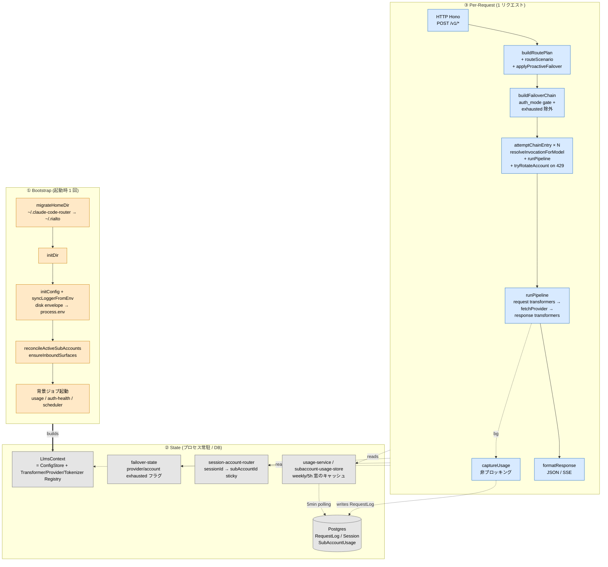

### 各層の役割と主なソース

| 層 | サブ層 | やること | 入力 → 出力 | 主なソース |
|---|---|---|---|---|
| ① Bootstrap | 0. migrateHomeDir | 旧 `~/.claude-code-router` を `~/.rialto` へコピー→検証→旧削除。**必ず最初**（`~/.rialto` が先にできると恒久 no-op になる） | disk → disk | `src/services/config/migrate-home-dir.ts` |
| | 1. initDir | `~/.rialto/` などホーム作成 | – | `src/services/config/envelope.ts` |
| | 2. initConfig | disk envelope を読み、HOST/PORT/APIKEY/LOG_LEVEL/PROXY_URL を `process.env` に反映。直後に `syncLoggerFromEnv()` が LOG_LEVEL を既存 pino に再適用 | disk → env | `src/services/config/envelope.ts`<br/>`src/logger.ts` |
| | 3. reconcileActiveSubAccounts | active binding が orphan になった subscription provider を自己修復（冪等） | DB → DB | `src/services/subscription-account-sync-service.ts` |
| | 4. ensureInboundSurfaces | 全面に明示的な `routingMode` 行を入れる（既存行は不変） | – → DB | `src/services/inbound-surface-service.ts` |
| | 5. 背景ジョブ | usage capture / auth health / routing scheduler。いずれも fire-and-forget で boot をブロックしない | – | `src/services/usage-job.ts` ほか |
| ② State | LlmsContext | 4 registries を 1 個に束ねた lazy singleton。DB-backed config 変更時に `resetLlmsContext()` で再生成 | AppConfig → ctx | `src/llms/context.ts` |
| | failover-state | provider / sub-account 単位の枯渇フラグ。`until` 時刻 or default 5min で失効 | – | `src/services/failover-state.ts` |
| | session-account-router | session → 選択 sub-account の sticky マップ | – | `src/services/session-account-router.ts` |
| | usage-service | 5h / weekly ウィンドウのキャッシュ。背景 polling で更新。**ルーティング判断には使われない**（Overview / Subscriptions の表示とアカウント選択の材料） | DB → mem | `src/services/usage-service.ts` |
| | Postgres | `Provider`/`Model`/`RouterSlot`/`Session`/`RequestLog`/`SubAccountUsage` ほか | – | `src/prisma/schema.prisma` |
| ③ Per-Request | HTTP | エンドポイント (`/v1/messages` 等) → 面記述子 → endpoint transformer 解決 | HTTP → ctx | `src/api/v1/route.ts` |
| | RoutePlan | body parse + scenario routing + proactive failover + persona append | body → RoutePlan | `src/api/v1/route-plan.ts`<br/>`src/llms/scenario-router.ts` |
| | FailoverChain | primary + fallbacks を auth_mode/exhausted で絞る | RoutePlan → string[] | `src/api/v1/candidate-chain.ts` |
| | ChainEntry loop | 各 entry を試し、429 ならアカウントを回し、それでも駄目なら次へ | string → Response | `src/api/v1/chain-failover.ts` |
| | runPipeline | request transformers → fetch → response transformers の本処理 | invocation → Response | `src/llms/pipeline.ts` |
| | captureUsage | **変換前の** response.clone() から usage を抽出、`RequestLog` に書く（非同期、応答ブロックしない） | Response → DB | `src/llms/pipeline/usage-extraction.ts` |
| | formatResponse | JSON は `c.json` 再シリアライズ、SSE は body そのままパススルー（ヘッダ整理） | Response → 出力 | `src/api/v1/route.ts:formatResponse` |

### 図の読み方

- **矢印** = 「呼び出し方向」。Bootstrap が State を組み、Per-Request が State を読み書きする。
- **太線 `==builds==>`** = 1 回だけ起こる初期化。
- **点線 `-.reads.->` / `-.read/write.->`** = リクエストごとに発生する State 参照。
- **`R5 -.bg.-> R6`** は **非ブロッキング** の usage 記録。応答返却を遅らせない。

---

---

## 試行順序 — provider と sub-account はどの順番で叩かれるか

### ざっくり図

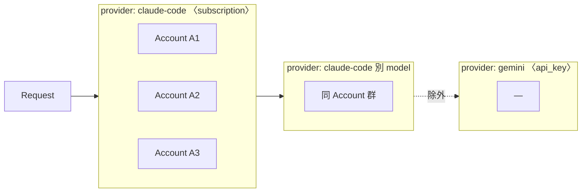

- リクエストはまず **primary の provider** に入る
- その provider 内で **未枯渇の sub-account** を 1 つ選んで試す（同 session は粘着、初回は balancingScore で選択）
- 429 を受けたら **同 provider の別 account** に回す（最大 10 回）
- 同 provider の peer が尽きたら **次の chain entry** へ
- **auth_mode が違う provider（例: subscription→api_key）は最初から chain に入れない**

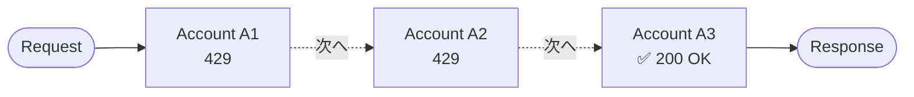

429 が出るたびに、その account を一定時間 (実 resetAt または 5 分) ロックして、**残っている peer** から再選択する。
全 peer が枯れたら **その provider 全体をロック** → 次の `provider,model` entry へ進む。

---

### 二重ループの構造

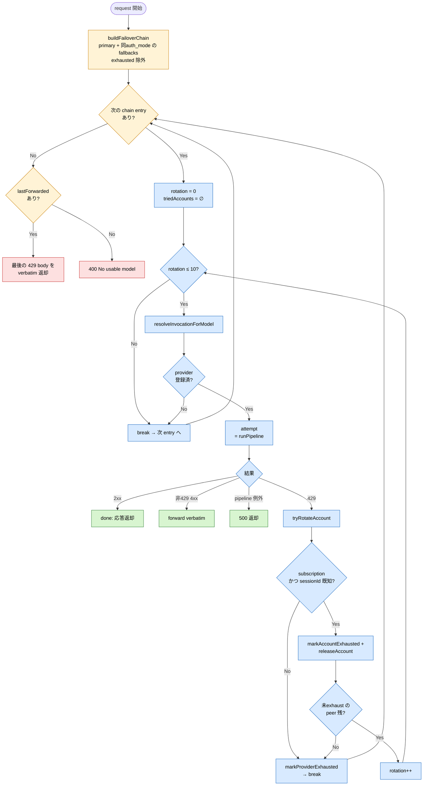

- **黄系 (outer)** = 外側 chain ループの判断点
- **青系 (inner)** = 内側 account rotation の判断点
- **緑** = 正常終了 / **赤** = 全 fallback 尽きた終了

**重要なルール:**

1. **chain は最初に 1 回だけ作る** — `buildFailoverChain` は entry 開始時のスナップショット。途中で新しい fallback が現れることはない。
2. **chain の auth_mode は primary に揃う** — primary が subscription なら fallbacks も subscription のみ残る。api_key 系は混じってても弾かれる。
3. **同 provider の fallback は弾かれる** — 5h/weekly quota は **account 単位** で全 model 共通なので、同 provider の別 model に逃げても同じ account で 429 になる。`applyUiConfig` は保存時に drop + warning、`buildFailoverChain` は実行時にも drop（古い config 防御）。UI の dropdown でも primary と同じ provider の option は最初から出ない。
4. **sub-account は OAuth transformer の `auth()` 内で選ばれる** — chain ループはアカウント名を知らない。429 が返ってきてから `getActiveAccountForSession(sessionId)` で「直前に何が選ばれたか」を逆引きする。
5. **アカウント選択は 4 段** — `src/services/session-account-router.ts` の順序どおり:
   1. in-process の枯渇マップが reactive に落としたアカウントを除外。
   2. **DB に記録された rate-limit 状態**で、常時拘束の窓が 100 % かつ `resetAt` が未来のアカウントを除外。claude なら 7d 全体・7d Opus・5h の3窓、codex なら primary 窓。どれか1つでも 100 % なら上流 429 が確定するので先回りで避ける。
   3. 生き残りの中に sticky マッピング（同じ `sessionId` = `x-claude-code-session-id`）が指すアカウントがあれば、それを再利用（prompt cache の連続性）。
   4. それも無ければ "weekly 窓の残り % ÷ リセットまでの残り時間" が **最高** のアカウント。一番余裕のあるアカウント優先ではなく、**消化を急ぐ必要があるアカウント** から優先する。

   1〜2 で全滅した場合は全候補に戻して「一番マシなもの」を返す。ここで null を返すとクライアントに 401 が出るが、送って 429 をもらう方が厳密に良い。
6. **rotation 回数の上限は MAX_ACCOUNT_ROTATIONS = 10** — 同じ entry で 11 回 attempt しても駄目なら provider exhausted 扱い（防御的キャップ）。
7. **exhausted の失効** — provider/account マークは `until` 時刻（429 レスポンスの実 resetAt）か、それが取れなければ **5 分** で自動失効。窓が転がれば自然に復活する。

### sub-account のスコアリング詳細

`session-account-router.ts:balancingScore`:

```
score = (100 - 当該 weekly 窓の使用率%) / 窓のリセットまでの残り時間ms
```

- 「残り % が大きい / 残り時間が短い」アカウントほど高スコア。
- 高スコア = **そのアカウントの容量を急いで消化しないと残してしまう** → 優先的に選ぶ。
- 結果として **使用率が低い & 残り時間が短い** アカウントが先に使われ、weekly drain が均される。

### 具体例で追う

**前提**

| Provider | auth_mode | hosts | sub-accounts |
|----------|-----------|-------|--------------|
| `claude-code` | subscription | claude-sonnet-4-6, claude-opus-4-8 | A1, A2, A3 |
| `gemini` | api_key | gemini-2.5-pro | – |

**`Router`**

| slot | value |
|------|-------|
| `default` | `claude-code,claude-sonnet-4-6` |
| `fallbacks.default` | `[claude-code,claude-opus-4-8, gemini,gemini-2.5-pro]` |

**chain 構築結果**

| step | 結果 |
|------|------|
| primary + fallbacks 並び | `[claude-code,sonnet-4-6, claude-code,opus-4-8, gemini,gemini-2.5-pro]` |
| auth_mode gate (primary=subscription) | `gemini,...` を除外 → `[claude-code,sonnet-4-6, claude-code,opus-4-8]` |
| exhausted 除外 | (どれも生きてれば) そのまま |

#### ケース A: 何事もなく成功

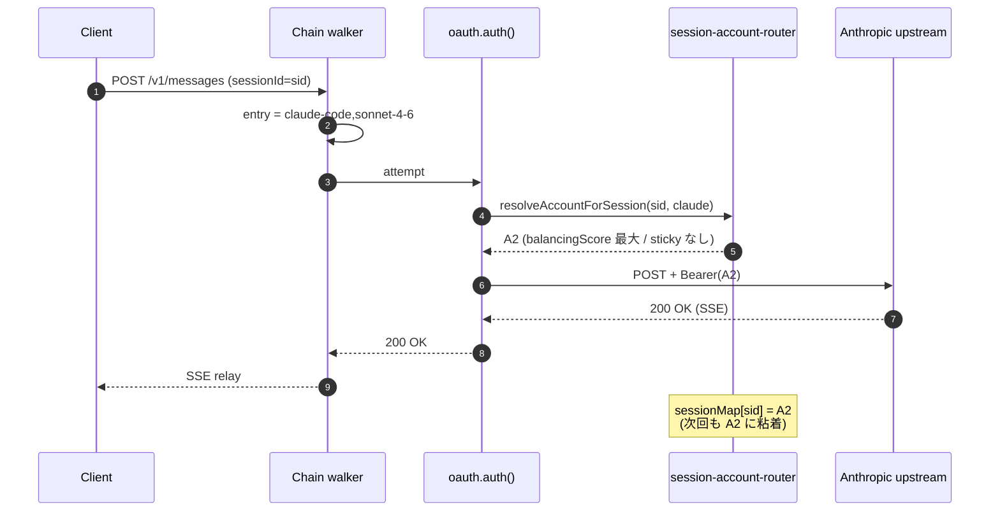

#### ケース B: sub-account の 429 で peer に回って成功

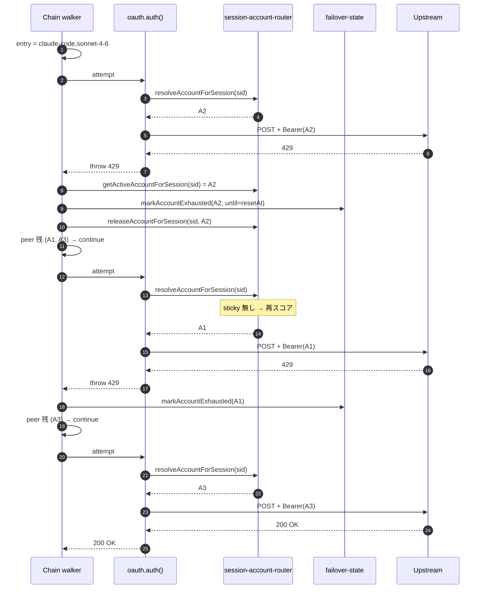

#### ケース C: provider 全アカ枯渇 → 同 provider の別 model へ → chain 全 exhaust

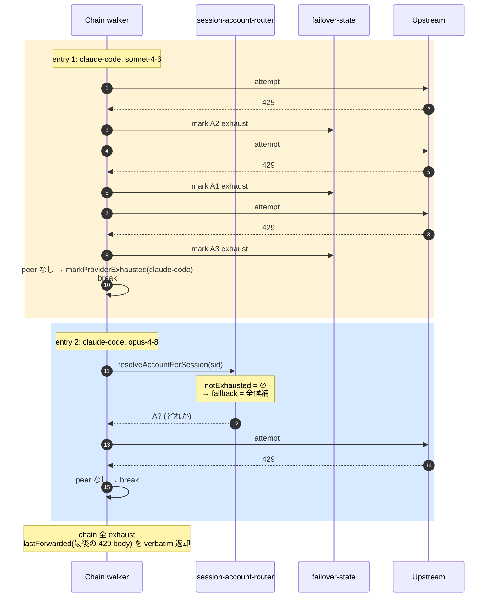

> `session-account-router` は "全部 exhaust なら notExhausted 空 → fallback で全候補に戻す" 設計（401 を返すよりは送って 429 を素直にもらう方が良い、という判断）。そのため entry 2 でも 1 回は upstream を叩く。

#### ケース D: proactive failover が走るケース

**直前のリクエスト**が 429 を食って `failover-state` に枯渇マークが残っているとき、次のリクエストは
attempt する前に `applyProactiveFailover` が primary を捨てて次の候補を採用する。マークを付ける
のは reactive 経路であって、proactive 経路は**それを読むだけ**である。

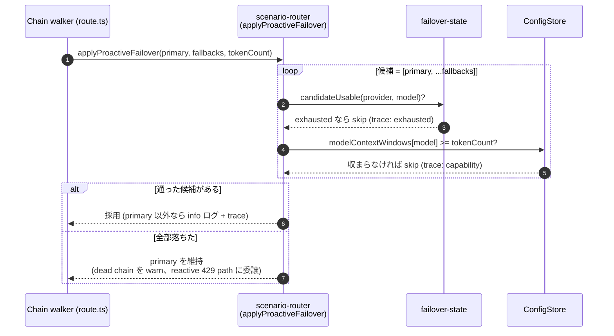

> 枯渇マークは **モデル単位が基本**で、プロバイダ単位のマークもORで効く。Fable の 429 が Fable
> だけを塞ぎ、同一プロバイダ上の Opus フォールバックには到達できるようにするためである
> （`candidateUsable(provider, model)` の2引数版）。全アカウントが尽きた結果として付く
> `markProviderExhausted` はプロバイダ全体を塞ぐので、そのときは同 provider 別モデルでも救えない。

### よくある勘違い

| 勘違い | 実際 |
|--------|------|
| 「fallback の `gemini` (api_key) に流れる」 | auth_mode gate で弾かれる |
| 「sub-account は順番に A1 → A2 → A3 と試される」 | balancingScore でソート、同じ session は sticky |
| 「429 出るたびに chain を作り直す」 | chain は entry 開始時 1 回スナップショット。途中で増減しない |
| 「sticky は永続」 | アカが exhaust マークされた瞬間 `releaseAccountForSession` で破棄 |
| 「provider exhausted は config 修正まで解けない」 | `until` 時刻 (default 5min / 実 resetAt) で自動失効 |
| 「週次が減ってきたら先回りで切り替わる」 | weekly drain guard は廃止済み。上流の上限まで走り、実際の 429 で切り替わる |
| 「bare な model 名を投げれば provider を探してくれる」 | `resolveByModelName` は削除済み。`routed` な面ではレーンとシナリオの設定値が使われ、`passthrough` な面では `provider,model` をこちらが指定する |
| 「`<RIALTO-SUBAGENT-MODEL>` の中身のモデルに飛ぶ」 | 読むのはタグの**有無**だけ。中身は無視され、`subagent` レーンの設定が使われる |
| 「同 provider 別 model を fallback に入れれば安心」 | 5h/weekly は account 単位の制限なので model を変えても同じ account で同様に 429。UI / applyUiConfig / buildFailoverChain の三層で弾く設計 |

---

## 0. プロセス起動

`src/index.ts` のトップレベル文（`getServer()` のような関数は無い。モジュール評価がそのまま起動シーケンス）:

1. `migrateHomeDir()` — 旧 `~/.claude-code-router` を `~/.rialto` へ移す。**この文が最初でなければならない**: 移行の冪等条件が「宛先が既に存在する」なので、`initDir()` でも logger の初回ファイル書き込みでも、先に `~/.rialto` を作った時点でコピーは恒久的な no-op になり、運用者は無言で空の設定から始まってしまう。`RIALTO_HOME_DIR` でホームが別の場所に固定されているときはスキップする。
2. `initDir()` — `~/.rialto/` などのホームディレクトリ確保。
3. `initConfig()` — disk envelope を読んで `HOST` / `PORT` / `APIKEY` / `LOG_LEVEL` / `PROXY_URL` などを `process.env` に反映。続けて `syncLoggerFromEnv()` が、import 時に構築済みの pino インスタンスへ `LOG_LEVEL` を再適用する。
4. `reconcileActiveSubAccounts()` — active account binding が orphan になった subscription provider の自己修復。冪等。
5. `ensureInboundSurfaces()` — 全面に明示的な `routingMode` 行を入れる。
6. `startUsageCapture()` / `startAuthHealthCheck()` / `startRoutingScheduler()` — 背景ジョブ。Redis 到達性などで boot をブロックしない。

**`runJsonToDbMigration()` は存在しない。** 旧 `config.json` の `Providers` / `Router` を Postgres へ
lift する一回限りの移行は削除済みで、流れは逆向きになった: `syncToConfigFile()`
（`src/services/config/sync-to-disk.ts`）が CRUD のたびに DB の `Providers` / `Router` を
`config.json` へ**書き戻す**。ディスク上のこの2キーは読み取り専用のミラーであり、手で編集しても
次の保存で上書きされる。

`loadFullConfig()`（`src/services/config/compose.ts`）はいまも存在するが、起動時ではなく
`buildLlmsContext` から遅延で呼ばれる。DDL とシード行もここでは作らない — `entrypoint.sh` が
`prisma migrate deploy` と `prisma db seed` をこのプロセスの exec 前に走らせる。

ここで作るのは **設定スナップショット** のみ。Provider/Transformer の実体は後段 `LlmsContext` で組み立てる。

---

## 1. LlmsContext

`src/llms/context.ts:buildLlmsContext`。最初のリクエストで lazy build され、DB-backed config 変更時は `resetLlmsContext()` で破棄される。

### 構成物

| メンバ | 中身 | 読まれる場所 |
|--------|------|--------------|
| `config: ConfigStore` | Providers / Router / 各種スカラを key で引ける薄いラッパ | routeScenario, buildFailoverChain |
| `transformers: TransformerRegistry` | endpoint transformer 群 (`anthropic`, `openai`, `openai-responses`, `gemini`, `claude-code-oauth`, `codex-oauth`) | endpointTransformerMap |
| `providers: ProviderRegistry` | name → ResolvedProvider Map。`api_base_url` / `api_key` 揃ったものだけ登録 | resolveInvocationForModel |
| `tokenizers: TokenizerRegistry` | 既定は tiktoken (cl100k_base)。`@huggingface/tokenizers` を使うモデル精確なバックエンドと、API 集計バックエンドも登録できる（`src/llms/tokenizers/`） | scenario-router の token 数計上 |
| `log: pino.Logger` | ベースロガー。`reqId` で child を切る | 全レイヤ |

### transformer chain の導出

chain は設定項目ではない。登録されている6つの transformer はどれも endpoint 束縛（`anthropic` / `openai` / `openai-responses` / `gemini`）か auth 束縛（`claude-code-oauth` / `codex-oauth`）で、選ぶ余地が無いため、chain は `Provider.apiStyle` + `Provider.authMode` の**関数**として `src/shared/transformer-chain.ts` が導出し、`ProviderRegistry` が Transformer インスタンスに解決する。`provider.transformer.use` は読まれない（古い build が書き残した値は compose 時に落とす）。

| apiStyle | api_key | subscription |
|---|---|---|
| `anthropic` | （変換不要） | `claude-code-oauth` |
| `openai_chat` | `openai` | — 未対応 |
| `openai_responses` | `openai-responses` | `openai-responses` → `codex-oauth` |
| `gemini` | `gemini` | — 未対応（Phase 3-2） |

`anthropic` / api_key が空なのは手落ちではない。endpoint transformer が作る unified 形がそのまま Anthropic のワイヤ形なので変換段が要らず、ここに `anthropic` を積むと chain 長1が endpoint transformer と一致して **bypass モードに落ちる**（別経路であって no-op ではない）。「未対応」の組は chain が null になり、provider は登録されない — placeholder キーで upstream を叩かせないため。

`Model.apiStyle` が provider と食い違うモデル（api_key openai provider 上の codex 系）は、その差分だけをモデル別 chain として provider chain の後段に足す。

### Subscription overlay

DB 上では subscription provider の `api_key` は null。これだと `ProviderRegistry.registerFromConfig` の sanity check で落ちるので、`applySubscriptionAuth` がメモリ上で `api_key: 'oauth'` をスタンプし、credential（`subscriptionCredentialPath` / `subscriptionAuth`）を `provider.transformer` に載せる。chain の選択はしない（上記の導出が担う）。OAuth の bearer token は disk の `~/.claude/.credentials.json` から **リクエスト時に** transformer.auth() が読む。

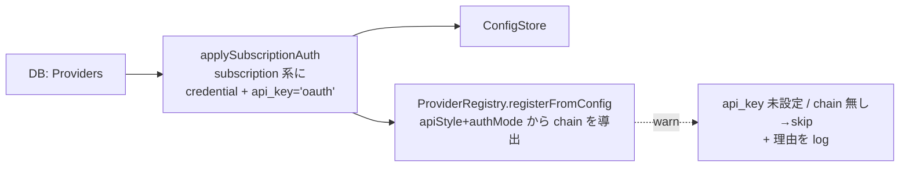

---

## 2. HTTP 層

```ts
v1Route.post('/v1/*', async (c) => {
  const ctx = await getLlmsContext()
  ...
})
```

ルートのマウント自体が面レジストリ由来で、`INBOUND_SURFACES` の各 `endpoint`
(`/v1/messages` / `/v1/chat/completions` / `/v1/responses` / `/v1beta/models/:modelAndAction`)
に POST ハンドラが張られる。transformer は**実パス一致ではなく `surface.endpoint`** で引く
（gemini はモデル名がパスに入るので実パスと `endPoint` が一致しない）。一致しなければ即 404。

認証・アクセスログのマウントも同様で、`INBOUND_MOUNT_PREFIXES`（面と catalog パスから導出した
`/v1/*` `/v1beta/*` のワイルドカード集合）に対して `index.ts` が一括で張る。`inboundProxyAuth`
が面の `auth` フィールドで `GATE_BY_CREDENTIAL` を引き分けるので、**1リクエストにつきゲートは
1つだけ**走る。

---

## 3. RoutePlan 構築

`src/api/v1/invocation.ts:buildRoutePlan`。

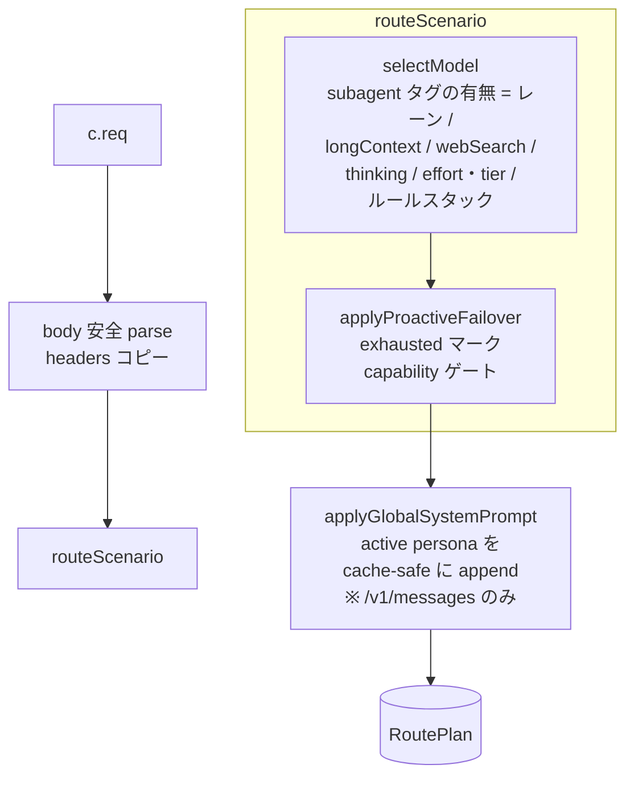

### selectModel の 3 ステージ

`src/llms/scenario-router/model-selection.ts`。**bare 名からプロバイダを逆引きする段は無い**
（`resolveByModelName` は削除済み）。

**ステージ 1 — 呼び手の種別**
`stripSubagentTag(body.system)` が system[1] のタグの**有無**を返す。`RIALTO-SUBAGENT-MODEL` /
`CCR-SUBAGENT-MODEL` のどちらでもよい。**タグの値は読まない** — 有無だけがレーン
(`agent` / `subagent`) を決める。閉じたタグは in-place で除去され、内部マーカーが上流へ漏れない。

**ステージ 2 — シナリオ分類** (`classifyScenario`、この優先順)

1. **longContext（サイズ）** — `tokenCount > effectiveLongContextThreshold(router, chain)`。
2. **webSearch** — `body.tools[]` に `type` が `web_search` で始まるものがある。
3. **think** — `body.thinking.type` が `'enabled'` / `'adaptive'`。`'disabled'` は**除外**する
   （Claude Code は Plan Mode 以外の全リクエストに `disabled` を送るので、真偽値で見ると
   安価な default トラフィックが丸ごと高価な think スロットへ流れる）。
4. **effort/tier escalation** — `output_config.effort` が `high`/`xhigh`/`max`、あるいは effort が
   無くて `body.model` が opus ティア → `longContext` レーン。`low`/`medium` はティア昇格を明示的に抑制。
5. それ以外 → `default`。

いずれの分岐も、**そのレーンを担う設定が無ければ成立しない**（`scenarioConfigured`）。担い手は
2 つあり、どちらか片方で足りる:

- RouterSlot の primary（Rules セレクタ側の設定）
- 優先チェーンの当該レーンに **enabled なエントリが 1 件以上**あること
  （Chain セレクタが走るリクエストのみ。`routeScenario` が `chainRoutingOf` で射影して
  `selectModel` に渡す）

チェーン側を数えるのは Chain セレクタが実際に走るときだけで、Rules セレクタのときは
`chain` が `undefined` なので RouterSlot だけを見る従来どおりの判定になる。Rules モードで
チェーンのレーンを数えてしまうと、そのレーンには誰も応答できず `req.body.model` へ落ちるため。

どちらの担い手も無いレーンは素通りして `default` に落ちる。旧 haiku→background 分岐はここには
無い — `20260728_router_rules_drop_background` により `default` シナリオ上の述語ルールになった。

> この 2 本立てになる前は RouterSlot だけを見ていたため、**チェーンだけを設定して RouterSlot を
> 空にしたインストールは全リクエストが `default` に分類され**、think / longContext / webSearch の
> チェーンが一度も参照されなかった。

**ステージ 3 — 振り先解決** (`resolveTarget`)
シナリオのルールスタックを先に歩き、述語が最初にマッチしたルールの `target` が primary になる
（カスケードは ルール target → シナリオ primary → シナリオ fallbacks）。target を持たないルールが
マッチした場合は「振り替えない」の意思表示で、`req.body.model` が使われる。どのルールもマッチ
しなければシナリオの catch-all primary、それも未設定なら `req.body.model`。

#### longContext しきい値の解決順

`effectiveLongContextThreshold`:

1. `Router.longContextThreshold` が正の数なら、それ。
2. なければ default エージェントレーンを担うモデルの `contextWindow × 0.7`
   （`LONG_CONTEXT_AUTO_RATIO`。応答と Rialto のラッパ分のヘッドルームを 30 % 残す）。
   Chain セレクタが走るリクエストでは**チェーンの先頭 enabled エントリ**の window が優先され
   （`chainRoutingOf` が解決）、それが無ければ RouterSlot の default primary 由来の
   `defaultAgentContextWindow`。
3. どちらも解決できないときだけ `DEFAULT_LONG_CONTEXT_THRESHOLD = 128_000`。

**60_000 は現在の既定値ではない。**

### applyProactiveFailover

`src/llms/scenario-router/failover.ts`。primary を実際に投げる前に `[primary, ...fallbacks]` を歩き、
**2つのゲート**を通る最初の候補を採用する:

| ゲート | 内容 |
|---|---|
| exhausted マーク | reactive な 429 経路が `failover-state` に書いたモデル単位／プロバイダ単位の枯渇マーク。`until`（実 resetAt）か既定 5 分で自動失効 |
| capability ゲート | 宣言済み `contextWindow` がリクエストを収容できるか。未宣言は許可（unknown = allow） |

**weekly drain guard は廃止された。** 以前はここで subscription の週次ウィンドウが線形ドレイン
目標を超えていないかを見て先回りで切り替え、その余裕幅を `Router.weeklyDrainMarginPct` で
調整していた。どちらも削除済みで、schema にも実装にも残っていない。subscription は上流の上限まで
走り、実際に返ってきた 429 に反応してローテーションする。

`getKindWindowHeadroom` / `drainTarget` は `src/services/usage-service/` に残っているが、
リクエスト経路からは呼ばれない（現在の呼び出し元はテストのみ）。

### RoutePlan の中身

| field | 用途 |
|-------|------|
| `routedBody` | scenario routing を当てた **per-model shaping 前** の body |
| `headers` | inbound headers コピー |
| `transformersByName` | このエンドポイント用 transformer の name → instance |
| `defaultTransformer` | bypass で使う 1 個目 |
| `scenarioType` | failover chain 選択キー |
| `primaryModel` | `provider,model` 文字列 |
| `requestedModel` | クライアントが投げてきた元の `body.model`。`RequestLog` に「何を頼まれたか」を「何を送ったか」の隣に残すため |
| `isSubagent` | サブエージェントタグの有無。reactive な failover chain が primary と同じレーンを歩くのに使う |
| `fallbacks` | 事前解決済みのフォールバックチェーン（ルールが刺さったならそのカスケード、でなければシナリオの catch-all）。`buildFailoverChain` は引き直さずこれを読むので、reactive 経路と proactive 経路が必ず同じチェーンを歩く |
| `peerTargets` | cross-provider peer 展開が注入したエントリ。同 `auth_mode` ゲートをこれだけバイパスさせるための印 |
| `accessTokenId` | このリクエストを認証した `AccessToken`。Activity がクライアント単位に支出を帰属させるため |
| `path` / `search` | upstream に投げ直す URL 構築用 |

---

## 4. Failover Chain

`buildFailoverChain(plan, ctx)`:

- `plan.fallbacks`（`selectModel` が既に解決済みのチェーン — ルールが刺さったならそのカスケード、でなければシナリオの catch-all）を読む。ここで引き直さないのは、proactive 経路と reactive 経路が必ず同じチェーンを歩くようにするため。
- 先頭に primary、続けて fallbacks。重複排除。
- **auth_mode gate** — primary が subscription なら subscription だけ残す（api_key が混じってても弾く）。
- 既に exhausted な provider を除外。
- 全部 exhausted の場合は元の順序を返す（窓が転がってる可能性に賭ける）。

---

## 5. ChainEntry × N

`src/api/v1/chain-failover.ts:attemptChainEntry`。1 entry につき **最大 11 回**（初回 + rotation 10 回）の attempt をする内側ループ。

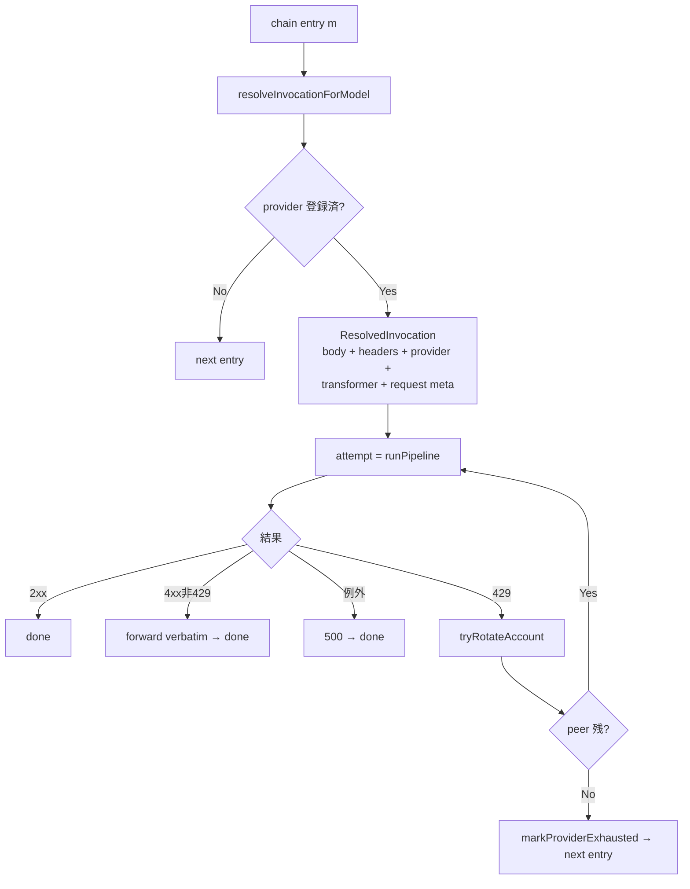

`resolveInvocationForModel` は **per-attempt の新規 body / headers** を切り出して shaping する:

- `output_config.effort` を `EFFORT_BY_MODEL` の範囲にクランプ。
- Rialto 内部拡張 (`context_management` / `output_config` / `diagnostics`) を削除。
- subscription path (transformer 名が `-oauth` 終わり) なら `prepareSubscriptionBetas` で `anthropic-beta` を整形（`context-1m-*` を落とす + `oauth-2025-04-20` を足す）。

---

## 6. Pipeline (1 upstream 呼び出し分)

`src/llms/pipeline.ts:runPipeline`。

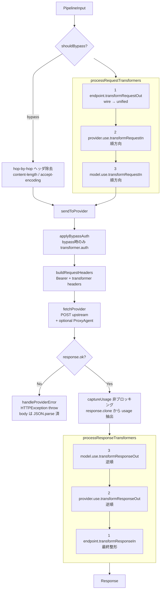

### bypass モード

導出された chain が単一かつ endpoint transformer と一致するとき発動。「unified に reshape する必要がなく、auth だけ被せれば良い」最短経路。inbound と provider の apiStyle が揃った組（gemini 面 → google provider、chat 面 → openai_chat provider）がこれに該当する。

### 各 transformer の責務

| transformer | 主な仕事 |
|-------------|----------|
| `anthropic` (endpoint) | inbound `/v1/messages` を unified に reshape、SSE を Anthropic スキーマに揃え直す |
| `openai` / `openai-responses` | `/v1/chat/completions` および Responses API のリシェイプ。出力上限は面ごとに名前が違うので、unified の `max_tokens` から `openai` が `max_completion_tokens` (gpt-5 系)、`openai-responses` が `max_output_tokens` に付け替える |
| `gemini` | Google Gemini 形式変換 |
| `claude-code-oauth` | Anthropic 直叩き subscription。`auth()` で `.credentials.json` の bearer token 注入 |
| `codex-oauth` | ChatGPT backend (codex) — openai-responses chain と組合せ |

登録されているのは**この6つで全部**である。`maxtoken` / `tooluse` / `reasoning` / `enhancetool`
といった旧ベンダーコード由来のユーティリティ系 transformer は存在しない（吸収時に消えた）。
プロバイダ別の差は上の6つの内部と `resolveInvocationForModel` の shaping で吸収している。

### captureUsage

`src/llms/pipeline/usage-extraction.ts`。非ブロッキング。`response.clone()` を別タスクで読み切り、
`UsageBlock` → `TokenStats` に整形して `deps.recordUsage({...})` を叩く。記録は `RequestLog` 行と
して DB に入る。失敗は黙って握り潰す（応答に影響しない）。

**読むのは `processResponseTransformers` の手前でクローンした、変換前の生の上流応答である。**
`sendToProvider` がそこでクローンするので、読める語彙は**面ではなくプロバイダ**のワイヤ形式で
決まる。つまり `UsageBlockSchema`（`src/schemas/domain/usage-record.ts`）が宣言していない綴りの
usage は、その面が正常に応答を返していても**行が1行も残らない** — Activity にもコスト集計にも
出てこない。gemini 面が既定の相方（Google プロバイダ）と組んだときはバイパス経路なので、
これは変換経路だけの問題ではなく通常運用でそのまま起きる。3つの綴りすべてを宣言してある:

| 出所 | 入力総量 | 出力 | キャッシュ読み |
|---|---|---|---|
| Anthropic | `input_tokens`（**非キャッシュ分のみ**） | `output_tokens` | `cache_read_input_tokens` / `cache_creation_input_tokens` |
| OpenAI Chat Completions | `prompt_tokens`（総量） | `completion_tokens` | `prompt_tokens_details.cached_tokens` |
| OpenAI Responses | `input_tokens`（総量） | `output_tokens` | `input_tokens_details.cached_tokens` |
| Gemini (`usageMetadata`) | `promptTokenCount`（総量） | `candidatesTokenCount` | `cachedContentTokenCount` |

`extractUsage` は `usage` と `usageMetadata` のどちらでも拾う（`usageFromEnvelope`）。

#### キャッシュ分の数え方は2つのベンダで逆

**足す前に、どちらの慣習かを判別しなければならない。** Anthropic の `input_tokens` は非キャッシュ
分だけで、キャッシュ分は隣に並ぶ（足して総量になる）。OpenAI の `cached_tokens` は SDK の型定義が
"Cached tokens present in the prompt" と書くとおり `prompt_tokens` / `input_tokens` の**内訳**で、
既に含まれている。Gemini も OpenAI 側の慣習に従う。

無条件に足すと、キャッシュ命中のある OpenAI / Gemini リクエストの入力が命中分ちょうど水増しされる。
`cachedInputTokens` は**どのフィールド名から来た数字か**で慣習を判定し
（`countedInsideReportedInput`）、`computeTokenStats` は行を書く前に

```
rawInput          = 内訳側なら reportedInput - cached（0 でクランプ）、そうでなければ reportedInput
totalInputTokens  = rawInput + cacheWrite + cacheRead
```

と Anthropic の慣習へ揃え直す。`RequestLog` の `inputTokens` は常に非キャッシュ分、
`totalInputTokens` はプロンプトにかかった全部、という一貫した意味になる。

### sessionId 解決

`resolveSessionId(context)`:
1. `headers.thread_id` (Codex)
2. `headers['x-claude-code-session-id']` (Claude Code)
3. それ以外は `randomUUID()`

---

## 7. 応答整形

`v1Route` ハンドラ末尾の `formatResponse(c, response, stream)`:

- **JSON** (`stream:false`) — body を一旦テキストで読み、`JSON.parse` してから `c.json(...)` で出力。
- **SSE** (`stream:true`) — upstream の body をそのままパススルー。`content-type: text/event-stream`、`cache-control: no-cache`、`connection: keep-alive` を強制。upstream の `content-encoding` / `transfer-encoding` は **除去** する（Bun fetch が auto-decompress 済のため、これらを転送すると Claude Code 側で double decompress (`ZlibError`) が出る）。`x-ratelimit-*` などのレートリミット系ヘッダは転送する。

---

## サブスクの 429 を 1 本のリクエストで追ってみる

例: `POST /v1/messages` (body.model = `claude-opus-4-8`, stream:true, 5h 窓 99%)

1. **HTTP** — `/v1/messages` → `anthropic` endpoint transformer マッチ。
2. **RoutePlan** — `classifyScenario` が opus ティアを heavy と見て `longContext` レーンへ寄せ、そのレーンの primary（ここでは `claude-code,claude-opus-4-8`）を採る。`applyProactiveFailover` は枯渇マークが無いので primary をそのまま維持する（**窓の使用率は見ない**）。
3. **buildFailoverChain** — `[claude-code,claude-opus-4-8]` + (subscription な fallbacks があれば追加)。api_key 系 fallback は auth_mode gate で除外。
4. **attemptChainEntry** — `resolveInvocationForModel` で per-attempt body 用意。
5. **runPipeline** (bypass) — `applyBypassAuth` が `claude-code-oauth.auth()` を呼んで、`.credentials.json` から bearer token を取得し `Authorization` ヘッダにセット。`anthropic-beta` から `context-1m-*` を落として `oauth-2025-04-20` を付加。
6. **fetchProvider** — `api.anthropic.com/v1/messages` に POST、SSE で返ってくる。
7. **upstream 429** — `handleProviderError` が `Error from provider(claude-code,claude-opus-4-8: 429): {…}` を throw。`body` は `JSON.parse` してネスト構造でログ。
8. **rotation** — `tryRotateAccount`:
   - `sessionId` (`x-claude-code-session-id`) でその request に紐付く `subAccountId` を取得。
   - `markAccountExhausted(subAccountId, resetAt)` でそのアカウントだけ exhaust。
   - `releaseAccountForSession` で sticky 解除。
   - 同 kind (`claude`) に未 exhaust の peer があれば `continue` で同 entry を再 attempt → `session-account-router` が peer アカウントを選び直す。
9. **success** — 2 周目で別アカウントが取れたら 2xx で SSE 開始、captureUsage が裏で usage を記録。
10. **client** — `formatResponse` が SSE をパススルー、`x-ratelimit-*` も中継。

ピアアカウントが残っていなければ `markProviderExhausted(provider.name)` → 次 chain entry へ。同 auth_mode の fallback も全て exhaust なら、最後に拾った 429 body を verbatim 返す。

---

## ログ整合と debugging tips

- `reqId` (sendToProvider 起点の UUID) を child logger に bind しているので、`reqId=xxx` で grep すると 1 upstream call の request / response / error が揃う。
- `[provider_response_error]` の `body` フィールドは構造化済み — pino-pretty / log viewer で展開できる。
- `provider 'X' skipped — missing required fields: api_key` の warn が出ていたら、その provider は **registry に存在しない**。router 解決もスキップされるので、`Used request-specified model — exact provider match` と `failover: provider not found; skipping` が同じ provider 名で連続することは無くなった（auth gate 修正後）。

---

## 関連ドキュメント

- [request-flow.md](./request-flow.md) — 本書の 3〜5 章を拡大した図とシナリオ早見表。
- [testing-map.md](./testing-map.md) — テストがどこにあり、何を担保しているか。
- [inbound-surfaces.md](./inbound-surfaces.md) — 受け口レジストリと、そこから導出されるもの。
