# LLM プロキシ全体パイプライン

## 目的

`/v1/*` に届いた 1 本のリクエストが、どの順序で、どのモジュールを通って、最終的にクライアントへ返るまでの **全体像** を描く。
[request-flow.md](./request-flow.md) はルーティング判断と 429 ローテーションだけを切り出した拡大図、[routing.md](./routing.md) はティアマップそのもの（データモデル・ゲート・結果・scheduler の snapshot）の参照。本ドキュメントは「サーバ起動 → 1 リクエスト処理 → upstream 呼び出し → 応答整形」の通し動線を扱う。

---

## レイヤ構造

Rialto は **「起動時 1 回だけ走る Bootstrap 層」 / 「リクエスト毎に走る Per-Request 層」 / 「常駐 State 層」** の 3 つに分かれる。
Bootstrap 層が State 層を組み立て、Per-Request 層がそれを読みながら 1 リクエスト処理する。

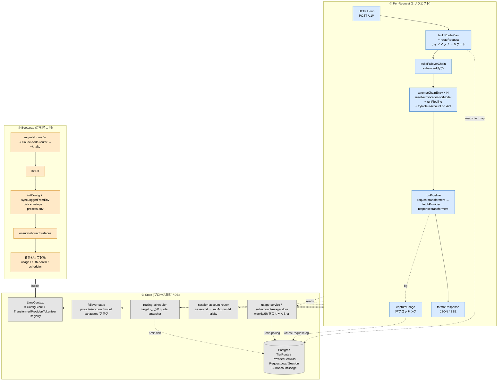

### 各層の役割と主なソース

| 層 | サブ層 | やること | 入力 → 出力 | 主なソース |
|---|---|---|---|---|
| ① Bootstrap | 0. migrateHomeDir | 旧 `~/.claude-code-router` を `~/.rialto` へコピー→検証→旧削除。**必ず最初**（`~/.rialto` が先にできると恒久 no-op になる） | disk → disk | `src/services/config/migrate-home-dir.ts` |
| | 1. initDir | `~/.rialto/` などホーム作成 | – | `src/services/config/envelope.ts` |
| | 2. initConfig | disk envelope を読み、HOST/PORT/LOG_LEVEL/PROXY_URL を `process.env` に反映。直後に `syncLoggerFromEnv()` が LOG_LEVEL を既存 pino に再適用 | disk → env | `src/services/config/envelope.ts`<br/>`src/logger.ts` |
| | 3. ensureInboundSurfaces | 全面に明示的な `routingMode` 行を入れる（既存行は不変） | – → DB | `src/services/inbound-surface-service.ts` |
| | 4. 背景ジョブ | usage capture / auth health / routing scheduler。いずれも fire-and-forget で boot をブロックしない | – | `src/services/usage-job.ts` ほか |
| ② State | LlmsContext | 4 registries を 1 個に束ねた lazy singleton。DB-backed config 変更時に `resetLlmsContext()` で再生成 | AppConfig → ctx | `src/llms/context.ts` |
| | failover-state | provider / sub-account / (provider, model) 単位の枯渇フラグ。`until` 時刻 or default 5min で失効 | – | `src/services/failover-state.ts` |
| | routing-scheduler | 有効なサブスクプロバイダの有効なモデルごとの quota snapshot（`exhausted` / `remainingBudgetPct` / `resetAt`）。5 分 tick、Refresh と Codex のリセット消費の直後にも作り直す。セレクタの quota ゲートが読む | DB → mem | `src/services/routing-scheduler/` |
| | session-account-router | session → 選択 sub-account の sticky マップ | – | `src/services/session-account-router.ts` |
| | usage-service | 5h / weekly ウィンドウのキャッシュ。背景 polling で更新。**ルーティング判断には使われない**（Overview / Subscriptions の表示とアカウント選択の材料） | DB → mem | `src/services/usage-service.ts` |
| | Postgres | `Provider`/`Model`/`ProviderTierAlias`/`RouterPreferenceProfile`/`TierRoute`/`InboundSurfaceConfig`/`Session`/`RequestLog`/`SubAccountUsage` ほか（`RouterSlot` / `RoutingPreset` は無い。退役した `RouterPreferenceEntry` / `RoutingWeightChange` は contract migration まで残るが、backfill 以外は読まない） | – | `src/prisma/schema.prisma` |
| ③ Per-Request | HTTP | エンドポイント (`/v1/messages` 等) → 面記述子 → endpoint transformer 解決 | HTTP → ctx | `src/api/v1/route.ts` |
| | RoutePlan | body parse + ティアマップによるルーティング + persona append。枯渇の 429 と拒否の 400 はここで返す | body → RoutePlan | `src/api/v1/route-plan.ts`<br/>`src/llms/router.ts`<br/>`src/llms/tier-router/` |
| | FailoverChain | primary + fallbacks を exhausted マークで絞る（auth_mode では絞らない） | RoutePlan → string[] | `src/api/v1/candidate-chain.ts` |
| | ChainEntry loop | 各 entry を試し、429 ならアカウントを回し、それでも駄目なら次へ | string → Response | `src/api/v1/chain-failover.ts` |
| | runPipeline | request transformers → fetch → response transformers の本処理 | invocation → Response | `src/llms/pipeline.ts` |
| | captureUsage | **変換前の** response.clone() から usage を抽出、`RequestLog` に書く（非同期、応答ブロックしない） | Response → DB | `src/llms/pipeline/usage-extraction.ts` |
| | formatResponse | JSON は `c.json` 再シリアライズ、SSE は body そのままパススルー（ヘッダ整理） | Response → 出力 | `src/api/v1/route.ts:formatResponse` |

### 図の読み方

- **矢印** = 「呼び出し方向」。Bootstrap が State を組み、Per-Request が State を読み書きする。
- **太線 `==builds==>`** = 1 回だけ起こる初期化。
- **点線 `-.reads.->` / `-.read/write.->`** = リクエストごとに発生する State 参照。
- **`R5 -.bg.-> R6`** は **非ブロッキング** の usage 記録。応答返却を遅らせない。

---

---

## 試行順序 — provider と sub-account はどの順番で叩かれるか

### ざっくり図

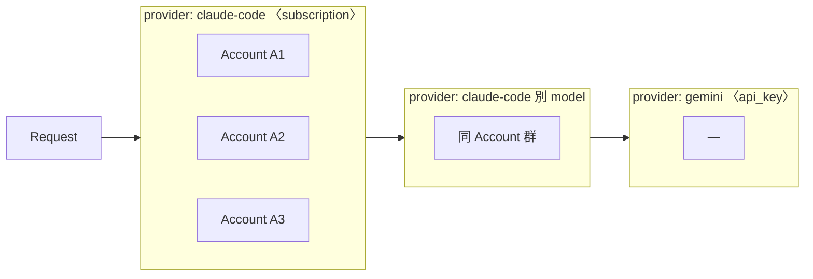

- リクエストはまず **primary の provider** に入る（要求ティアのルートのうち、セレクタのゲートを通った先頭）
- その provider 内で **未枯渇の sub-account** を 1 つ選んで試す（同 session は粘着、初回は balancingScore で選択）
- 429 を受けたら **同 provider の別 account** に回す（最大 10 回）
- 同 provider の peer が尽きたら **次の chain entry**（そのティアの次のルート）へ
- **chain の順序は operator がティアマップに書いたとおり** — subscription のルートの後ろに api_key（例: gemini）のルートを書けば、そこへ落ちる。auth_mode で弾くゲートは無い


429 が出るたびに、その account を一定時間 (実 resetAt または 5 分) ロックして、**残っている peer** から再選択する。
全 peer が枯れたら **その `(provider, model)` をロック**（5 分）→ 次の `provider,model` entry へ進む。
provider 全体をロックするのは `insufficient_quota`（api_key の課金上限）のときだけである — それは同 provider の
どのモデルでも同じ 429 になるが、サブスクの窓切れは別モデルなら通ることがある（Fable の週次窓だけが尽きた等）。

---

### 二重ループの構造

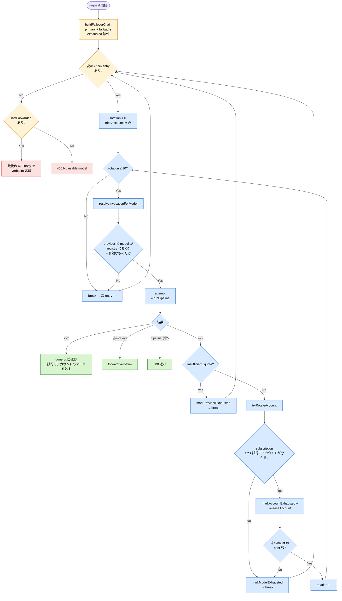

- **黄系 (outer)** = 外側 chain ループの判断点
- **青系 (inner)** = 内側 account rotation の判断点
- **緑** = 正常終了 / **赤** = 全 fallback 尽きた終了

**重要なルール:**

1. **chain は最初に 1 回だけ作る** — `buildFailoverChain` は entry 開始時のスナップショット。途中で新しい fallback が現れることはない。
2. **chain の順序は operator の記述そのもの** — 要求ティアのルートを、ティアマップに書かれた順に並べたもの（ゲートで落ちたルートを除く）。auth_mode gate は廃止された。primary が subscription でも、後ろに書いた api_key のルートはそのまま走る。落としたくなければルートに書かない。
3. **同 provider の fallback も通る** — 枯渇マークは `(provider, model)` 単位なので、Fable の 429 で同 provider の Opus のルートへ逃げるのは正当。peer が尽きたときに付くのも `markModelExhausted`（その model だけ）である。ただし 5h/weekly quota は **account 単位** で全 model 共通なので、account が枯れた 429 では別 model でも同じ account で 429 になる。provider ごと塞ぐのは `insufficient_quota` の `markProviderExhausted` だけ。
4. **無効な provider / model は chain に載らない** — `loadTierProfileView` がエイリアスの先の `Model.enabled && Provider.enabled` を `targetEnabled` に折り込み、セレクタがそのルートを落とす。registry も有効なものしか持たないので、ルートの target でも passthrough の `provider,model` でも、無効な pair は `resolveInvocationForModel` が null を返して skip される。
5. **sub-account は OAuth transformer の `auth()` 内で選ばれる** — chain ループはアカウント名を知らない。transformer が選んだアカウントをその試行の request に `subAccountId` として stamp するので、429 が返ってきたらそれを読む。session 単位の `getActiveAccountForSession(sessionId)` は同じ session の並行リクエストに上書きされうるため、transformer がアカウントを解決する前に失敗した試行のフォールバックでしかない。候補になるのは**有効な provider** の有効な account だけ（`getSubAccountTokensForKind` が `Provider.enabled` で絞る）。
6. **アカウント選択は 4 段** — `src/services/session-account-router.ts` の順序どおり:
   1. in-process の枯渇マップが reactive に落としたアカウントを除外。
   2. **DB に記録された rate-limit 状態**で、このリクエストを拘束する窓が `HARD_LIMIT_PCT`（99 %）以上かつ `resetAt` が未来のアカウントを除外。どの窓が拘束するかは `windowBinds` が決める — account 全体の 5h / 7d（codex は primary / secondary）は全 model、per-model の 7d（Fable など）はその model だけ。
      `SubAccountUsage` の値は上流が返したとおりで、畳み込みはしない。account 全体の 5h / 7d はどの model に対しても拘束するので、どちらかが 100 % ならこの段で除外されるし、他の窓を 100 % に引き上げても判断は変わらない。
      **account 全体の窓（5h か 7d）のどちらかが 100 % に達したら残りの窓も 100 % 扱い（リセットは到達した窓のうち遅い方）にするのは、quota snapshot を出す routing-scheduler の中だけ。** 上流は到達後も他の窓を自分の値のまま返す（7d 到達なら 5h ≈ 0 %、5h 到達なら 7d や Fable は到達前の値）が、実際には全リクエストが拒否される。scheduler の Fable の残り予算とリセット時刻（`Retry-After` の元）は scoped 窓しか見ないので、tick が `SubAccountQuota` を読み込むときに畳み込む（`routing-scheduler/account-limit.ts`）。per-model 7d の到達はその model だけの話なので、他の窓には波及させない。codex の primary / secondary も同じ。
      以前は usage 取得時に畳み込んでいたため、キャッシュ・`SubAccountUsage`・`SubAccountQuota`・`UsageSnapshot` に 100 % 扱いの値がそのまま書かれ、Activity → Usage などに「5-hour のリセットが 1 日後」「7-day だけが Fable より何日も早くリセット」といった上流が返していない値が出ていた。保存と表示は上流の値、100 % 扱いはルーティングの判断、と分けてある。
   3. 生き残りの中に sticky マッピング（同じ `sessionId` = `x-claude-code-session-id`）が指すアカウントがあれば、それを再利用（prompt cache の連続性）。
   4. それも無ければ "weekly 窓の残り % ÷ リセットまでの残り時間" が **最高** のアカウント。一番余裕のあるアカウント優先ではなく、**消化を急ぐ必要があるアカウント** から優先する。

   1〜2 で全滅した場合は全候補に戻して「一番マシなもの」を返す。ここで null を返すとクライアントに 401 が出るが、送って 429 をもらう方が厳密に良い。
7. **rotation 回数の上限は MAX_ACCOUNT_ROTATIONS = 10** — 同じ entry で 11 回 attempt しても駄目なら次の entry へ進む（防御的キャップ）。
8. **exhausted の失効** — account マークは `until` 時刻（その account の DB の使用量から取った実 resetAt）、model / provider マークと resetAt が取れなかった account マークは **5 分** で自動失効。窓が転がれば自然に復活する。それより早く外れるのは、その account の試行が成功したとき（account マーク）と、手動 Refresh / Codex のリセット消費で最新の値が上限を下回ったとき（account マークと model マーク。provider マークは外さない）。

### sub-account のスコアリング詳細

`session-account-router.ts:balancingScore`:

```
score = (100 - 当該 weekly 窓の使用率%) / 窓のリセットまでの残り時間ms
```

- 「残り % が大きい / 残り時間が短い」アカウントほど高スコア。
- 高スコア = **そのアカウントの容量を急いで消化しないと残してしまう** → 優先的に選ぶ。
- 結果として **使用率が低い & 残り時間が短い** アカウントが先に使われ、weekly drain が均される。

### 具体例で追う

**前提**

| Provider | auth_mode | hosts | ティアエイリアス | sub-accounts |
|----------|-----------|-------|------------------|--------------|
| `claude-code` | subscription | claude-sonnet-4-6, claude-opus-4-8 | sonnet → claude-sonnet-4-6、opus → claude-opus-4-8 | A1, A2, A3 |
| `gemini` | api_key | gemini-2.5-pro | sonnet → gemini-2.5-pro | – |

**`live` profile のティアマップ（要求ティア `sonnet`）**

| priority | ルート | エイリアスで解決した target |
|------|-------|-------|
| 1 | `claude-code · sonnet` | `claude-code,claude-sonnet-4-6` |
| 2 | `claude-code · opus` | `claude-code,claude-opus-4-8` |
| 3 | `gemini · sonnet` | `gemini,gemini-2.5-pro` |

**chain 構築結果**（`body.model = claude-sonnet-4-6` → 要求ティア `sonnet`）

| step | 結果 |
|------|------|
| セレクタの primary + fallbacks | `[claude-code,sonnet-4-6, claude-code,opus-4-8, gemini,gemini-2.5-pro]` |
| exhausted 除外 | (どれも生きてれば) そのまま。api_key の `gemini` も**そのまま残る** — auth_mode で弾くゲートは無い |

#### ケース A: 何事もなく成功

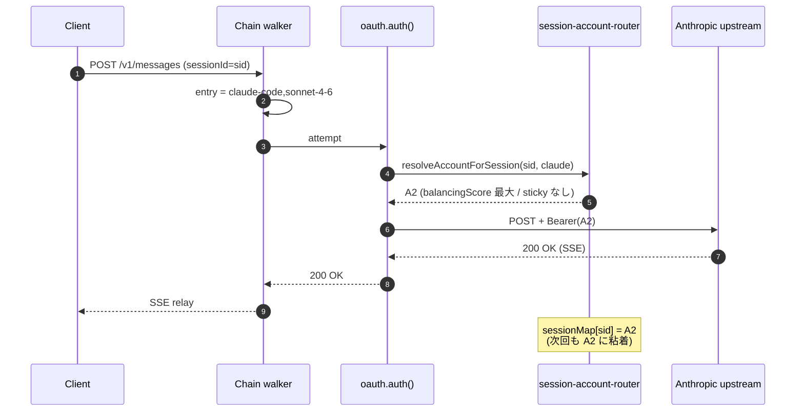

#### ケース B: sub-account の 429 で peer に回って成功

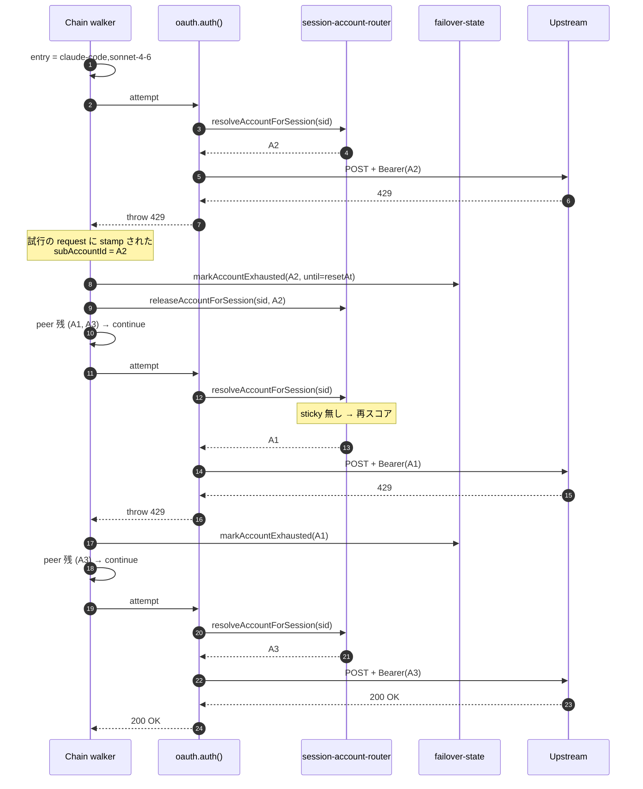

#### ケース C: provider 全アカ枯渇 → 同 provider の別ティアのルートへ → api_key の gemini へ

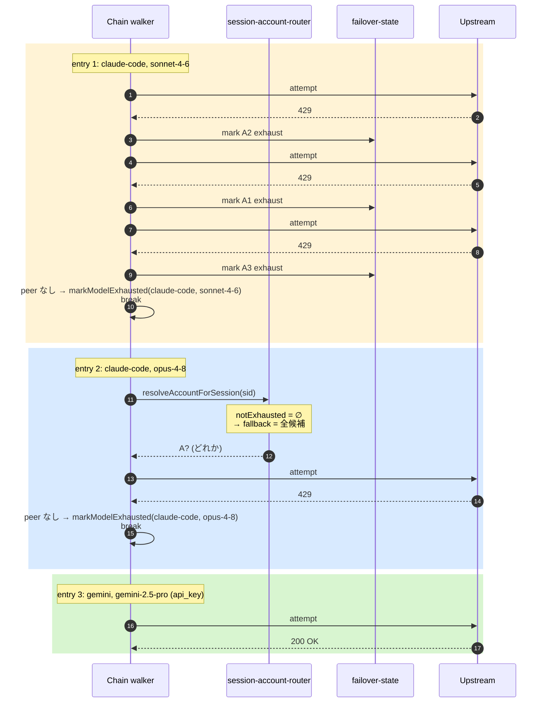

> `session-account-router` は "全部 exhaust なら notExhausted 空 → fallback で全候補に戻す" 設計（401 を返すよりは送って 429 を素直にもらう方が良い、という判断）。そのため entry 2 でも 1 回は upstream を叩く。
>
> entry 3 の `gemini` は api_key provider だが、ルートに書いてある以上そこへ落ちる。これが嫌ならルートに書かない。
> `gemini` も枯れていれば chain 全 exhaust で、`lastForwarded`（最後の 429 body）を verbatim 返却する。

#### ケース D: 直前の 429 のマークで、送る前にルートが外れるケース

**直前のリクエスト**が 429 を食って `failover-state` に枯渇マークが残っているとき、次のリクエストでは
ティアのセレクタが quota ゲートでそのルートを落とし、次のルートを primary にする。マークを付ける
のは reactive 経路であって、セレクタは**それを読むだけ**である。かつての `applyProactiveFailover` の
ような、選んだ後にもう一度歩く段は無い — 枯渇と context のゲートはセレクタに吸収された。

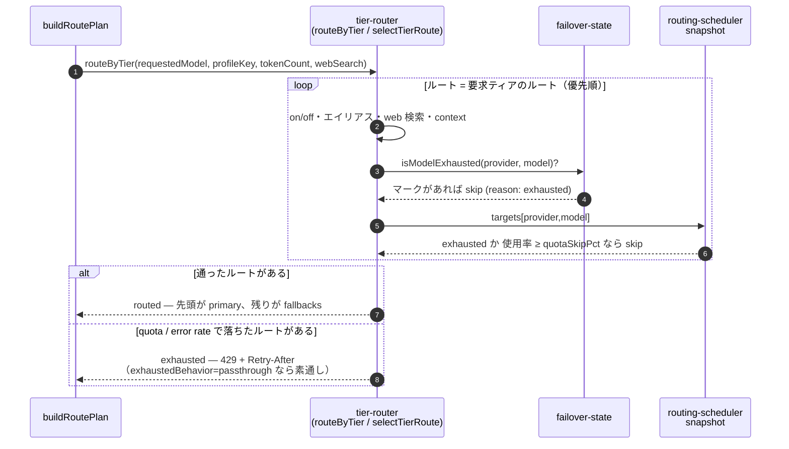

> 枯渇マークは **モデル単位が基本**で、プロバイダ単位のマークもORで効く（`isModelExhausted`）。
> Fable の 429 が Fable だけを塞ぎ、同一プロバイダ上の Opus のルートには到達できるようにするためである。
> プロバイダ単位のマーク（`insufficient_quota`）はプロバイダ全体を塞ぐので、そのときは同 provider 別モデルでも救えない。
> ティアのルートが全部落ちたとき、以前は primary を維持して reactive の 429 経路に任せていたが、いまは
> セレクタが `exhausted` を返し、`buildRoutePlan` が upstream へ出さずに 429 + `Retry-After` を返す
> （`Retry-After` はマークの期限 → snapshot の `resetAt` → どちらも無ければ 30 秒）。

### よくある勘違い

| 勘違い | 実際 |
|--------|------|
| 「subscription の primary から api_key の fallback には落ちない」 | 落ちる。auth_mode gate は廃止され、ルートの順序どおりに辿る。落としたくなければルートに書かない |
| 「sub-account は順番に A1 → A2 → A3 と試される」 | balancingScore でソート、同じ session は sticky |
| 「429 出るたびに chain を作り直す」 | chain は entry 開始時 1 回スナップショット。途中で増減しない |
| 「sticky は永続」 | アカが exhaust マークされた瞬間 `releaseAccountForSession` で破棄 |
| 「provider exhausted は config 修正まで解けない」 | `until` 時刻 (default 5min / 実 resetAt) で自動失効 |
| 「週次が減ってきたら先回りで切り替わる」 | weekly drain guard は廃止済み。上流の上限まで走り、実際の 429 で切り替わる。先回りに近いのは profile の `quotaSkipPct` だけで、既定の 100 では残り 0 % になるまでルートを外さない |
| 「bare な model 名を投げれば provider を探してくれる」 | `routed` な面では要求ティアのルートが使われる。ルートが無い・全部 off のとき、あるいは `passthrough` な面では、bare 名を**有効な**プロバイダがちょうど 1 つ hosts している場合に限りそこへ送る。曖昧・未知・無効なら skip |
| 「`<RIALTO-SUBAGENT-MODEL>` の中身のモデルに飛ぶ」 | 中身は読まない。有無さえルートを変えない — タグは routed でも passthrough でも最初に取り除かれ、`RequestLog.isSubagent` に記録されるだけ。サブエージェントのリクエストも、自分が要求したティアのルートに従う |
| 「同 provider 別 model を fallback に入れれば安心」 | 入れてよいし、model 単位の 429（Fable だけ枯れた）には効く。ただし 5h/weekly は account 単位の制限なので、account が枯れた 429 では model を変えても同じ account で同様に 429 |
| 「Providers 画面で model を OFF にしても、ルートに残っていれば送られる」 | 送られない。`loadTierProfileView` がエイリアスの先の on/off を `targetEnabled` に折り込んでセレクタが落とし、registry にも無いので `resolveInvocationForModel` も skip する。passthrough で手で名指ししても同じ |
| 「ルートが空なら 429 になる」 | ならない。ルートが 1 本も無い（か全部 off の）ティアは `exhaustedBehavior` に関係なく呼び出し側の `body.model` を素通しする。429 は「quota か error rate で落ちたルートがある」かつ `exhaustedBehavior='429'` のときだけ |
| 「Haiku の要求は、ルートに Sonnet しか無ければ tier が合わずに落ちる」 | tier を合わせるゲートは無い。`haiku` の行に `claude-code · sonnet` と書けば Haiku の要求は Sonnet へ行く。代替は表に明示的に書くもので、書いていなければ `haiku` のルートは無い = passthrough |
| 「新しいモデルが出たらルートを張り替える」 | 張り替えるのはプロバイダのティアエイリアス 1 行だけ。ルートはプロバイダとティアを指し、モデルを指さない。エイリアスは自動では動かない — Refresh は候補を示すだけ |
| 「設定が合わないと 429 が返る」 | 返らない。エイリアス未設定・web 検索非対応・context 不足で全ルートが受けられないときは 400（面のエラー封筒）。429 は quota と error rate だけ |

---

## 0. プロセス起動

`src/index.ts` のトップレベル文（`getServer()` のような関数は無い。モジュール評価がそのまま起動シーケンス）:

1. `migrateHomeDir()` — 旧 `~/.claude-code-router` を `~/.rialto` へ移す。**この文が最初でなければならない**: 移行の冪等条件が「宛先が既に存在する」なので、`initDir()` でも logger の初回ファイル書き込みでも、先に `~/.rialto` を作った時点でコピーは恒久的な no-op になり、運用者は無言で空の設定から始まってしまう。`RIALTO_HOME_DIR` でホームが別の場所に固定されているときはスキップする。
2. `initDir()` — `~/.rialto/` などのホームディレクトリ確保。
3. `initConfig()` — disk envelope を読んで `HOST` / `PORT` / `LOG_LEVEL` / `PROXY_URL` などを `process.env` に反映。続けて `syncLoggerFromEnv()` が、import 時に構築済みの pino インスタンスへ `LOG_LEVEL` を再適用する。
4. `ensureInboundSurfaces()` — 全面に明示的な `routingMode` 行を入れる。
5. `startUsageCapture()` / `startAuthHealthCheck()` / `startRoutingScheduler()` — 背景ジョブ。Redis 到達性などで boot をブロックしない。

**`runJsonToDbMigration()` は存在しない。** 旧 `config.json` の `Providers` を Postgres へ
lift する一回限りの移行は削除済みで、流れは逆向きになった: `syncToConfigFile()`
（`src/services/config/sync-to-disk.ts`）が CRUD のたびに DB の `Providers` を
`config.json` へ**書き戻す**。ディスク上のこのキーは読み取り専用のミラーであり、手で編集しても
次の保存で上書きされる。`Router` はもうミラーされない — ミラーする実体（RouterSlot）が無い。
旧ビルドが残した `Router` / `CUSTOM_ROUTER_PATH` / `LiveRoutingName` / `CROSS_PROVIDER_FALLBACK`
は読み取り時に剥がされ（`RETIRED_ENVELOPE_KEYS`）、次の保存でディスクからも消える。廃止された管理キー
`APIKEY` も同じ扱いで、`process.env` へは反映されない。

`loadFullConfig()`（`src/services/config/compose.ts`）はいまも存在するが、起動時ではなく
`buildLlmsContext` から遅延で呼ばれる。DDL とシード行もここでは作らない — `entrypoint.sh` が
`prisma migrate deploy` と `prisma db seed` をこのプロセスの exec 前に走らせる。

ここで作るのは **設定スナップショット** のみ。Provider/Transformer の実体は後段 `LlmsContext` で組み立てる。

---

## 1. LlmsContext

`src/llms/context.ts:buildLlmsContext`。最初のリクエストで lazy build され、DB-backed config 変更時は `resetLlmsContext()` で破棄される。

### 構成物

| メンバ | 中身 | 読まれる場所 |
|--------|------|--------------|
| `config: ConfigStore` | Providers（有効な provider の有効な model だけ）/ Personas / ActivePersona / 各種スカラを key で引ける薄いラッパ。`Router` は載らない。ティアマップも載らない — それはリクエストごとに Postgres から読む（`loadTierProfileView`） | routeRequest（persona）, chain-failover |
| `transformers: TransformerRegistry` | endpoint transformer 群 (`anthropic`, `openai`, `openai-responses`, `gemini`, `claude-code-oauth`, `codex-oauth`) | endpointTransformerMap |
| `providers: ProviderRegistry` | name → ResolvedProvider Map。`api_base_url` / `api_key` 揃ったものだけ登録 | resolveInvocationForModel |
| `tokenizers: TokenizerRegistry` | 既定は tiktoken (cl100k_base)。`@huggingface/tokenizers` を使うモデル精確なバックエンドと、API 集計バックエンドも登録できる（`src/llms/tokenizers/`） | routeRequest の token 数計上（context ゲート） |
| `log: pino.Logger` | ベースロガー。`reqId` で child を切る | 全レイヤ |

### transformer chain の導出

chain は設定項目ではない。登録されている6つの transformer はどれも endpoint 束縛（`anthropic` / `openai` / `openai-responses` / `gemini`）か auth 束縛（`claude-code-oauth` / `codex-oauth`）で、選ぶ余地が無いため、chain は `Provider.apiStyle` + `Provider.authMode` の**関数**として `src/shared/transformer-chain.ts` が導出し、`ProviderRegistry` が Transformer インスタンスに解決する。`provider.transformer.use` は読まれない（古い build が書き残した値は compose 時に落とす）。

| apiStyle | api_key | subscription |
|---|---|---|
| `anthropic` | `anthropic`（単独） | `claude-code-oauth` |
| `openai_chat` | `openai` | — 未対応 |
| `openai_responses` | `openai-responses` | `openai-responses` → `codex-oauth` |
| `gemini` | `gemini` | — 未対応（Phase 3-2） |

`anthropic` / api_key が `anthropic` 1 段なのは、ネイティブ経路に乗せるためである。unified 形は Chat の形であって Anthropic のワイヤ形ではないので、`anthropic` には外向きの変換段が無い。chain を空にすると native passthrough にはならず、Anthropic → unified の変換をしたまま Chat 形の body を送ってしまう（Claude Code の classifier リクエストが壊れていた — [anthropic-native-classifier.md](./anthropic-native-classifier.md)）。`anthropic` 単独なら chain 長 1 が `/v1/messages` の endpoint transformer と一致して **bypass モード**に入り、リクエストをそのまま送る。`claude-code-oauth` の前に `anthropic` を積まないのも同じ理由による。「未対応」の組は chain が null になり、provider は登録されない — placeholder キーで upstream を叩かせないため。

`Model.apiStyle` が provider と食い違うモデル（api_key openai provider 上の codex 系）は、その差分だけをモデル別 chain として provider chain の後段に足す。

### Subscription overlay

DB 上では subscription provider の `api_key` は null。これだと `ProviderRegistry.registerFromConfig` の sanity check で落ちるので、`applySubscriptionAuth` がメモリ上で `api_key: 'oauth'` をスタンプし、credential（`subscriptionCredentialPath` / `subscriptionAuth`）を `provider.transformer` に載せる。chain の選択はしない（上記の導出が担う）。OAuth の bearer token は disk の `~/.claude/.credentials.json` から **リクエスト時に** transformer.auth() が読む。

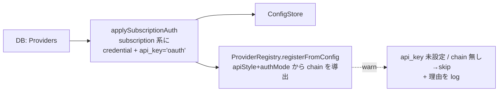

---

## 2. HTTP 層

```ts
v1Route.post('/v1/*', async (c) => {
  const ctx = await getLlmsContext()
  ...
})
```

ルートのマウント自体が面レジストリ由来で、`INBOUND_SURFACES` の各 `endpoint`
(`/v1/messages` / `/v1/chat/completions` / `/v1/responses` / `/v1beta/models/:modelAndAction`)
に POST ハンドラが張られる。transformer は**実パス一致ではなく `surface.endpoint`** で引く
（gemini はモデル名がパスに入るので実パスと `endPoint` が一致しない）。一致しなければ即 404。

認証・アクセスログのマウントも同様で、`INBOUND_MOUNT_PREFIXES`（面と catalog パスから導出した
`/v1/*` `/v1beta/*` のワイルドカード集合）に対して `index.ts` が一括で張る。`inboundProxyAuth`
が面の `auth` フィールドで `GATE_BY_CREDENTIAL` を引き分けるので、**1リクエストにつきゲートは
1つだけ**走る。

---

## 3. RoutePlan 構築

`src/api/v1/route-plan.ts:buildRoutePlan`。

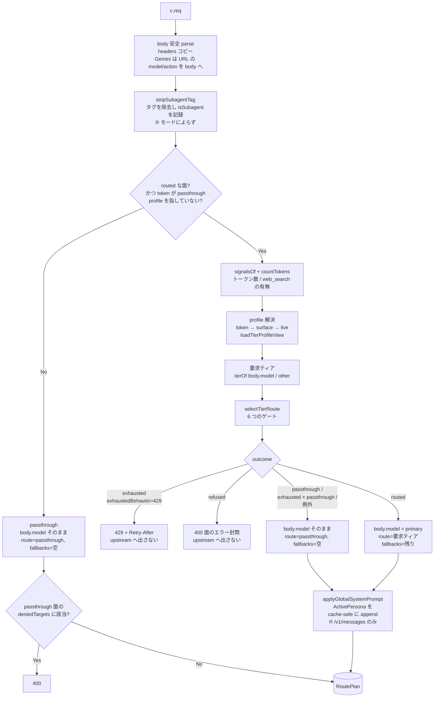

### routeRequest の段階

`src/llms/router.ts`→ `src/llms/tier-router/runtime.ts:routeByTier`
→ `src/llms/tier-router/select.ts:selectTierRoute`。ゲートと結果の全体は [routing.md](./routing.md)
が正で、ここでは各段が何を読むかを押さえる。**bare 名からプロバイダを逆引きする段は無い** —
それは chain walker 側の `resolveInvocationForModel` が、ルートが何も取らなかった（あるいは
passthrough の）ときに、有効なホストがちょうど 1 つあれば行う。

**段階 0 — サブエージェントタグ**
`stripSubagentTag(body.system)` が system[1] のタグの**有無**を返し、閉じたタグを in-place で除去する。
`RIALTO-SUBAGENT-MODEL` / `CCR-SUBAGENT-MODEL` のどちらでもよい。**モードより先**に走るので、
passthrough の面でも内部マーカーは上流へ漏れず、`isSubagent` も記録される。**タグは何も選ばない** —
レーンはもう無く、サブエージェントのリクエストも自分が要求したティアのルートに従う。記録は Activity が
サブエージェントのトラフィックを見分けるためだけにある。

**段階 1 — モード**
面の `routingMode` が `passthrough`、または認証したトークンの `profileKey` が予約キー `passthrough`
（面の `profileKey` がそれを指していても同じ）なら、ここで終わり。`body.model` は触らず、
`route='passthrough'` / fallbacks `[]` を stamp して返る。persona も付かない。

**段階 2 — シグナルとトークン数**
`signalsOf(req)` が面ごとの語彙の違いを吸収して `{ tokenize, webSearch, … }` を作り
（`src/llms/router/surface-signals.ts`）、トークナイザが `signals.tokenize` を数える。
Responses の呼び手は会話を `input` に、Gemini は `contents` に載せるので、`body.messages` を直に数えない。
数えた値は context ゲートが、`webSearch` は web 検索ゲートが読む。

**段階 3 — profile**
トークンの `profileKey` → 面の `profileKey` → `live`（`DEFAULT_PROFILE_KEY`）。`loadTierProfileView` が
1 回だけ読み、各ルートを「そのプロバイダのそのティアのエイリアス」でモデルへ解決する。解決できた
ルートには `targetEnabled`（`Model.enabled && Provider.enabled`）、`hostsWebSearch`、`contextWindow`
（`Model.contextWindow`）が付く。

**段階 4 — 要求ティア**
`tierOf(body.model)` — モデル名の部分一致で `fable` / `opus` / `sonnet` / `haiku`。どれでもなければ `other`。
effort も thinking もトークン数も、どのティアのルートを使うかには関わらない。旧分類器が見ていたこれらの
シグナルで行き先を変えたいなら、ティアマップにルートとして書く。

**段階 5 — 選択**（`selectTierRoute`）
そのティアのルートを優先順に歩き、6 つのゲート（ルートと target の on/off → エイリアス → web 検索 →
context → quota → error rate）を順に掛ける。通ったものが `[primary, ...fallbacks]` になる。
結果と `body.model` の関係:

| outcome | `body.model` | fallbacks / 応答 |
|---|---|---|
| routed（通ったルートがある） | 先頭ルートの `provider,model` | 残りのルート。route = 要求ティア |
| exhausted（quota か error rate で落ちたルートがある）、`exhaustedBehavior='429'`（既定） | 触らない | — `buildRoutePlan` が 429 + `Retry-After` を返し、upstream へ出さない |
| 同上、`exhaustedBehavior='passthrough'` | 触らない | `[]`。route = `passthrough` |
| refused（ルートはあるが、エイリアス未設定・web 検索非対応・context 不足でどれも受けられない） | 触らない | — `buildRoutePlan` が面のエラー封筒で 400 を返す。**`exhaustedBehavior` は見ない**（待っても変わらない） |
| passthrough（ルートが 0 本、または全部 off） | 触らない。**`exhaustedBehavior` は見ない**（未設定のティアは「意見無し」であって「全部枯渇」ではない） | `[]`。route = `passthrough` |
| ティアマップの読込失敗（Postgres 不在）/ トークナイザやルーティングが例外 | 触らない。error ログ、route = `passthrough`、`isSubagent` はタグから | `[]` |

skip 理由が混ざったときは exhausted が refused より、refused が passthrough より優先する。どれか 1 本でも
quota か error rate で落ちていれば、待てば通る見込みがあるからである。

`Retry-After` は、quota で落ちたルートのうち最も早く戻るものまでの秒数: 429 経路が付けたマークの期限、
無ければ scheduler の snapshot の `resetAt`、どちらも無ければ 30 秒。

`body.model` が書き換わるのはルートの target に置き換えるときだけ。振り先を捏造する経路は無い。
テストは `__tests__/llms/route-request.test.ts` と `__tests__/llms/tier-router/select.test.ts`。

**persona** — routed な面の `/v1/messages` では、どの出口（routed / passthrough / 例外）でも
`applyGlobalSystemPrompt` が ActivePersona を append する。persona はインストールの属性であって、ルートが
見つかったかどうかの属性ではない。OpenAI 形の面には付けない（top-level の未知パラメータを拒否する
upstream がある — codex がその例）。passthrough の面では付かない。

#### トークン数と context ゲート

トークン数は `tool_result` の配列 content をブロック単位で数える。中に入れ子になった image /
document の base64 は（トップレベルの image ブロックと同じく）0 として数える — 文字列化して
数えていた頃はスクリーンショット 1 枚が 100 万トークンになり、以後のリクエストが全部
`longContext` シナリオに分類された。いまこの数を読むのは context ゲートなので、数え過ぎはそのまま
「どのルートの context window にも収まらない」= 400 になる。

`contextWindow` が未知（`null`）のモデルは context ゲートで止めない（unknown = allow）。
先に一律のしきい値で振り分ける `longContext` シナリオは廃止された — 大きすぎるリクエストは、
収まらないルートを飛ばして次のルートへ行き、どれにも収まらなければ 400 になる。

上流へ送る変換も同じ扱いにしてある。Anthropic → unified の変換（`toolResultContent`）は
`tool_result` の配列 content を `JSON.stringify` していたため、Read で読んだスクリーンショットが
base64 のままプロンプトのテキストとして上流に届き、Codex ではコンテキスト長を超えて
ストリーム途中の `response.failed` になっていた（その会話の以後のターンもすべて同じく失敗する）。
今は unified の tool メッセージが画像を image part のまま持ち、Responses では
`function_call_output.output` の `input_image` 配列として送る。tool メッセージに画像を
載せられない Chat Completions と Gemini では、`liftToolResultImages` がそれを tool メッセージ群の
直後の user メッセージへ移す。

### 先回りの failover は無い

`applyProactiveFailover` は廃止された。以前はセレクタが選んだ後にもう一度 `[primary, ...fallbacks]` を
歩き、枯渇マークと context window で候補を落としていたが、その 2 つはいまセレクタのゲートそのもので、
選ぶ時点で済んでいる。2 回目の歩きには何も残っていない。

**weekly drain guard も廃止された。** 以前は subscription の週次ウィンドウが線形ドレイン
目標を超えていないかを見て先回りで切り替え、その余裕幅を `Router.weeklyDrainMarginPct` で
調整していた。どちらも削除済みで、schema にも実装にも残っていない。subscription は上流の上限まで
走り（profile の `quotaSkipPct` を下げればその手前で外れる）、実際に返ってきた 429 に反応してローテーションする。

`getKindWindowHeadroom` / `drainTarget` は `src/services/usage-service/` に残っているが、
リクエスト経路からは呼ばれない（現在の呼び出し元はテストのみ）。

### RoutePlan の中身

| field | 用途 |
|-------|------|
| `routedBody` | ティアマップのルーティングを当てた **per-model shaping 前** の body |
| `headers` | inbound headers コピー |
| `transformersByName` | このエンドポイント用 transformer の name → instance |
| `defaultTransformer` | bypass で使う 1 個目 |
| `route` | 要求ティア（ルートが取ったとき）か `passthrough`。`RequestLog.scenario` 列（名前はティアマップ以前のまま）に記録され、Activity が Route として出す |
| `primaryModel` | `provider,model` 文字列 |
| `requestedModel` | クライアントが投げてきた元の `body.model`。`RequestLog` に「何を頼まれたか」を「何を送ったか」の隣に残すため |
| `isSubagent` | サブエージェントタグの有無。`RequestLog.isSubagent` に記録するだけで、何も選ばない |
| `fallbacks` | セレクタがゲートを通したルートの残り（primary の後ろ、ティアマップの順）。ルートが取らなかったときは空。`buildFailoverChain` は引き直さずこれを読むので、セレクタが選んだ順と reactive 経路が歩く順が必ず一致する |
| `accountSessionKey` | サブアカウント picker が粘着するキー。ヘッダに session id が無ければ `token:<id>`、それも無ければ `anonymous` |
| `accessTokenId` | このリクエストを認証した `AccessToken`。Activity がクライアント単位に支出を帰属させるため |
| `path` / `search` | upstream に投げ直す URL 構築用 |

---

## 4. Failover Chain

`buildFailoverChain(plan)`:

- `plan.fallbacks`（セレクタが既に解決済みのルートの残り）を読む。ここで引き直さないのは、セレクタが選んだチェーンと reactive 経路が歩くチェーンを必ず一致させるため。
- 先頭に primary、続けて fallbacks。重複排除。
- 既に exhausted な `(provider, model)` を除外。
- 全部 exhausted の場合は元の順序を返す（窓が転がってる可能性に賭ける）。

**auth_mode gate も same-provider gate も無い。** chain の順序は operator がティアマップに書いたルートの順そのものであり、
「subscription の後に api_key が来てよいか」はルートにそう書いたかどうかで決まる。

---

## 5. ChainEntry × N

`src/api/v1/chain-failover.ts:attemptChainEntry`。1 entry につき **最大 11 回**（初回 + rotation 10 回）の attempt をする内側ループ。

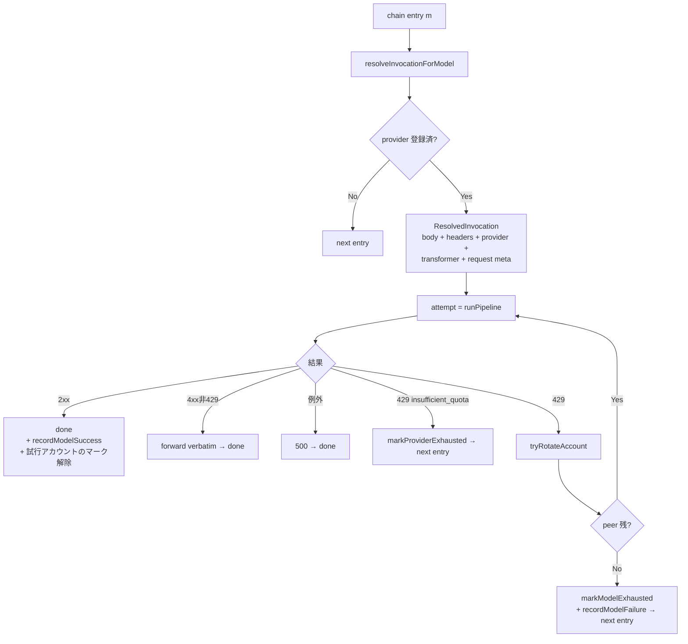

`resolveInvocationForModel` は **per-attempt の新規 body / headers** を切り出して shaping する:

- `output_config.effort` を `EFFORT_BY_MODEL` の範囲にクランプ。
- Rialto 内部拡張 (`context_management` / `output_config` / `diagnostics`) を削除。
- subscription path (transformer 名が `-oauth` 終わり) なら `prepareSubscriptionBetas` で `anthropic-beta` を整形（`context-1m-*` を落とす + `oauth-2025-04-20` を足す）。

---

## 6. Pipeline (1 upstream 呼び出し分)

`src/llms/pipeline.ts:runPipeline`。

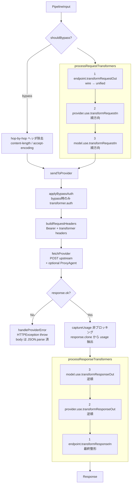

### bypass モード

導出された chain が単一かつ endpoint transformer と一致するとき発動。「unified に reshape する必要がなく、auth だけ被せれば良い」最短経路。inbound と provider の apiStyle が揃った組（gemini 面 → google provider、chat 面 → openai_chat provider）がこれに該当する。

### 各 transformer の責務

| transformer | 主な仕事 |
|-------------|----------|
| `anthropic` (endpoint) | inbound `/v1/messages` を unified に reshape、SSE を Anthropic スキーマに揃え直す |
| `openai` / `openai-responses` | `/v1/chat/completions` および Responses API のリシェイプ。出力上限は面ごとに名前が違うので、unified の `max_tokens` から `openai` が `max_completion_tokens` (gpt-5 系)、`openai-responses` が `max_output_tokens` に付け替える |
| `gemini` | Google Gemini 形式変換 |
| `claude-code-oauth` | Anthropic 直叩き subscription。`auth()` で `.credentials.json` の bearer token 注入 |
| `codex-oauth` | ChatGPT backend (codex) — openai-responses chain と組合せ |

登録されているのは**この6つで全部**である。`maxtoken` / `tooluse` / `reasoning` / `enhancetool`
といった旧ベンダーコード由来のユーティリティ系 transformer は存在しない（吸収時に消えた）。
プロバイダ別の差は上の6つの内部と `resolveInvocationForModel` の shaping で吸収している。

### captureUsage

`src/llms/pipeline/usage-extraction.ts`。非ブロッキング。`response.clone()` を別タスクで読み切り、
`UsageBlock` → `TokenStats` に整形して `deps.recordUsage({...})` を叩く。記録は `RequestLog` 行と
して DB に入る。失敗は黙って握り潰す（応答に影響しない）。

行には量のほかに、`context.req` に載って届いた属性が入る: 要求モデル（`requestedModel`）、ルート
（`scenario` 列。要求ティアか `passthrough`）、`isSubagent`、面、`AccessToken`、そして
**この試行を処理したサブスクのアカウント**（`subAccountId`。OAuth transformer が送信前に試行の request へ
stamp する。api_key のプロバイダでは null）。アカウントの切り替えで試行ごとに request が作り直されるので、
記録されるのは成功した試行のアカウントである。Overview とプロバイダのページがアカウントごとの API 換算額を
出せるのはこの列があるから（`src/services/account-usage-service.ts`）。

**読むのは `processResponseTransformers` の手前でクローンした、変換前の生の上流応答である。**
`sendToProvider` がそこでクローンするので、読める語彙は**面ではなくプロバイダ**のワイヤ形式で
決まる。つまり `UsageBlockSchema`（`src/schemas/domain/usage-record.ts`）が宣言していない綴りの
usage は、その面が正常に応答を返していても**行が1行も残らない** — Activity にもコスト集計にも
出てこない。gemini 面が既定の相方（Google プロバイダ）と組んだときはバイパス経路なので、
これは変換経路だけの問題ではなく通常運用でそのまま起きる。3つの綴りすべてを宣言してある:

| 出所 | 入力総量 | 出力 | キャッシュ読み |
|---|---|---|---|
| Anthropic | `input_tokens`（**非キャッシュ分のみ**） | `output_tokens` | `cache_read_input_tokens` / `cache_creation_input_tokens`（内訳 `cache_creation.ephemeral_1h_input_tokens`） |
| OpenAI Chat Completions | `prompt_tokens`（総量） | `completion_tokens` | `prompt_tokens_details.cached_tokens` |
| OpenAI Responses | `input_tokens`（総量） | `output_tokens` | `input_tokens_details.cached_tokens` |
| Gemini (`usageMetadata`) | `promptTokenCount`（総量） | `candidatesTokenCount` | `cachedContentTokenCount` |

`extractUsage` は `usage` と `usageMetadata` のどちらでも拾う（`usageFromEnvelope`）。

#### キャッシュ分の数え方は2つのベンダで逆

**足す前に、どちらの慣習かを判別しなければならない。** Anthropic の `input_tokens` は非キャッシュ
分だけで、キャッシュ分は隣に並ぶ（足して総量になる）。OpenAI の `cached_tokens` は SDK の型定義が
"Cached tokens present in the prompt" と書くとおり `prompt_tokens` / `input_tokens` の**内訳**で、
既に含まれている。Gemini も OpenAI 側の慣習に従う。

無条件に足すと、キャッシュ命中のある OpenAI / Gemini リクエストの入力が命中分ちょうど水増しされる。
`cachedInputTokens` は**どのフィールド名から来た数字か**で慣習を判定し
（`countedInsideReportedInput`）、`computeTokenStats` は行を書く前に

```
rawInput          = 内訳側なら reportedInput - cached（0 でクランプ）、そうでなければ reportedInput
totalInputTokens  = rawInput + cacheWrite + cacheRead
```

と Anthropic の慣習へ揃え直す。`RequestLog` の `inputTokens` は常に非キャッシュ分、
`totalInputTokens` はプロンプトにかかった全部、という一貫した意味になる。

cache write のうち 1 時間 TTL の分は `cacheWrite1hTokens` に別に残す（`cacheWriteTokens` の**内訳**で、
足し算ではない。`cacheWriteTokens` でクランプする）。料金が TTL で違うからである — `computeCosts`
（`src/services/cost-service.ts`）は 5 分 TTL を入力単価の 1.25 倍、1 時間 TTL を 2 倍で計算する。内訳を
返さないベンダーでは 0 のままなので、すべて 5 分の単価になる。

### sessionId 解決

`resolveSessionId(context)`:
1. `headers.thread_id` (Codex)
2. `headers['x-claude-code-session-id']` (Claude Code)
3. それ以外は `randomUUID()`

---

## 7. 応答整形

`v1Route` ハンドラ末尾の `formatResponse(c, response, stream)`:

- **JSON** (`stream:false`) — body を一旦テキストで読み、`JSON.parse` してから `c.json(...)` で出力。
- **SSE** (`stream:true`) — upstream の body をそのままパススルー。`content-type: text/event-stream`、`cache-control: no-cache`、`connection: keep-alive` を強制。upstream の `content-encoding` / `transfer-encoding` は **除去** する（Bun fetch が auto-decompress 済のため、これらを転送すると Claude Code 側で double decompress (`ZlibError`) が出る）。`x-ratelimit-*` などのレートリミット系ヘッダは転送する。

---

## サブスクの 429 を 1 本のリクエストで追ってみる

例: `POST /v1/messages` (body.model = `claude-opus-4-8`, stream:true, 5h 窓 99%)

1. **HTTP** — `/v1/messages` → `anthropic` endpoint transformer マッチ。
2. **RoutePlan** — 要求ティアは `opus`。`opus` の先頭ルート `claude-code · opus` をエイリアスで `claude-code,claude-opus-4-8` に解決し、ゲートを通す。枯渇マークは無く、snapshot の使用率が profile の `quotaSkipPct`（既定 100）未満なので primary になる（**99 % でも外さない**。外すのは snapshot が使い切りと読んだときか、`quotaSkipPct` を下げたとき）。
3. **buildFailoverChain** — `[claude-code,claude-opus-4-8]` + `opus` のルートの残り（api_key のルートも書いてあればそのまま）。
4. **attemptChainEntry** — `resolveInvocationForModel` で per-attempt body 用意。
5. **runPipeline** (bypass) — `applyBypassAuth` が `claude-code-oauth.auth()` を呼んで、`.credentials.json` から bearer token を取得し `Authorization` ヘッダにセット。`anthropic-beta` から `context-1m-*` を落として `oauth-2025-04-20` を付加。
6. **fetchProvider** — `api.anthropic.com/v1/messages` に POST、SSE で返ってくる。
7. **upstream 429** — `handleProviderError` が `Error from provider(claude-code,claude-opus-4-8: 429): {…}` を throw。`body` は `JSON.parse` してネスト構造でログ。
8. **rotation** — `tryRotateAccount`:
   - OAuth transformer がその試行の request に stamp した `subAccountId` を読む（無ければ `sessionId` = `x-claude-code-session-id` の sticky から引く）。
   - `markAccountExhausted(subAccountId, resetAt)` でそのアカウントだけ exhaust。
   - `releaseAccountForSession` で sticky 解除。
   - 同 kind (`claude`) に未 exhaust の peer があれば `continue` で同 entry を再 attempt → `session-account-router` が peer アカウントを選び直す。
9. **success** — 2 周目で別アカウントが取れたら 2xx で SSE 開始、captureUsage が裏で usage を記録。
10. **client** — `formatResponse` が SSE をパススルー、`x-ratelimit-*` も中継。

ピアアカウントが残っていなければ `markModelExhausted(provider.name, model)` → 次 chain entry へ。chain の残りも全て exhaust なら、最後に拾った 429 body を verbatim 返す。

---

## ログ整合と debugging tips

- `reqId` (sendToProvider 起点の UUID) を child logger に bind しているので、`reqId=xxx` で grep すると 1 upstream call の request / response / error が揃う。
- `[provider_response_error]` の `body` フィールドは構造化済み — pino-pretty / log viewer で展開できる。
- `provider 'X' skipped — missing required fields: api_key` の warn が出ていたら、その provider は **registry に存在しない**。router 解決もスキップされるので、`Used request-specified model — exact provider match` と `failover: provider not found; skipping` が同じ provider 名で連続することは無くなった（auth gate 修正後）。

---

## 関連ドキュメント

- [request-flow.md](./request-flow.md) — 本書の 3〜5 章を拡大した図とシナリオ早見表。
- [routing.md](./routing.md) — ティアマップ（データモデル・ゲート・結果・scheduler の snapshot・モデルの世代交代・backfill）。
- [testing-map.md](./testing-map.md) — テストがどこにあり、何を担保しているか。
- [inbound-surfaces.md](./inbound-surfaces.md) — 受け口レジストリと、そこから導出されるもの。
