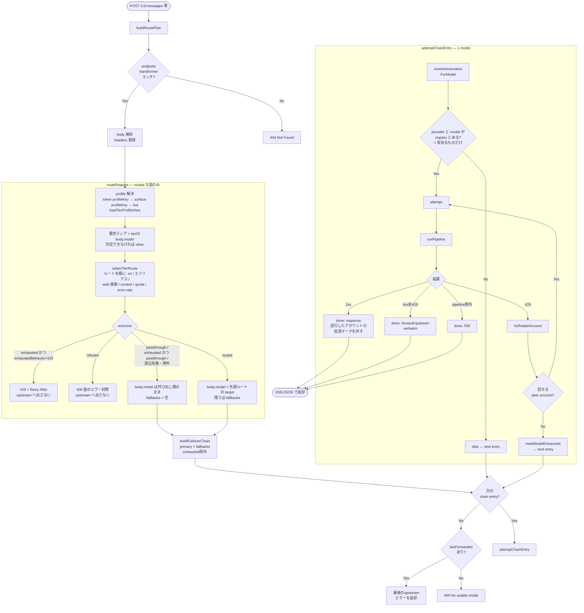
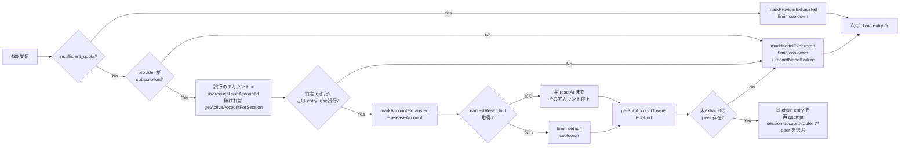
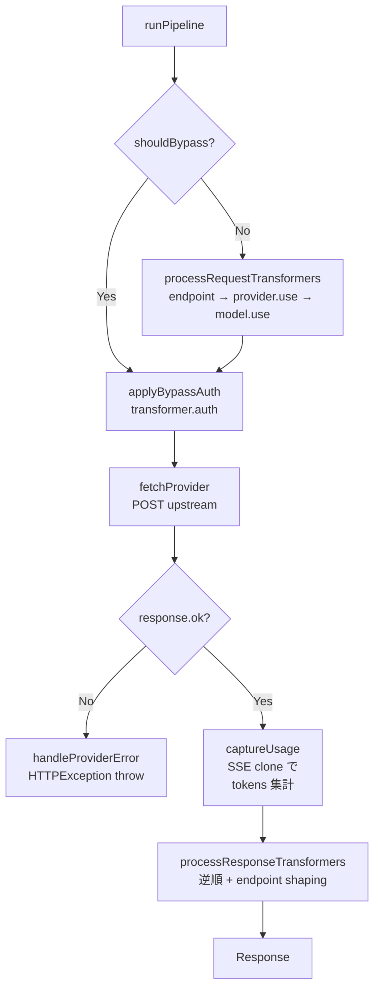

# /v1/* リクエスト処理フロー

## 目的

`POST /v1/*` で Claude Code（または互換クライアント）から入ってきたリクエストが、ティアマップによるルーティング → failover chain → upstream provider 呼び出しまでどう流れるかを可視化する。
特に **multi-account subscription での 429 ローテーション**、**upstream へ出さずに返す 429 / 400**、**無効な target のスキップ** を取りこぼさないこと。
ティアマップそのもの（データモデル・ゲート・結果・scheduler の snapshot・backfill）は [routing.md](./routing.md) にまとめてある。本書はそれがリクエストの流れのどこに入るかを描く。

実装は以下に分散している:

- `src/api/v1/route.ts` — HTTP ハンドラ / chain ループ
- `src/api/v1/route-plan.ts` — `buildRoutePlan`（リクエストごとに1回。枯渇の 429 と拒否の 400 もここで返す）
- `src/api/v1/candidate-chain.ts` — `buildFailoverChain`（試す候補の順序）
- `src/api/v1/invocation.ts` — `resolveInvocationForModel`（候補1件 → 実行可能な invocation）
- `src/api/v1/chain-failover.ts` — `attemptChainEntry` / `tryRotateAccount`
- `src/llms/router.ts` — `routeRequest`
- `src/llms/tier-router/runtime.ts` — `routeByTier`（ティアマップを読み、live state から述語を組む）
- `src/llms/tier-router/select.ts` — `selectTierRoute`（純粋関数のセレクタ。6 つのゲート）
- `src/services/tier-route-service.ts` — `loadTierProfileView`（各ルートをエイリアスで解決し、無効な target を `targetEnabled` に折り込んだ profile）
- `src/llms/pipeline.ts` — `runPipeline` / `handleProviderError`

> **前提**: 以下は面の `routingMode` が `routed` のときの話である。`passthrough`（全面の初期値）、
> あるいは認証したトークンが予約プロファイル `passthrough` を指すときは、ティアマップ以降の段は丸ごと
> スキップされ、`body.model` がそのまま候補になる（persona も付かない。サブエージェントタグは
> どちらのモードでも最初に取り除かれる）。ルーティングの機構は **ティアマップと passthrough の
> 2 つだけ**で、シナリオ・レーン・ルール・スロット・プリセット・カスタムルーターは存在しない。

## 全体フロー

routed / passthrough / exhausted / refused の 4 つの outcome と、それぞれの `body.model` と応答は
[routing.md の結果表](./routing.md) が正である。ここで押さえるのは、**429 と 400 はどちらも
`buildRoutePlan` が返し、chain ループにも upstream にも届かない**こと。

## 429 のときの分岐

`attemptChainEntry` 内のループで起こる、subscription multi-account 対応のローテーション。

- **どのアカウントが 429 を受けたか**は、OAuth transformer が送信前にその試行の request へ
  stamp した `subAccountId` で決める。session 単位の「最後に選んだアカウント」は同じ session の
  並行リクエストに上書きされうるので、transformer がアカウントを解決する前に失敗した試行の
  フォールバックとしてしか使わない。
- peer が尽きたときに塞ぐのは **その `(provider, model)` だけ**である。プロバイダ全体を塞ぐのは
  `insufficient_quota`（api_key の課金上限。同 provider のどのモデルでも同じ 429 になる）のときだけ。
- 成功した試行は、その試行のアカウントに枯渇マークが残っていれば外す（成功したのならマークは誤り）。

ローテーションは 1 chain entry あたり最大 `MAX_ACCOUNT_ROTATIONS = 10` 回までで打ち切る（防御的キャップ）。

## pipeline 内部

`handleProviderError` がスローする `HTTPException` の message は
`Error from provider(<name>,<model>: <status>): <rawBody>` 固定形式。
`src/api/v1/upstream-error.ts` の `forwardUpstreamError` が `PROVIDER_ERR_RE` で
逆パースして upstream の生 body を verbatim 返す。

## fallback に掛かるゲート

ゲートは 2 か所にある。**送る前**にはティアのセレクタが各ルートを 6 つのゲート（ルートと target の
on/off・エイリアス・web 検索・context・quota・error rate。詳細は [routing.md](./routing.md)）に掛け、
通ったものだけを `[primary, ...fallbacks]` にする。**送った後**の `buildFailoverChain` が落とすのは
**枯渇マークの付いた候補だけ**である（全候補が枯渇していれば元の順序をそのまま返す — 窓が転がっている
可能性に賭ける）。かつてあった 2 つのゲートは廃止された。

| かつてのゲート | いま |
|--------|------|
| **auth_mode gate**（primary と異なる auth_mode の fallback を除外） | **廃止。** ルートの順序は operator がティアマップに書いたとおりに辿る。subscription のルートの後ろに api_key のルートを書けば、それは走る。走らせたくなければ書かない — ルートの並び自体が「何の後に何が来てよいか」の意思表示である |
| **same-provider gate**（primary と同じ provider の fallback を除外） | **廃止。** 枯渇は `(provider, model)` 単位でマークされるので、同 provider 別ティアのルートは正当な fallback。ただし 5h / weekly の窓は account 単位なので、account が枯れた 429 では別 model でも同じ account で 429 になる |
| **無効な provider / model** | そもそも primary にも fallback にもならない。`loadTierProfileView` がエイリアスの先の `Model.enabled && Provider.enabled` を `targetEnabled` に折り込み、セレクタが `disabled` として落とす。registry も有効なものしか持たないので、手で名指しした pair も `resolveInvocationForModel` が null で返して次へ進む |

| 場面 | 挙動 |
|------|------|
| bare 名 `claude-opus-4-8` を受信 | `routed` な面では要求ティア `opus` のルートが使われる。ルートが無い・全部 off なら `body.model` はそのまま通り、`resolveInvocationForModel` が**有効な**プロバイダをちょうど 1 つ見つけたときだけそこへ送る（0 件・複数件はスキップ → 400）。`passthrough` な面でも同じ解決 |
| primary が subscription で 429 | `tryRotateAccount` で peer サブアカへ回し、尽きたらその model に枯渇マーク → chain の**次のエントリ**へ。それが api_key でも同 provider 別ティアでも、ルートに書いてあれば試す |
| primary が subscription で 429、fallback 無し | チェーンは primary 1 件のみ。回せなければ 429 を verbatim 返却 |
| primary が api_key で 429 | その model に枯渇マーク → 次のエントリへ。`insufficient_quota` のときだけ provider ごと塞ぐ |
| 「サブスク 5h 枯渇したら api_key にフォールバック」を **明示的に** したい | そのティアのルートで、subscription のルートの後ろに api_key のルートを書く。それだけ |
| ティアのルートがすべて quota か error rate で落ち、profile の `exhaustedBehavior` が `'429'`（既定） | `buildRoutePlan` が 429 + `Retry-After` を返し、upstream へは出さない |
| ルートはあるが、どれもこのリクエストを受けられない（エイリアス未設定・web 検索非対応・context 不足） | `buildRoutePlan` が面のエラー封筒で 400 を返す。待っても変わらないので 429 にはしない。`exhaustedBehavior` も見ない |
| ティアにルートが 1 本も無い、または全部 off | `exhaustedBehavior` に関係なく 429 にはならない。呼び出し側の `body.model` がそのまま通る（未設定のティアは「意見無し」であって「全部枯渇」ではない） |
| ティアマップが読めない（Postgres 不在）/ ルーティングが例外 | `body.model` は触らない。error ログ、route は `passthrough`、`isSubagent` はタグから、fallbacks 空 |

## 代表シナリオ早見表

| # | 状況 | 流れ |
|---|------|------|
| 1 | claude-code (sub) `claude-sonnet-4-6` で正常応答 | 要求ティア `sonnet` → `selectTierRoute` が先頭ルート `claude-code · sonnet` をエイリアスで解決 → `attemptChainEntry` → 2xx → SSE 返却 |
| 2 | 同上で **5h 窓 429**、サブアカ 3 つあり 1 つだけ枯渇 | 429 → `tryRotateAccount` で当該アカ exhaust → 同 entry 再試行 → peer アカで成功 |
| 3 | 全サブアカが 5h 枯渇 | 429 → 全アカ exhaust → その model に `markModelExhausted` → 次のルート（例 `gemini,gemini-2.5-pro`） |
| 4 | 直前のリクエストで 429 を食って provider / model に exhausted マークが付いている | セレクタの quota ゲートがマークを読み、投げる前にそのルートを外して次のルートを primary にする。ティアのルートが全部マークで落ちれば `exhaustedBehavior` どおり 429 + `Retry-After`（マークの期限）か passthrough。マークは 429 レスポンスの実 resetAt（無ければ 5 分）で自動失効する。**それより早く外れるのは手動 Refresh と Codex のリセット消費のとき** — 最新の使用量で上限を下回ったアカウントのマークと、最新の値で配信できると分かったモデルのマークを外し、routing snapshot をすぐ作り直す（下の状態ストア表） |
| 5 | model 名 bare で `claude-opus-4-8` 指定 | 要求ティア `opus` のルートが使われる。effort や thinking で行き先は変わらない（それを見るシナリオ分類は無い）。ルートが無ければ `body.model` がそのまま通り、chain walker が唯一の有効なホストへ解決する |
| 6 | 同じ model を api_key の `anthropic` も hosts している | ルートに書いてある方（エイリアスが指す方）が選ばれる。bare 名のまま通った場合はホストが 2 つあるので曖昧としてスキップ（→ 400） |
| 7 | subscription primary が 429、fallback に api_key 混在 | ルートの順どおりに api_key fallback も試す。全部枯渇なら最後の 429 を verbatim 返却 |
| 8 | `anthropic` provider が **api_key 未設定** | registry がこの provider を warn 付きでスキップ → そのルートの候補は `resolveInvocationForModel` が null → 次へ |
| 9 | inbound `body.model` に `provider,model` 形式（コンマ）が来た | `routed` な面では文字列全体から `tierOf` がティアを読む（`anthropic,claude-sonnet-4-6` なら `sonnet`、ティア名を含まなければ `other`）。そのティアのルートがあれば書き換えられ、無ければ `provider,model` のまま送られる。`passthrough` な面では `provider,model` がそのまま宛先として使われる — OpenAI 互換面が `/v1/models` の id をそのまま投げ返せるのはこの経路。※ `provider,model` は router 出力〜下流の内部表現としても引き続き使用 |
| 10 | upstream が 401/403 (subscription) | `handleProviderError` が「OAuth 期限切れ → CLI 再ログイン」と warn、HTTPException として上に伝播 → 429 ではないので verbatim 返却（rotate なし）|
| 11 | upstream が 400 で `effort` 不一致 | `attempt` 内で `bestSupportedLevel` を読んで effort 差し替え → 同 model に 1 回だけ retry |
| 12 | 全 fallback exhaust | `lastForwarded` (最後の 429 body) を verbatim 返却 |
| 13 | ルートのエイリアスの先、または passthrough の `provider,model` が Providers 画面で無効化した model / provider を指す | ルートはセレクタが `disabled` で落とす（ティアの全ルートがそうなら passthrough）。passthrough の pair は registry に無いので `resolveInvocationForModel` が null → skip。全 entry が該当すれば 400 `No usable model`。手で名指ししても転送されない |
| 14 | `web_search` ツール付きのリクエストで、ティアのルートが Chat Completions のプロバイダだけ | web 検索ゲートで全ルートが落ち、refused → 400。Anthropic / Responses / Gemini の形式で送るルートがあればそちらが選ばれる |
| 15 | エイリアスを新しいモデルへ昇格した直後 | 次のリクエストからそのティアのルートは新しいモデルへ解決される。ルートは書き換えない — 動くのはエイリアス 1 行だけ |

## 関連する状態ストア

| ストア | 役割 | 失効条件 |
|--------|------|----------|
| `failover-state` (`isProviderExhausted` / `isAccountExhausted` / `isModelExhausted` / `exhaustedUntil`) | provider / sub-account / (provider, model) 単位の枯渇フラグ。セレクタの quota ゲートと `buildFailoverChain` が読み、429 経路の `Retry-After` はその期限を読む。**プロセスローカル**で、複数インスタンス間では共有されない | `markXxxExhausted(until?)` の `until` 時刻 or デフォルト 5min。成功した試行はそのアカウントのマークを外す。加えて手動 Refresh（`POST /api/subscriptions/refresh`、接続時・Codex のリセット消費後の再取得も同じ経路）が、最新の値を取れたアカウントについて `accountHasHardLimitHit` で判定し直して外す — アカウントのマークはアカウント全体の窓で、モデルのマークはそのモデルに効く窓（Fable の週次窓を含む）で判定する。provider のマーク（`insufficient_quota`）は外さない |
| `routing-scheduler` (`getRoutingSnapshot`) | quota snapshot。有効なサブスクプロバイダの有効なモデルごとに `{ exhausted, remainingBudgetPct, resetAt }` と、全体の `soonestResetAt`。セレクタの quota ゲート（`quotaSkipPct`）と `Retry-After` が読む。snapshot に無い target（api_key プロバイダ、初回 tick 前）は quota では止めない | 5 分ごとの tick で作り直す。手動 Refresh と Codex のリセット消費の後は `republishRoutingSnapshot()` が、実行中の tick の後にもう 1 回 tick を走らせる（tick は重ならない） |
| `model-health` (`errorRateOf` / `sampleCountOf`) | target ごとの直近 5 分の成功 / 429 のリング。セレクタの error-rate ゲートが読み、`minHealthSamples` 件に満たないうちは効かない | 5 分より古いイベントは読むときに捨てる |
| `session-account-router` (`getActiveAccountForSession`) | session ↔ 選択 sub-account の sticky マップ | `releaseAccountForSession` で剥がす |
| `subaccount-usage-store` (`getPerAccountUsage`) | DB の `SubAccountUsage` 行をキャッシュ | 周期 polling で更新 |
| `usage-service` (`getKindWindowHeadroom`) | weekly / 5h ウィンドウのキャッシュ。**ルーティング判断からは外れた** — `getKindWindowHeadroom` の呼び出し元はテストだけで、セレクタはこれを読まない | 周期 polling で更新 |

## ログ整合

- `[provider_response_error]` の `body` は `JSON.parse` で構造化されてから出力されるので
  pino 上はネストされたオブジェクトとして読める（escape まみれの文字列にはならない）。
- `ProviderRegistry.registerFromConfig` は api_key/api_base_url 欠落時に
  `provider 'xxx' skipped — missing required fields: ...` を **warn** で出すので、
  「config 上は居るのに chain walker が見つけられない」状況を即特定できる。
- ルーティングが何も取らなかったときは `[routing] no route taken` を info で、429 にするときは
  `[routing] every route of the tier is out of quota — will 429`、400 にするときは
  `[routing] refused — will 400` を warn で出す。いずれも要求モデル・ティア・各ルートの skip 理由を持つ。
