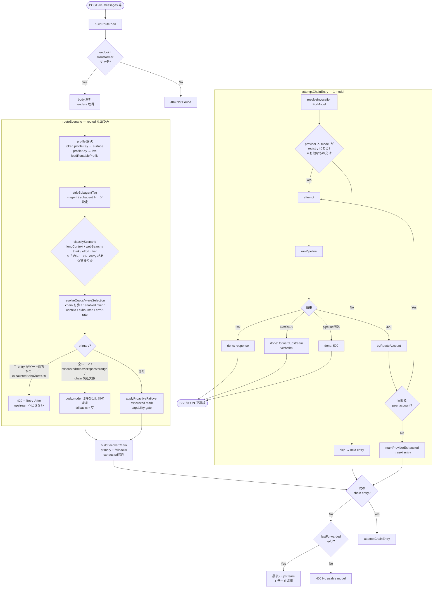
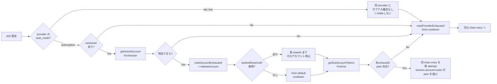
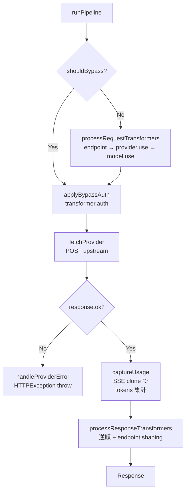

# /v1/* リクエスト処理フロー

## 目的

`POST /v1/*` で Claude Code（または互換クライアント）から入ってきたリクエストが、scenario routing → failover chain → upstream provider 呼び出しまでどう流れるかを可視化する。
特に **multi-account subscription での 429 ローテーション** と **provider 未登録時のスキップ** を取りこぼさないこと。

実装は以下に分散している:

- `src/api/v1/route.ts` — HTTP ハンドラ / chain ループ
- `src/api/v1/route-plan.ts` — `buildRoutePlan`（リクエストごとに1回）
- `src/api/v1/candidate-chain.ts` — `buildFailoverChain`（試す候補の順序）
- `src/api/v1/invocation.ts` — `resolveInvocationForModel`（候補1件 → 実行可能な invocation）
- `src/api/v1/chain-failover.ts` — `attemptChainEntry` / `tryRotateAccount`
- `src/llms/scenario-router.ts` — `routeScenario`
- `src/llms/scenario-router/model-selection.ts` — `classifyRequest` / `classifyScenario` / `effectiveLongContextThreshold`
- `src/llms/quota-router/runtime.ts` — `chainRoutingOf` / `resolveQuotaAwareSelection`（chain を歩く selector）
- `src/services/router-preference-service.ts` — `loadRoutableProfile`（無効な target を entry に折り込んだ profile）
- `src/llms/scenario-router/failover.ts` — `applyProactiveFailover`
- `src/llms/pipeline.ts` — `runPipeline` / `handleProviderError`

> **前提**: 以下は面の `routingMode` が `routed` のときの話である。`passthrough`（全面の初期値）、
> あるいは認証したトークンが予約プロファイル `passthrough` を指すときは、分類以降の段は丸ごと
> スキップされ、`body.model` がそのまま候補になる（persona も付かない）。ルーティングの
> 機構はこの **chain と passthrough の 2 つだけ**で、ルール・スロット・プリセット・カスタム
> ルーターは存在しない。

## 全体フロー

## 429 のときの分岐

`attemptChainEntry` 内のループで起こる、subscription multi-account 対応のローテーション。

ローテーションは 1 chain entry あたり最大 `MAX_ACCOUNT_ROTATIONS = 10` 回までで打ち切る（防御的キャップ）。

## pipeline 内部

`handleProviderError` がスローする `HTTPException` の message は
`Error from provider(<name>,<model>: <status>): <rawBody>` 固定形式。
`src/api/v1/upstream-error.ts` の `forwardUpstreamError` が `PROVIDER_ERR_RE` で
逆パースして upstream の生 body を verbatim 返す。

## fallback に掛かるゲート

`buildFailoverChain` が chain から落とすのは **枯渇マークの付いた候補だけ**である（全候補が枯渇して
いれば元の順序をそのまま返す — 窓が転がっている可能性に賭ける）。かつてあった 2 つのゲートは廃止された。

| かつてのゲート | いま |
|--------|------|
| **auth_mode gate**（primary と異なる auth_mode の fallback を除外） | **廃止。** chain の順序は operator が書いたとおりに辿る。subscription の primary の後ろに api_key の fallback を書けば、それは走る。走らせたくなければ書かない — chain の並び自体が「何の後に何が来てよいか」の意思表示である |
| **same-provider gate**（primary と同じ provider の fallback を除外） | **廃止。** 枯渇は `(provider, model)` 単位でマークされるので、同 provider 別 model は正当な fallback。ただし 5h / weekly の窓は account 単位なので、account が枯れた 429 では別 model でも同じ account で 429 になる（peer が尽きたときの `markProviderExhausted` は provider ごと塞ぐ） |
| **無効な provider / model** | そもそも chain に載らない。`loadRoutableProfile` が `Model.enabled && Provider.enabled` を entry の `enabled` に折り込み、registry も有効なものしか持たないので、`resolveInvocationForModel` は無効な pair を null で返して次へ進む |

| 場面 | 挙動 |
|------|------|
| bare 名 `claude-opus-4-8` を受信 | `routed` な面では chain のレーン設定が使われる。chain に primary が無ければ `body.model` はそのまま通り、`resolveInvocationForModel` が**有効な**プロバイダをちょうど 1 つ見つけたときだけそこへ送る（0 件・複数件はスキップ → 400）。`passthrough` な面でも同じ解決 |
| primary が subscription で 429 | `tryRotateAccount` で peer サブアカへ回し、尽きたら `markProviderExhausted` → chain の**次のエントリ**へ。それが api_key でも同 provider 別 model でも、書いてあれば試す |
| primary が subscription で 429、fallback 無し | チェーンは primary 1 件のみ。回せなければ 429 を verbatim 返却 |
| primary が api_key で 429 | provider ごと枯渇マーク → 次のエントリへ |
| 「サブスク 5h 枯渇したら api_key にフォールバック」を **明示的に** したい | そのレーンの chain で、subscription エントリの後ろに api_key エントリを書く。それだけ |
| chain の全 entry がゲート落ちで、profile の `exhaustedBehavior` が `'429'`（既定） | `buildRoutePlan` が 429 + `Retry-After` を返し、upstream へは出さない |
| レーンに entry が 1 件も無い | `exhaustedBehavior` に関係なく 429 にはならない。呼び出し側の `body.model` がそのまま通る（未設定のレーンは「意見無し」であって「全部枯渇」ではない） |
| chain が読めない（Postgres 不在）/ ルーティングが例外 | `body.model` は触らない。error ログ、`scenarioType='default'`、`isSubagent` はタグから、fallbacks 空 |

## 代表シナリオ早見表

| # | 状況 | 流れ |
|---|------|------|
| 1 | claude-code (sub) `claude-sonnet-4-6` で正常応答 | `classifyRequest` → `resolveQuotaAwareSelection` → `attemptChainEntry` → 2xx → SSE 返却 |
| 2 | 同上で **5h 窓 429**、サブアカ 3 つあり 1 つだけ枯渇 | 429 → `tryRotateAccount` で当該アカ exhaust → 同 entry 再試行 → peer アカで成功 |
| 3 | 全サブアカが 5h 枯渇 | 429 → 全アカ exhaust → `markProviderExhausted` → 次 fallback (例 `gemini,gemini-2.5-pro`) |
| 4 | 直前のリクエストで 429 を食って provider / model に exhausted マークが付いている | `applyProactiveFailover` が投げる前に primary を捨てて次の候補へ。マークは 429 レスポンスの実 resetAt（無ければ 5 分）で自動失効する |
| 5 | model 名 bare で `claude-opus-4-8` 指定 | `classifyScenario` が effort/tier シグナル（opus → heavy）で `longContext` レーンに寄せ（そのレーンに entry があれば）、chain の設定値が使われる。レーンに primary が無ければ `body.model` がそのまま通り、chain walker が唯一の有効なホストへ解決する |
| 6 | 同じ model を api_key の `anthropic` も hosts している | chain に書いてある方が選ばれる。bare 名のまま通った場合はホストが 2 つあるので曖昧としてスキップ（→ 400） |
| 7 | subscription primary が 429、fallback に api_key 混在 | chain の順どおりに api_key fallback も試す。全部枯渇なら最後の 429 を verbatim 返却 |
| 8 | `anthropic` provider が **api_key 未設定** | router がこの provider をスキップ＋registry が warn 出力 |
| 9 | inbound `body.model` に `provider,model` 形式（コンマ）が来た | `routed` な面では素通りしてシナリオルーティング（最終的に `default` レーン）に落ちる。`passthrough` な面では `provider,model` がそのまま宛先として使われる — OpenAI 互換面が `/v1/models` の id をそのまま投げ返せるのはこの経路。※ `provider,model` は router 出力〜下流の内部表現としても引き続き使用 |
| 10 | upstream が 401/403 (subscription) | `handleProviderError` が「OAuth 期限切れ → CLI 再ログイン」と warn、HTTPException として上に伝播 → 429 ではないので verbatim 返却（rotate なし）|
| 11 | upstream が 400 で `effort` 不一致 | `attempt` 内で `bestSupportedLevel` を読んで effort 差し替え → 同 model に 1 回だけ retry |
| 12 | 全 fallback exhaust | `lastForwarded` (最後の 429 body) を verbatim 返却 |
| 13 | chain の entry、または passthrough の `provider,model` が Providers 画面で無効化した model / provider を指す | registry に無いので `resolveInvocationForModel` が null → skip。全 entry が該当すれば 400 `No usable model`。手で名指ししても転送されない |

## 関連する状態ストア

| ストア | 役割 | 失効条件 |
|--------|------|----------|
| `failover-state` (`isProviderExhausted` / `isAccountExhausted`) | provider / sub-account 単位の枯渇フラグ | `markXxxExhausted(until?)` の `until` 時刻 or デフォルト 5min |
| `session-account-router` (`getActiveAccountForSession`) | session ↔ 選択 sub-account の sticky マップ | `releaseAccountForSession` で剥がす |
| `subaccount-usage-store` (`getPerAccountUsage`) | DB の `SubAccountUsage` 行をキャッシュ | 周期 polling で更新 |
| `usage-service` (`getKindWindowHeadroom`) | weekly / 5h ウィンドウのキャッシュ。**ルーティング判断からは外れた** — 現在の呼び出し元はテストと UI 表示のみで、`applyProactiveFailover` はこれを読まない | 周期 polling で更新 |

## ログ整合

- `[provider_response_error]` の `body` は `JSON.parse` で構造化されてから出力されるので
  pino 上はネストされたオブジェクトとして読める（escape まみれの文字列にはならない）。
- `ProviderRegistry.registerFromConfig` は api_key/api_base_url 欠落時に
  `provider 'xxx' skipped — missing required fields: ...` を **warn** で出すので、
  「config 上は居るのに chain walker が見つけられない」状況を即特定できる。
