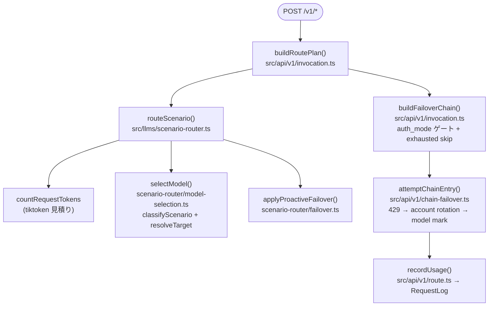
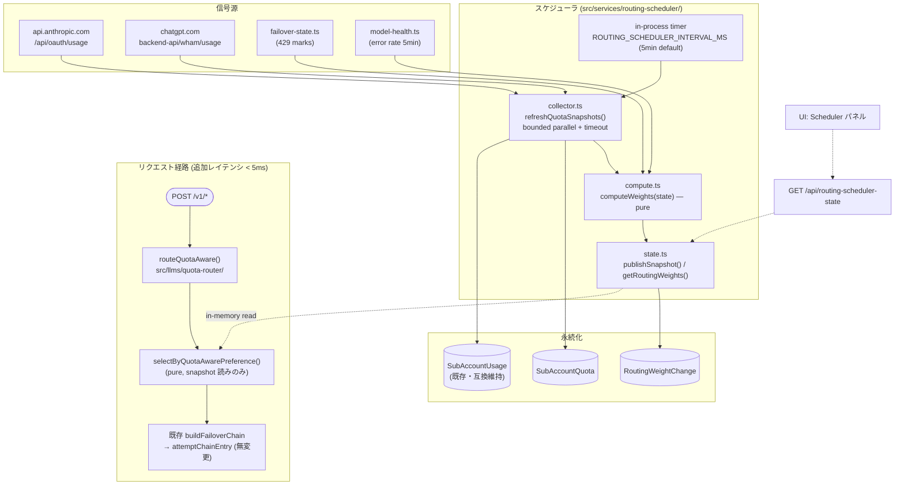
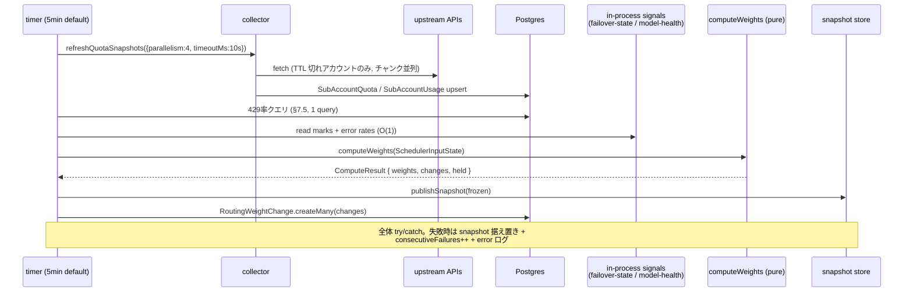
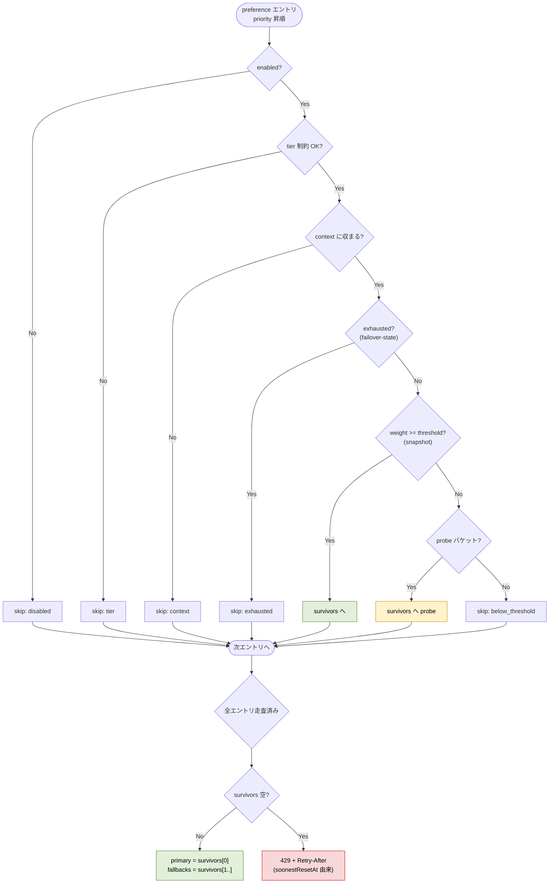

# Quota-Aware Preference Router（残枠・時間窓駆動の自動トラフィック配分）

Status: Draft (implementation-level)

親ドキュメント:

- [subscription-utilization-tuning.md](./subscription-utilization-tuning.md) — Level 1〜4 の枠組み定義（スコープ・動機はそちらが正）
- [subscription-utilization-tuning-implementation.md](./subscription-utilization-tuning-implementation.md) — Level 2 / Level 4 の実装計画（本書は Part B のスキーマ・セレクタ骨格を継承する）
- [router-force-override.md](./router-force-override.md) — スロット単位の force 上書き（scenario router 側の関連計画）

本書は **Level 3（オートチューナー）と Level 4（宣言的 Preference Router）を統合し、さらに「残枠 × 時間窓」という新しい次元を加えた** ルーティングシステムの実装計画である。L4 計画の再掲ではない — L4 は「優先度リスト + その場のゲート判定」で止まっていたが、本計画は **スケジューラが周期的に quota 状態を観測してルーティング重みを再計算し、枯渇に近いアカウントからトラフィックを自動退避させる** ところまで踏み込む。

---

## 1. 目的

ユーザーが宣言するのは次の 1 リストだけ:

```jsonc
// 「使いたい順」。これ以外のルーティング設定は書かない。
{
  "preferences": [
    { "model": "claude-code,claude-fable-5",  "priority": 1 },
    { "model": "claude-code,claude-opus-5",   "priority": 2 },
    { "model": "claude-code,claude-opus-4-7", "priority": 3 },
    { "model": "claude-code,claude-sonnet-5", "priority": 4 }
  ]
}
```

システム側はこの宣言に対して:

1. **現在のトラフィック配分**（直近のリクエストがどのモデルへ流れているか）
2. **各 subscription アカウントの rate limit 窓の消化率**
   - Claude (Team/Pro/Max): **5 時間ローリング窓** と **週次窓**（全体 + per-model scoped）の二重制約
   - Codex: **primary（5h 相当）** と **secondary（週次相当）** の二重制約
3. **窓リセットまでの残り時間**（枯渇していてもすぐ戻るなら絞りすぎない）
4. **直近のエラー率**（429 / 5xx）

を**周期的（既定 5min、最大 1h）** に突合し、**モデルごとの「healthiness スコア」→ ルーティング重み** を再計算する。リクエスト着信時のセレクタは preference チェーンを priority 順に歩き、**重みがしきい値を超えた最初の候補**に送る。全滅時はクライアントへ 429 を返し、`Retry-After` に最も早いリセット時刻を載せる。

**周期選択の根拠**: quota 情報の唯一の情報源は upstream `/usage` エンドポイントの能動ポーリング（§3.2）で、そのキャッシュ TTL は 5min。tick を 5min より短くしても実 fetch は増えない（キャッシュヒットするだけ）ので、tick 頻度は精度上限に律速される。「毎リクエスト動的に変える必要はなく、5min〜1h に一度で十分」というのが本計画の前提。

DB の Router 設定（preference リスト）は「静的な意図」であり、**スケジューラはランタイム配分だけを所有する（DB を書き換えない）**。これは L3 計画のガードレール（自動変更の暴走防止）を「そもそも永続設定を触らない」ことで構造的に満たす設計である。

## 2. 用語

| 用語 | 意味 |
|---|---|
| **target** | `"providerName,modelName"` 形式のモデル参照。RouterSlot / fallbacks と同一の内部表現 |
| **kind** | subscription の系統。`'claude'`（anthropic.com）/ `'codex'`（chatgpt.com）。`subscriptionKindOf()` が判定 |
| **窓 (window)** | rate limit の観測単位。Claude: `five_hour` / `seven_day` / `seven_day_opus` / `weekly_scoped.<model>`、Codex: `primary` / `secondary` |
| **healthiness** | 残枠 × エラー率 × リセット近接補正 から成るモデル別スコア（§8.2）。**実装では preference 順位を掛けない**（下記の注記を参照） |
| **weight** | healthiness にガードを適用した 0..1 の値。**候補間での正規化はしない** — 各行がそのターゲット単体の健全度（下記の注記を参照）。UI 表示と probe 判定に使う |
| **tick** | スケジューラの 1 周期（既定 **5min**、上限 1h）。quota 更新 → computeWeights → snapshot 差し替え |
| **snapshot** | tick が publish する不変オブジェクト。セレクタ / API / UI はこれだけを読む |

---

## 3. 前提: 現行実装の事実確認（コードを読んだ結果）

実装時にここが変わっていたら本書の該当箇所を見直すこと。ファイルパス・シグネチャはすべて 2026-08-11 時点の実物。

### 3.1 リクエスト経路



- `selectModel(req, tokenCount, router, _config)` は `{ model, scenarioType, isSubagent, fallbacks }` を返す（`model-selection.ts` L78）。`fallbacks` はそのまま `plan.fallbacks` に載り、reactive 側 `buildFailoverChain` も **同じチェーンを読む**。
- `applyProactiveFailover(primaryModel, scenarioType, fallbacks, tokenCount, config, log): string`（`failover.ts` L86）は exhaustion mark（`isModelExhausted`）と context 容量（`candidateFitsContext`、module-private）で前詰めする。
- `attemptChainEntry(chain, model)`（`chain-failover.ts` L79）は 429 のとき `tryRotateAccount` → 尽きたら `markModelExhausted(provider, model)`。rotate 時は `getPerAccountUsage([failedAcct])` で DB の `resetAt` を引き、`earliestResetUntil(usage, kind, now)`（`percent >= 90` の窓の最速 resetAt）を exhaustion mark の `until` に使う。
- セッション ID はヘッダ `x-claude-code-session-id`（`sessionIdFrom()`、`chain-failover.ts` L51）。
- 429 判定は `FAILOVER_STATUSES = new Set([429])`（`upstream-error.ts` L36）。

### 3.2 quota 信号の現実（何が取れて何が取れないか）

**Claude subscription** — `https://api.anthropic.com/api/oauth/usage`（`usage-service/fetch.ts` L64 `requestClaudeUsage`、`anthropic-beta: oauth-2025-04-20`）:

- `five_hour: { utilization, resets_at }` — 5 時間ローリング窓、**0-100 の百分率のみ**
- `seven_day` / `seven_day_sonnet` / `seven_day_opus` — 週次窓（flat フィールドは大半のプランで非推奨化が進行）
- `limits[]` — `kind: 'weekly_scoped'` の行が per-model 週次窓を運ぶ（`scope.model.display_name`（例 "Fable"）+ `percent` + `resets_at`）。`scopedWindowsOf()`（fetch.ts L35）がパース済み
- **絶対値（残リクエスト数 / used / limit）は返らない。取れるのは百分率とリセット時刻だけ**
- `/api/oauth/profile`（`claude-profile-service.ts`）は identity + `organization.rate_limit_tier` のみ。**残枠は返さない**

**Codex subscription** — `https://chatgpt.com/backend-api/wham/usage`（fetch.ts L116 `requestCodexUsage`）:

- `plan_type`（プラン名。profile-sync が `SubAccount.plan` / `monthlyPriceUsd` に反映済み）
- `rate_limit.primary_window: { used_percent, reset_at (unix sec), limit_window_seconds }` — 5h 相当
- `rate_limit.secondary_window` — 週次相当。**窓長は `limit_window_seconds` がワイヤーで返る**（Claude と違い定数でない）
- **こちらも百分率のみ。`remaining_usage` のような絶対残数フィールドは現行パース（`CodexUsageWireSchema`）に存在しない**

**レスポンスヘッダ**: `src/api/v1/route.ts` L135 のコメント "Forward upstream cache / x-ratelimit headers when present" のとおり、SSE 相対時に upstream ヘッダを**素通し転送しているだけでパースはしていない**。**subscription (OAuth) レスポンスにレート残量ヘッダは載らない** — api_key 経路の `anthropic-ratelimit-unified-*` は subscription には来ない。これは実装調査で確定。よって本計画では**ヘッダ経由の quota 取得は行わない**（もし将来 upstream の挙動が変わって載るようになったら別途 issue で扱う）。

**quota シグナルの単一情報源**: **`oauth/usage` / `wham/usage` の能動ポーリング**が唯一の残枠情報源。ポーリング頻度がスケジューラ tick 間隔を実質的に決める（§8.1）。

**429 観測**: リアルタイム補正シグナル。`attemptChainEntry` が既に捕捉している。`Retry-After` レスポンスヘッダは現状読んでいない（`until` は DB の resetAt から導出）— 本計画で観測対象に加える。ヘッダから *quota 残量* は取れないが、`Retry-After` は **枯渇イベントに対する upstream 由来の権威的シグナル**なので使う。

### 3.3 既存ストア（本計画が合流するもの）

| ストア | 実体 | 鮮度 | 読み手 |
|---|---|---|---|
| `claudeCache` / `codexCache` | `usage-service/cache.ts` の in-memory Map（`TTL_MS = 5 * 60_000`） | usage-job の 5 分ポーリング | `headroom.ts` / `window-headroom.ts` / `getCachedUsagePct` |
| `SubAccountUsage` | per-(subAccountId, metric) 最新値。`recordPerAccountUsage()` が upsert | 同上（同一ポーラー） | `session-account-router.ts` / `chain-failover.ts`（reactive 経路のみ） |
| `UsageSnapshot` | 時系列（チャート用、prune あり） | 同上 | Usage 画面 |
| `failover-state.ts` | provider / account / model の 3 スコープ TTL map（in-process） | 即時（429 イベント駆動） | proactive + reactive 両方 |
| `session-account-router.ts` | session→account の sticky + 残枠バランシング（`balancingScore = pctRemaining / timeRemainingMs`） | リクエスト毎（DB 読みあり ※reactive 経路） | OAuth transformer |

metric 語彙は `subaccount-usage-store.ts`: `CLAUDE_METRICS`（`claude.five_hour` 等）、`CODEX_METRICS`（`codex.primary` / `codex.secondary`）、`scopedMetricKey(modelName)` → `claude.seven_day_scoped.fable` 等。

**重要**: `window-headroom.ts` には既に「窓長 × 経過時間からの線形ドレイン目標」を計算する pure 関数 `drainTarget(usage, windowLengthMs, now, marginPct)` がある（`DrainTarget = { pct, resetAt, targetPct, headroom, overTarget }`）。本計画の残枠評価はこれを**流用**する（再発明しない）。

### 3.4 L4 実装計画から継承するもの / 置き換えるもの

| L4 (Part B) の要素 | 本計画での扱い |
|---|---|
| `RouterPreferenceProfile` / `RouterPreferenceEntry`（B-1.1） | **そのまま採用**。constraints JSONB に quota-aware ノブを追加（§6.3） |
| `GET/PUT /api/router-preferences` 専用エンドポイント（B-3.1） | そのまま採用（catchall 罠の回避理由も同一） |
| `selectByPreference` + `CandidateGate`（B-2.1/2.2） | **拡張**: ゲート判定に「scheduler snapshot の重みしきい値」を加えた `selectByQuotaAwarePreference` に置き換え（§9） |
| `model-health.ts`（B-2.3 のイベント駆動 error-rate tracker） | そのまま採用。スケジューラの `errorRate5min` 入力になる |
| `ROUTER_MODE: 'scenario' \| 'shadow' \| 'preference'`（B-1.2） | **改訂**: mode と shadow を直交させる（§6.4）。'shadow' を enum から外し `ROUTER_SHADOW` を新設 |
| migrate コンバータ（B-4） | そのまま採用 + quota-aware 固有の追加入力を確認画面に足す（§12.2) |
| 全滅時 passthrough（B-2.1） | **変更**: quota-aware モードでは 429 + `Retry-After` を返す（§9.3。passthrough は constraints でオプトイン可） |

---

## 4. スコープ / 非スコープ

### スコープ

- 新テーブル `SubAccountQuota`（per-account の窓状態 + 429 観測の固定カラム化）と `RoutingWeightChange`（重み変更の監査ログ）
- quota コレクタ（bounded parallelism + timeout guard 付きの周期リフレッシュ）
- ルーティングスケジューラ（既定 5min tick、pure な `computeWeights`、in-process snapshot publish）
- quota-aware セレクタ（preference チェーン + healthiness しきい値 + 全滅時 429）
- shadow モード、hash bucketing による段階ロールアウト
- `GET /api/routing-scheduler-state` と UI ダッシュボード拡張

### 非スコープ

- Level 2 ダッシュボード本体（実装計画 Part A のまま。ただし §11.3 で載せる追加メトリクスを定義する）
- api_key provider のコスト最適化（quota 概念がないので重み計算では常に budget=1.0 扱い）
- マルチプロセス / 水平スケール時の snapshot 共有（現行はシングルプロセス前提。Open Question 9）
- scenario router の削除そのもの（ロールアウト Phase 5 として言及するが、削除 migration は L4 計画 §B-5/C-1 に従う）

---

## 5. 全体アーキテクチャ



設計の背骨は L4 計画 B-0 と同じ「**既存 failover 機構への合流**」である。セレクタの出力を `{ primary, fallbacks }` に整形して `req.resolvedFallbacks` に載せれば、`buildFailoverChain` / `attemptChainEntry` / `failover-state` / `session-account-router` は **1 行も変更せずに再利用できる**。本計画が新しく足すのは「その入力列を quota 状態で並べ替え・間引きする周期プロセス」だけ。

---

## 6. データモデル

### 6.1 Prisma: `SubAccountQuota`（新規）

`src/prisma/schema.prisma` に追記 → `bun run db:migrate -- --name add_subaccount_quota_and_weight_log` → **`bun run db:migrate:test` も必須**（rialto_test）。

既存 `SubAccountUsage` は (subAccountId, metric) の縦持ちで、スケジューラが 1 tick で全アカウントの全窓 + 429 観測 + 鮮度を読むには join / 集約が要る。また 429 観測やヘッダ由来の情報を置く場所がない。そこで **1 アカウント 1 行の横持ちテーブル**を新設する。`SubAccountUsage` は既存読み手（session-account-router / chain-failover / Usage 画面）が居るので**廃止しない**（コレクタが両方書く。§7.4）。

```prisma
// Latest quota state per SubAccount, one row per account (upserted by the
// routing-scheduler collector). Horizontal layout so the scheduler reads a
// whole account's state in one row; SubAccountUsage (vertical, per-metric)
// stays as-is for its existing readers.
//
// Unit convention: this deployment's upstreams (Claude oauth/usage, Codex
// wham/usage) only report percentages, so `*Used` holds the observed
// utilization pct and `*Limit` is fixed at 100. If a future source reports
// absolute counts, the same columns hold counts and the ratio stays valid.
model SubAccountQuota {
  id           String     @id @default(cuid())
  subAccountId String     @unique
  subAccount   SubAccount @relation(fields: [subAccountId], references: [id], onDelete: Cascade)

  // 5h rolling window (claude.five_hour / codex.primary).
  fiveHourUsed    Float?
  fiveHourLimit   Float?
  fiveHourResetAt DateTime?
  // Codex reports the actual window length on the wire; Claude is a fixed
  // 5h. Stored so drainTarget() never has to guess.
  fiveHourWindowSeconds Int?

  // Weekly window (claude.seven_day / codex.secondary).
  weeklyUsed    Float?
  weeklyLimit   Float?
  weeklyResetAt DateTime?
  weeklyWindowSeconds Int?

  // Claude per-model weekly_scoped rows, keyed by scopedMetricKey slug:
  // { "fable": { "used": 42, "limit": 100, "resetAt": "..." }, ... }.
  // JSONB because the model set is dictated by the upstream response.
  scopedWindows Json?

  // Last observed rate-limit event on any model of this account, written
  // by the reactive 429 path (fire-and-forget).
  lastRateLimitedAt     DateTime?
  lastRateLimitStatus   Int?
  // Parsed Retry-After (seconds) from the 429 response, when present.
  lastRetryAfterSec     Int?
  // Parsed x-ratelimit / anthropic-ratelimit remaining+reset headers from
  // the most recent successful response, when the upstream sends them
  // (api_key responses do; subscription responses: to be verified).
  headerRemaining       Float?
  headerResetAt         DateTime?

  // When the collector last completed a successful upstream refresh for
  // this account. Stale detection: now - quotaRefreshedAt > 3 * TTL_MS.
  quotaRefreshedAt DateTime?
  updatedAt        DateTime @updatedAt
}
```

`SubAccount` に back-relation を 1 行追加:

```prisma
model SubAccount {
  // ... 既存フィールド ...
  quota SubAccountQuota?
}
```

**設計判断**:

- `*Used` / `*Limit` を percent 固定にせず Float ペアで持つのは、将来ヘッダ（`anthropic-ratelimit-unified-*` が絶対値を返す場合）や別 vendor の絶対値ソースをそのまま入れられるようにするため。**読み手は常に `used / limit` の比で扱う**（percent ソースなら used=utilization, limit=100）。
- `onDelete: Cascade` — アカウント削除で quota 行も消えるのが自然（RouterSlot の Restrict とは性質が違う）。
- リセット時刻は upstream の ISO / unix 秒を dayjs で `DateTime` 化して保存（`subaccount-usage-store.ts` の `toDate` と同じ流儀）。

### 6.2 Prisma: `RoutingWeightChange`（新規）

L3 計画の必須ガードレール 5「監査ログ」の実装形。**重みが変わった tick でのみ**変更行を書く（毎 tick 全量ではない）。

```prisma
// Audit log of scheduler weight adjustments. One row per (tick, target)
// whose published weight changed. Pruned like UsageSnapshot (14 days).
model RoutingWeightChange {
  id         String   @id @default(cuid())
  target     String   // "providerName,modelName"
  fromWeight Float
  toWeight   Float
  // Machine slug, i18n-able on the UI side: quota_drop / quota_recovered /
  // error_rate / reset_soon / probe_floor / hold_guard / stale_quota ...
  reason     String
  tickAt     DateTime
  createdAt  DateTime @default(now())

  @@index([createdAt])
  @@index([target, createdAt])
}
```

書き込みは tick の最後に `createMany` 1 回。prune は usage-history-service の `pruneOldSnapshots` と同じパターンで tick 側から日次相当の頻度で発火（`createdAt < now() - 14 days` を削除）。

```sql
DELETE FROM "RoutingWeightChange" WHERE "createdAt" < $1  -- dayjs().subtract(14, 'day').toDate()
```

### 6.3 preference チェーンと constraints

**L4 実装計画 B-1.1 の `RouterPreferenceProfile` / `RouterPreferenceEntry` をそのまま採用する**（entries が Model FK + `@@unique([profileId, priority])`、profile は `key='live'` シングルトン）。差分:

**`RouterPreferenceEntry` に subagent フィルタを追加** (Open Question 11 の決定を反映):

```prisma
model RouterPreferenceEntry {
  // ... 既存フィールド ...
  // Subagent-only tier filter. When non-null and the request is a
  // subagent call, only candidates whose model tier is in this list
  // participate. Null = no restriction (agent と同じ挙動). Enables
  // "subagent は sonnet/haiku のみ" without splitting the whole
  // preference into two lists.
  subagentTiers String[]  // RequestedModelTier[]: 'fable' | 'opus' | 'sonnet' | 'haiku'
}
```

constraints JSONB のスキーマ拡張 (`src/schemas/preference-router.dto.ts`):

constraints JSONB のスキーマを拡張（`src/schemas/preference-router.dto.ts`）:

```ts
import { z } from '@hono/zod-openapi'

// L4 の PreferenceConstraintsSchema (sonnetTierRespect / haikuTierRespect /
// quotaSkipPct / errorRateSkipPct / minHealthSamples) を extend する。
export const QuotaAwareConstraintsSchema = PreferenceConstraintsSchema.extend({
  // Candidates whose published weight is below this are skipped by the
  // selector (except probe traffic).
  healthinessThreshold: z.number().min(0).max(1).default(0.05),
  // Weight floor (%) for any enabled candidate with healthiness > 0, so a
  // recovering account keeps receiving probe traffic.
  minWeightPct: z.number().min(0).max(10).default(1),
  // Max absolute weight movement per tick (oscillation damper).
  maxDeltaPerTick: z.number().min(0.01).max(1).default(0.2),
  // "Reset is near" downweight: applies when timeToReset < resetSoonMinutes
  // AND remaining < resetSoonRemainingPct.
  resetSoonMinutes: z.number().int().positive().default(10),
  resetSoonRemainingPct: z.number().min(0).max(100).default(10),
  resetSoonFactor: z.number().min(0).max(1).default(0.25),
  // Multiplier applied when quotaRefreshedAt is older than 3x the poll TTL
  // (unknown-but-was-known budget → route conservatively).
  staleQuotaFactor: z.number().min(0).max(1).default(0.25),
  // What to do when every candidate is exhausted. '429' returns a
  // rate_limit_error with Retry-After (§9.3); 'passthrough' keeps the
  // client's own model (L4 behaviour).
  exhaustedBehavior: z.enum(['429', 'passthrough']).default('429')
})
export type QuotaAwareConstraints = z.infer<typeof QuotaAwareConstraintsSchema>
```

`.extend()` なので旧 constraints JSON はそのままパースでき、全ノブに default がある = **DDL もデータ migration も不要**。

### 6.4 envelope キー（`src/schemas/config.dto.ts` `ConfigEnvelopeSchema`）

L4 計画 B-1.2 の 3 値 enum（`'scenario' | 'shadow' | 'preference'`）を改訂し、**mode と shadow を直交**させる。理由: quota-aware を preference 稼働中に shadow 比較したいケース（Phase 2→3 の判断材料）が 3 値 enum では表現できない。

```ts
// Which selector routes /v1 traffic. 'scenario' = current RouterSlot router
// (default; zero behavior change). 'preference' = L4 gate-only selector.
// 'quota-aware' = this plan's scheduler-weighted selector.
ROUTER_MODE: z.enum(['scenario', 'preference', 'quota-aware']).default('scenario'),
// Run a second selector on the same inputs and log the would-be decision
// without affecting routing. 'off' disables shadowing.
ROUTER_SHADOW: z.enum(['off', 'preference', 'quota-aware']).default('off'),
// Percentage (0-100) of sessions the non-scenario ROUTER_MODE applies to.
// Sessions hashing outside the bucket stay on the scenario router.
ROUTER_ROLLOUT_PCT: z.coerce.number().int().min(0).max(100).default(100),
// Scheduler tick interval. Default 5 min matches the usage-cache TTL —
// weight recomputes any faster than the underlying signal refresh just
// burns CPU. Upper bound 1 h suits deployments happy to recompute hourly.
// Lower bound 60 s exists for shadow/staging comparisons; production
// should stay >= 300 s so upstream /usage endpoints are not hammered.
ROUTING_SCHEDULER_INTERVAL_MS: z.coerce.number().int().min(60_000).max(3_600_000).default(300_000)
```

envelope 採用理由は L4 B-1.2 と同一: (1) DB が死んでいても disk の 1 キー + `ccr restart` で戻せる、(2) `POST /api/config` の catchall 経由（`LiveRoutingName` と同じ）で再起動なしに `resetLlmsContext()` が効く、(3) `applyEnvelopeToEnv` の既存機構に乗る。

`__tests__/lib/configEnvelopeSchema.test.ts` と `__tests__/services/config/envelope.test.ts` に新キーの default / 境界ケースを追加する。

---

## 7. Quota シグナル収集

### 7.1 収集経路の全体像

| 経路 | 信号 | 鮮度 | 確度 |
|---|---|---|---|
| **A. ポーリング** (collector) | Claude `oauth/usage` / Codex `wham/usage` の窓 % + resetAt | TTL 5min（tick と同じ ~5min 相当。tick 短くしてもキャッシュ TTL が上限で実 fetch は 5min 1 回） | 高（upstream 公式値） |
| **B. レスポンスヘッダ** | `anthropic-ratelimit-*` remaining / reset（存在すれば） | リクエスト毎 | 中（subscription 経路での存在が未検証。§7.3） |
| **C. 429 観測** | `attemptChainEntry` の失敗 + `Retry-After` ヘッダ | 即時 | 高（ただし「もう遅い」信号） |
| **D. 履歴推定** | `RequestLog` の 429 率 + `drainTarget` 線形推定 | 集計窓依存 | 低（A〜C が全部欠けたときの保険） |

### 7.2 経路 A: コレクタ `src/services/routing-scheduler/collector.ts`（新規）

```ts
import type { PrismaClient } from '../../generated/prisma/client'

export type CollectorOptions = {
  // Concurrent upstream fetches (chunked). Default 4.
  parallelism?: number
  // Per-account fetch timeout via AbortSignal.timeout. Default 10_000.
  timeoutMs?: number
}

export type CollectorResult = {
  refreshed: number     // live-fetched and persisted
  fromCache: number     // cache younger than TTL_MS — no upstream call
  failed: number        // fetch threw / non-OK / schema mismatch
}

// Refresh quota state for every enabled SubAccount of both kinds.
// Reads through the existing claudeCache / codexCache (TTL_MS = 5min in
// usage-service/cache.ts) so the 60s tick does NOT multiply upstream
// traffic: at most one live fetch per account per TTL window. Writes
// three sinks per §7.4. Never throws — per-account failures are counted
// and logged, and the account keeps its previous DB row (stale detection
// happens via quotaRefreshedAt).
export async function refreshQuotaSnapshots(
  options?: CollectorOptions,
  prisma?: PrismaClient
): Promise<CollectorResult>
```

実装要点:

- アカウント列挙は既存 `getSubAccountTokensForKind('claude' | 'codex')`（`subscription-account-sync-service.ts`）。enabled=false は列挙されない。
- **TTL 尊重**: `claudeCache.get(id)` の `at` が `TTL_MS` 未満なら upstream を叩かない（`fetchClaudeUsage` の既存ロジックと同じ判定）。つまり 60s tick × 5min TTL で、**upstream への実 fetch は従来の usage-job と同頻度のまま**。tick が速くなるのは「メモリ上の再計算」だけ。
- **bounded parallelism**: アカウント配列を `parallelism` 件ずつのチャンクに割り、チャンク内は `Promise.all`、チャンク間は逐次。既存 `fetchClaudeUsage` は完全逐次なので、アカウント数が増えたときの tick 遅延を抑える改善になる。
- **timeout guard**: `fetch(url, { signal: AbortSignal.timeout(timeoutMs) })`。現行 `requestClaudeUsage` / `requestCodexUsage` にはタイムアウトが無い（ハング＝tick 停止に直結）ので、コレクタ経由の呼び出しでは必ず付ける。実装は fetch.ts の request 関数に optional `init?: { signal?: AbortSignal }` を足して共用する（コピペ禁止）。
- 失敗時: 該当アカウントの前回値を保持（cache も DB 行もそのまま）。`quotaRefreshedAt` を**更新しない**ことが stale 検出の根拠になる。

### 7.3 経路 B/C: イベント駆動の観測フック

**429 観測**（確実な経路）— `chain-failover.ts` `tryRotateAccount` の `markAccountExhausted(failedAcct, until)` の隣に 1 行:

```ts
// src/services/routing-scheduler/observations.ts (新規)
// Fire-and-forget persistence of a rate-limit observation. Never awaited
// on the request path; failures are logged and dropped.
export function recordRateLimitObservation(input: {
  subAccountId: string | null   // null when the sticky map had no entry
  providerName: string
  modelName: string | undefined
  status: number
  retryAfterSec: number | null  // parsed Retry-After response header
}): void
```

- `SubAccountQuota.lastRateLimitedAt / lastRateLimitStatus / lastRetryAfterSec` を upsert（`void recordRateLimitObservation(...)` + 内部 `.catch(log.warn)`）。
- `Retry-After` は `forwardUpstreamError` が組む Response から読めるように、`upstream-error.ts` の HTTPException 生成箇所でヘッダを添える（既存の forward 挙動は不変。ヘッダ読み出しの追加のみ）。
- `markModelExhausted` の `until` にも `retryAfterSec` 由来の値を優先supply する（現行は DB resetAt → 5min default の 2 段。Retry-After が最優先の 3 段になる）。

**ヘッダ観測は行わない** — subscription (OAuth) レスポンスは `anthropic-ratelimit-*` を返さないと確認済み（§3.2）。api_key 経路のヘッダは quota-aware ルータの範疇外。将来 upstream が subscription にもヘッダを載せるようになったら本節を復活させる。

**単一情報源の帰結**: quota 残量は **oauth/usage / wham/usage の能動ポーリング（経路 A）だけ**が REAL、DERIVED は **429 観測（本節）** と **履歴推定（§7.5）** の 2 系統のみ。ヘッダ 3 系統目は無い。この単純化のおかげでスケジューラ tick は「ポーリング頻度 = 精度上限」の 1 対 1 対応になり、5min tick で 5min 粒度、1h tick で 1h 粒度、が明確に成立する（§8.1）。

**`SubAccountQuota` の header 由来カラム**: §6.1 の `headerRemaining` / `headerResetAt` は **本計画では書き込まれない**。スキーマ上は残す（api_key 経路の将来拡張のため）が、初期実装では null 固定。Phase 1 の実装完了時にコレクタが書き込むのは経路 A（ポーリング）と経路 B（429）だけ。

### 7.4 書き込み先（3 シンク）

コレクタは 1 回の refresh で次を書く:

1. `claudeCache` / `codexCache`（in-memory）— 既存読み手（headroom / getCachedUsagePct）互換のため
2. `SubAccountUsage` — 既存の `recordPerAccountUsage(claude, codex)` をそのまま呼ぶ（session-account-router / chain-failover の読み手互換）
3. `SubAccountQuota` — 新規 upsert。マッピング:

| upstream | SubAccountQuota |
|---|---|
| claude `five_hour.utilization` / `resets_at` | `fiveHourUsed` / `fiveHourLimit=100` / `fiveHourResetAt`、`fiveHourWindowSeconds=18000` |
| claude `seven_day.*` | `weeklyUsed` / `weeklyLimit=100` / `weeklyResetAt`、`weeklyWindowSeconds=604800` |
| claude `limits[].weekly_scoped` | `scopedWindows[slug] = { used, limit: 100, resetAt }`（slug は `scopedMetricKey` 準拠） |
| codex `primary_window.used_percent` / `reset_at` / `limit_window_seconds` | `fiveHour*` 系（窓長はワイヤー値） |
| codex `secondary_window.*` | `weekly*` 系 |
| 成功時共通 | `quotaRefreshedAt = dayjs().toDate()` |

既存 usage-job（BullMQ `*/5 * * * *`）との関係: **usage-job は温存**（UsageSnapshot 時系列と Redis 死活からの独立性を担う）。コレクタと usage-job は同じ TTL キャッシュを共有するので、両方が生きていても upstream fetch は増えない。Phase 1（§15）ではコレクタを usage-job の Worker 内からも呼び、スケジューラ本体なしで `SubAccountQuota` が貯まる状態を先行させる。

### 7.5 経路 D: フォールバック推定（SQL）

quota API が一切取れないアカウント（ネットワーク断・スキーマ変更）向けの保険。tick 内で **1 クエリ**（per-model 429 率、直近 30 分）:

```sql
SELECT
  "provider",
  "model",
  COUNT(*)::int                                    AS total,
  COUNT(*) FILTER (WHERE "status" = 429)::int      AS limited,
  COUNT(*) FILTER (WHERE "status" >= 500)::int     AS failed
FROM "RequestLog"
WHERE "createdAt" >= $1   -- dayjs(now).subtract(30, 'minute').toDate()
GROUP BY "provider", "model"
```

- Prisma 既定命名（`@@map` なし）なのでダブルクォート必須。`prisma.$queryRaw` タグ付きテンプレートで書く。
- 残枠推定: 429 率 r（直近 30 分）に対して `estimatedBudget = clamp01(1 - r * 4)`。係数 4 は「429 が 25% を超えたら実質枯渇」という保守的な写像（Open Question 5）。
- この推定は `quotaRefreshedAt` が 3×TTL より古い **かつ** `total >= 20` のときだけ有効化する（少数サンプル判断の禁止 — L3 ガードレール 3 の継承）。

---

## 8. スケジューラ

### 8.1 配置と tick ループ

```
src/services/routing-scheduler/
  index.ts          // startRoutingScheduler() / stopRoutingScheduler() / tick 駆動
  collector.ts      // §7.2
  observations.ts   // §7.3
  compute.ts        // computeWeights() — pure
  state.ts          // snapshot store + getRoutingWeights() + ring buffer
  types.ts          // SchedulerInputState / RoutingSnapshot ほか
```

**タイマーは in-process**（BullMQ に載せない）。理由: (1) snapshot はプロセスメモリに住むので、別プロセス実行に意味がない、(2) Redis 死亡時にもスケジューラは動き続けなければならない（usage-job は Redis 前提で止まるが、その場合コレクタが TTL 切れキャッシュを自前リフレッシュする）、(3) 5min〜1h 周期は cron 分解能で十分だが、`setInterval` ベースの in-process 実装のほうが停止・再開・テストが素直。

**tick 間隔の設計思想**: quota 情報の唯一の源はポーリング（§3.2）で、その頻度が精度上限を決める。upstream の `/usage` エンドポイントは 5min キャッシュ TTL の中で走るので、それより早く回してもポーリング側で 304-like（キャッシュヒット）になるだけ = **weight 再計算だけ空回りする**。したがって**デフォルトは 5min**、コスト気にする deployment 向けに **1h まで許容**。「毎リクエスト動的に変える必要はない、5min〜1h に一回で十分」というのが本計画の前提。60s tick は shadow/staging 用のみ。

```ts
// src/services/routing-scheduler/index.ts
// Drift-corrected setTimeout chain (no `while`). Guarded by a globalThis
// flag exactly like usage-job / auth-health-job so Vite HMR re-evaluation
// can't double-start it. The tick body is fully try/caught — a throwing
// tick increments consecutiveFailures and keeps the previous snapshot.
export function startRoutingScheduler(): void
export function stopRoutingScheduler(): void   // for tests / shutdown
```

起動は `src/index.ts` の `void startUsageCapture()` の隣に `void startRoutingScheduler()`（`ROUTER_MODE`/`ROUTER_SHADOW` が scenario/off 以外のときだけ実 tick、それ以外は待機 — モード切替が `resetLlmsContext()` 経由で反映されたら次 tick から動く）。

tick の処理列:



### 8.2 pure 関数 `computeWeights`（`compute.ts`）

**時計・DB・グローバル状態に触れない**。全入力は引数、`now` も注入（`new Date()` / `Date.now()` を書かない — 呼び出し側が `dayjs().valueOf()` を渡す）。

```ts
import type { RequestedModelTier } from '@/schemas'

// One rate-limit window normalized to used/limit + reset.
export type QuotaWindowState = {
  used: number
  limit: number
  resetAt: number | null        // epoch ms
  windowLengthMs: number | null // for drainTarget()
}

export type AccountQuotaState = {
  subAccountId: string
  kind: 'claude' | 'codex'
  authLive: boolean
  exhausted: boolean            // failover-state account mark (isAccountExhausted)
  fiveHour: QuotaWindowState | null
  weekly: QuotaWindowState | null
  scoped: ReadonlyMap<string, QuotaWindowState>  // slug -> window (Fable etc.)
  quotaRefreshedAt: number | null
}

export type ModelCandidateState = {
  target: string                          // "provider,model"
  tier: RequestedModelTier | undefined    // tierOf(modelName)
  kind: 'claude' | 'codex' | null         // null = api_key provider (no quota)
  accounts: readonly AccountQuotaState[]  // accounts of the enclosing provider
  errorRate5min: number | null            // model-health; null = < minSamples
  exhausted: boolean                      // isModelExhausted(provider, model)
  requestLog429Rate30min: number | null   // §7.5 fallback (null = < 20 samples)
}

export type SchedulerInputState = {
  now: number
  preferences: readonly { target: string; priority: number; enabled: boolean }[]
  candidates: ReadonlyMap<string, ModelCandidateState>
  previousWeights: ReadonlyMap<string, number> | null
  constraints: QuotaAwareConstraints
  ttlMs: number                           // usage cache TTL (staleness base)
}

export type WeightReason =
  | 'ok' | 'quota_drop' | 'quota_recovered' | 'error_rate' | 'reset_soon'
  | 'stale_quota' | 'probe_floor' | 'hold_guard' | 'unknown_budget' | 'no_quota_kind'

export type WeightEntry = {
  target: string
  weight: number                 // 0..1, normalized across enabled candidates
  healthiness: number            // raw score before normalization
  remainingBudgetPct: number | null   // 0..100; null = api_key / unknown
  earliestResetAt: number | null
  reasons: readonly WeightReason[]
}

export type ComputeResult = {
  weights: readonly WeightEntry[]
  held: boolean                  // hold_guard fired — previous vector kept
  changes: readonly { target: string; from: number; to: number; reason: WeightReason }[]
}

export function computeWeights(state: SchedulerInputState): ComputeResult
```

**スコア式**（要求仕様の `preferenceWeight × remainingBudgetPct × (1 - errorRate5min)` を土台に、係数を明文化）:

```
rank(m)             = enabled preference 内の 0-based 順位 (priority 昇順)
preferenceWeight(m) = (N - rank(m)) / N                    // 先頭 1.0, 末尾 1/N

budget(account)     = min over binding windows of (1 - used/limit)
                      // binding windows = HARD_LIMIT_METRICS と同じ発想:
                      //   claude: five_hour, weekly, scoped[該当モデル slug]
                      //   codex:  fiveHour(primary), weekly(secondary)
                      // モデル名が scoped slug に一致する場合はその窓も min に参加
budget(m)           = max over usable accounts of budget(account)
                      // usable = authLive ∧ !exhausted
                      // max なのは session-account-router が最良アカウントへ
                      // 回すため (headroomFrom の「全滅時のみ over」と同じ思想)
                      // kind=null (api_key) → 1.0 固定 (quota 概念なし)
                      // 全アカウント quota 不明:
                      //   - 一度も観測なし (quotaRefreshedAt=null) → 1.0 (cold start allow)
                      //   - 観測が stale (now - refreshedAt > 3×ttlMs)
                      //       → 前回値 × staleQuotaFactor(0.25), reason 'stale_quota'
                      //   - requestLog429Rate30min があれば §7.5 の推定で上書き

err(m)              = errorRate5min ?? requestLog429Rate30min ?? 0
                      // 注: `??` は禁止構文なので実装は明示 if 分岐で書く

resetPenalty(m)     = resetSoonFactor(0.25)
                        if timeToReset < resetSoonMinutes(10min)
                        ∧ budget(m) < resetSoonRemainingPct(10%)/100
                      else 1.0
                      // 「リセット間近 & ほぼ枯渇」は落とすが 0 にはしない —
                      // リセット後に即復帰させるための soft down

healthiness(m)      = budget(m) × (1 - err(m)) × resetPenalty(m)
weight(m)           = healthiness(m)                   // 0..1 にクランプするだけ
```

> **実装との差分（この計画からの意図的な逸脱）**
>
> 当初の式は `preferenceWeight(m) = (N - rank(m)) / N` で始まり
> `healthiness(m) / Σ healthiness` で終わっていた。どちらも削除済み。
>
> weight ベクトルは結局トラフィックの配分としては消費されていない
> ——セレクタは preference チェーンを順に歩き、`weight <= 0`（=skip）
> しか見ない（`llms/quota-router/runtime.ts`）。にもかかわらず正規化と
> 順位補正が入っていたため、公開される数値が (a) その候補の順位と
> (b) 他に何個ターゲットがあるか に依存していた。tick は**全シナリオの
> チェーンを 1 本に合併**して計算するので、別シナリオにターゲットを
> 足すと無関係な行の数値まで動き、Chain 画面の Weight 列は合計しても
> 1 にも 100 にもならなかった。
>
> 現在は 1 行 = そのターゲット単体の健全度（`1.00` = 万全、`0.00` =
> 選ばれない）。承認済みモック `mocks/routing.html` の見え方と一致する。

**ガード**（適用順）:

1. **probe floor**: enabled かつ healthiness > 0 の候補は `weight >= minWeightPct/100`（既定 1%）に底上げする。reason `'probe_floor'`。回復中アカウントに探索トラフィックを流し続けるため。（正規化を廃止したので「残りを比例で再正規化」も不要になった）
2. **oscillation damper**: `|weight - previous| > maxDeltaPerTick`（既定 0.2）の候補は previous ± maxDeltaPerTick にクランプする。L3 ガードレール 1（変化率制限）の継承。**tick 間隔 5min 以上ならこのガードはほぼ発火しない**（真の変化速度がガード閾値を下回る）が、shadow/staging 向けの 60s tick や運用側の設定ミスで tick が短くなったケースの保険として残す。tick 間隔 >= 300s のときは damper を off (`maxDeltaPerTick = 1.0` 相当) にする constraint オプションも用意（§6.3 に `dampenerEnabled` を追加）。
3. **hold guard（fake weight bug protection）**: rank 0（preference 先頭）の候補について、`budget >= 0.10` なのに新 weight が `minWeightPct/100` 未満へ落ちる場合、**前回ベクトル全体を維持**して `held=true` を返す。tick 側は error レベルでログし、`consecutiveHolds` が 5 を超えたら snapshot に `degraded=true` を立てる（§13-4）。計算バグや入力欠損で「予算のある primary が 0 になる」事故を封じる。

`changes` はガード適用後の最終値と previous の差分（`|Δ| >= 0.01` のみ）で作る。

### 8.3 snapshot store（`state.ts`）

```ts
export type RoutingSnapshot = {
  tickAt: number                     // epoch ms (dayjs().valueOf() at publish)
  tickCount: number
  consecutiveFailures: number
  degraded: boolean                  // §13 の縮退モード表示
  weights: ReadonlyMap<string, WeightEntry>
  // Per-account view for the API / UI (label + windows + stale flag).
  accounts: readonly AccountQuotaView[]
  // Earliest reset among exhausted candidates — the Retry-After source.
  soonestResetAt: number | null
}

// O(1), lock-free: the publisher swaps a frozen object reference; readers
// only ever see a complete snapshot. Returns null before the first tick.
export function getRoutingWeights(): RoutingSnapshot | null

// Internal: called by the tick only.
export function publishSnapshot(next: RoutingSnapshot): void

// Bounded in-process history (last 100 changes) for the API's
// recentChanges field; the durable history is RoutingWeightChange.
export function recentWeightChanges(): readonly WeightChangeView[]

export function __resetSchedulerStateForTest(): void
```

- `Object.freeze` した snapshot を参照差し替えするだけなのでリクエスト経路との競合はない（JS シングルスレッド + 完全置換）。
- **DB には書かない**（RoutingWeightChange は監査ログであり読み手はいない）。「静的意図は DB、ランタイム配分は memory」の分離が本計画の要求仕様。

---

## 9. セレクタ

### 9.1 pure セレクタ `src/llms/quota-router/selection.ts`

L4 の `selectByPreference` を拡張置換する。ゲート順は「安いチェック → 高いチェック」。

```ts
export type QuotaTraceReason =
  | 'eligible' | 'disabled' | 'tier' | 'context' | 'exhausted'
  | 'below_threshold' | 'probe' | 'unknown-model'

export type QuotaTraceEntry = { target: string; reason: QuotaTraceReason }

export type QuotaSelectionInput = {
  requestedModel: string
  requestedTier: RequestedModelTier | undefined
  tokenCount: number
  preferences: readonly { target: string; priority: number; enabled: boolean }[]
  constraints: QuotaAwareConstraints
  snapshot: RoutingSnapshot | null      // null = scheduler not yet ticked
  gate: CandidateGate                   // L4 B-2.1 の contextFits / isExhausted / tierOfTarget
  // Deterministic probe bucket: hash(sessionId + minuteEpoch) % 100 == 0.
  probeEligible: boolean
  now: number
}

export type QuotaSelection =
  | { kind: 'route'; primary: string; fallbacks: string[]; trace: QuotaTraceEntry[] }
  | { kind: 'exhausted'; retryAfterSec: number; trace: QuotaTraceEntry[] }
  | { kind: 'passthrough'; trace: QuotaTraceEntry[] }

export function selectByQuotaAwarePreference(input: QuotaSelectionInput): QuotaSelection
```

アルゴリズム（擬似コード）:

```
sorted    = preferences を priority 昇順に整列
survivors = []
for candidate in sorted:
  if !candidate.enabled                     → trace 'disabled';        continue
  tier = gate.tierOfTarget(candidate)
  if !tierAllowed(requestedTier, tier)      → trace 'tier';            continue   // L4 と同一の代数
  if !gate.contextFits(candidate, tokens)   → trace 'context';         continue
  if gate.isExhausted(candidate)            → trace 'exhausted';       continue
  w = snapshot?.weights.get(candidate)
  if snapshot == null or w == undefined:
      trace 'eligible'; survivors.push      // scheduler 未稼働 = L4 gate-only と同挙動
      continue
  if w.weight < constraints.healthinessThreshold:
      if probeEligible ∧ w.healthiness > 0:
          trace 'probe'; survivors.push     // 1% 探索トラフィック
      else:
          trace 'below_threshold'
      continue
  trace 'eligible'; survivors.push

if survivors is empty:
  if constraints.exhaustedBehavior == 'passthrough' → { kind: 'passthrough' }
  retryAfterSec = clamp(1, 3600, ceil((snapshot.soonestResetAt - now) / 1000))
                  // soonestResetAt が null → 60 (default cooldown 相当)
  → { kind: 'exhausted', retryAfterSec }

→ { kind: 'route', primary: survivors[0], fallbacks: survivors[1..] }
```



### 9.2 probe バケット（min weight 1% の実装形）

重み 1% を「確率 1% でルーティング」にすると非決定的でテスト不能になる。代わりに **決定的ハッシュバケット**で実装する:

```ts
// FNV-1a over `${sessionId}:${floor(now / 60_000)}` — the same session
// flips probe eligibility at most once a minute, so a probe request and
// its immediate retries stay on the same side.
export function isProbeBucket(sessionId: string | null, now: number): boolean
```

- sessionId が null（ヘッダ欠落）のときは probe しない（安全側）。
- probe に選ばれたリクエストは below-threshold 候補も survivors に残すため、**回復したモデルの成功がそのまま model-health / 429 mark の解消として観測され、次 tick で weight が自然回復する**。

### 9.3 全滅時の 429 レスポンス

`routeQuotaAware` が `{ kind: 'exhausted' }` を受けたら、`buildRoutePlan` はチェーン実行に進まず即座に返す:

```ts
// Anthropic error envelope so Claude Code renders it natively.
return c.json(
  {
    type: 'error',
    error: {
      type: 'rate_limit_error',
      message: `All configured models are rate-limited. Retry after ${retryAfterSec}s.`
    }
  },
  429,
  { 'retry-after': String(retryAfterSec) }
)
```

- `Retry-After` の導出: snapshot の `soonestResetAt`（exhausted 候補の binding 窓の resetAt 最小値。§8.3）。snapshot 欠落時は failover-state に until があればそれ、無ければ 60s。
- scenario router の「全滅 → passthrough で primary へ突っ込む」と挙動が違う点は**意図的**: quota-aware モードの契約は「枯渇を隠さず、正確な再試行時刻を返す」。Claude Code は 429 + Retry-After を自前でリトライするので UX はむしろ改善する。従来挙動が欲しい構成は `exhaustedBehavior: 'passthrough'`。

### 9.4 ランタイム統合 `src/llms/quota-router/index.ts`

```ts
// Same side-effect contract as routeScenario: rewrites req.body.model,
// stamps req.isSubagent (tag stripped so the marker never leaks upstream),
// req.tokenCount, req.resolvedFallbacks. scenario vocabulary is retired —
// RequestLog.scenario gets the literal 'quota-aware'.
export async function routeQuotaAware(
  req: RouterRequest,
  ctx: RouterContext
): Promise<{ exhausted: { retryAfterSec: number } | null }>
```

内部手順（L4 B-2.4 の routePreference と同型 + snapshot 読み）:

1. `countRequestTokens`（`scenario-router.ts` の private 関数を export して共用）
2. `stripSubagentTag`（同上。値も presence もルーティングに使わないが、CCR 内部マーカーの strip 義務は残る）
3. ConfigStore から `RouterPreferences`（llms context build 時に DB からロード済み）+ `buildRuntimeGate`
4. `getRoutingWeights()` で snapshot 取得（O(1)）
5. `isProbeBucket(sessionId, now)` 判定
6. `selectByQuotaAwarePreference(...)` → route: `req.body.model = primary; req.resolvedFallbacks = fallbacks` / exhausted: 呼び出し元へ返す / passthrough: body.model 据え置き
7. persona 注入は L4 B-2.4 で抽出する `applyPersonaTo(req, router, config)` を共用
8. `applyProactiveFailover` は**呼ばない**（exhausted / context をセレクタが織り込み済み。reactive 側 `buildFailoverChain` → `attemptChainEntry` はそのまま効く）

`buildRoutePlan`（`invocation.ts`）の分岐:

```ts
const mode = resolveRouterMode(ctx.config, sessionIdFrom(headers))
// 'scenario' | 'preference' | 'quota-aware' — rollout hash bucketing folded in
if (mode === 'quota-aware') {
  const { exhausted } = await routeQuotaAware(routeReq, { config: ctx.config, tokenizers: ctx.tokenizers })
  if (exhausted !== null) return rateLimitedResponse(c, exhausted.retryAfterSec)  // §9.3
}
```

### 9.5 性能予算（要求: 追加 < 5ms）

| 項目 | コスト | 備考 |
|---|---|---|
| token counting | 既存と同一（全モード共通の支配項） | 変更なし |
| preferences / constraints 読み | ConfigStore in-memory 読み | 0ms |
| `getRoutingWeights()` | frozen object の参照 1 回 | ~0ms |
| ゲート走査 | 候補数 N（高々十数）× Map lookup | <0.5ms |
| probe hash | FNV-1a 1 回 | <0.01ms |
| 429 応答生成（全滅時のみ） | JSON 1 個 | <0.1ms |

**リクエスト経路の新規 DB クエリ・ネットワーク I/O はゼロ**。quota の実データ取得・重み計算・DB 書き込みはすべて tick 側。これが「scheduler state lives in memory, refreshed by the timer」の実装形。

---

## 10. Observability

### 10.1 tick ログ（pino / server log）

毎 tick、変更があったときだけ info 1 行（変更なし tick は debug）:

```jsonc
// level=info msg="[routing-scheduler] weights updated"
{
  "tick": 1234,
  "durationMs": 180,
  "changes": [
    { "target": "claude-code,claude-fable-5", "from": 0.62, "to": 0.41, "reason": "quota_drop" },
    { "target": "claude-code,claude-opus-5",  "from": 0.25, "to": 0.44, "reason": "quota_recovered" }
  ],
  "held": false,
  "collector": { "refreshed": 2, "fromCache": 4, "failed": 0 }
}
```

- hold guard 発火は **error** レベル（`reason: 'hold_guard'` + 入力ダイジェスト付き）。
- collector の per-account 失敗は warn（subAccountId + kind + 原因クラスのみ。トークン等は絶対に出さない）。

### 10.2 API: `GET /api/routing-scheduler-state`（新規）

`src/api/routing-scheduler/route.ts`。`refresh-models/route.ts` のパターン踏襲（`createRoute` + `OpenAPIHono`、`src/index.ts` に mount）。

```ts
export const RoutingSchedulerStateSchema = z
  .object({
    mode: z.enum(['scenario', 'preference', 'quota-aware']),
    shadow: z.enum(['off', 'preference', 'quota-aware']),
    running: z.boolean(),
    lastTickAt: z.string().nullable(),      // ISO; null = not yet ticked
    tickCount: z.number().int().nonnegative(),
    consecutiveFailures: z.number().int().nonnegative(),
    degraded: z.boolean(),
    weights: z.array(
      z.object({
        target: z.string().nonempty(),
        priority: z.number().int().positive(),
        weight: z.number().min(0).max(1),
        healthiness: z.number().min(0),
        remainingBudgetPct: z.number().min(0).max(100).nullable(),
        earliestResetAt: z.string().nullable(),
        reasons: z.array(z.string())
      })
    ),
    accounts: z.array(
      z.object({
        subAccountId: z.string().nonempty(),
        label: z.string(),
        kind: z.enum(['claude', 'codex']),
        stale: z.boolean(),                  // quotaRefreshedAt > 3×TTL 前
        quotaRefreshedAt: z.string().nullable(),
        windows: z.array(
          z.object({
            key: z.string().nonempty(),      // five_hour / weekly / scoped.fable ...
            usedPct: z.number().min(0),
            resetAt: z.string().nullable()
          })
        ),
        lastRateLimitedAt: z.string().nullable()
      })
    ),
    recentChanges: z.array(
      z.object({
        target: z.string().nonempty(),
        from: z.number(),
        to: z.number(),
        reason: z.string().nonempty(),
        tickAt: z.string().nonempty()
      })
    ),
    shadowReport: z
      .object({
        total: z.number().int().nonnegative(),
        agree: z.number().int().nonnegative(),
        topDisagreements: z.array(
          z.object({ actual: z.string(), shadow: z.string().nullable(), count: z.number().int() })
        )
      })
      .nullable()
  })
  .openapi('RoutingSchedulerState')
```

- 内容はすべて snapshot + in-process ring + envelope 値から合成。**このハンドラは DB を読まない**（`recentChanges` は ring buffer。長期履歴が欲しい場合の RoutingWeightChange 参照 API は必要になってから）。
- トークン・メールアドレス等の秘匿情報は含めない（`label` は既存 `/api/subscriptions` と同じ表示名）。

### 10.3 UI ダッシュボード

L2 計画（実装計画 Part A）の Router 使用率ダッシュボードに **Scheduler セクション**を追加する。配置は `Usage.tsx` の隣に新ページ or `RoutingLiveEditor` 上部（実装時に UX 判断。フラットパターン厳守 — **shadcn Card 禁止**、`border-l` accent + `hover:bg-muted/50`）。

表示する 3 メトリクス（要求仕様どおり）:

1. **直近 1 時間の per-model トラフィックシェア** — 既存 `RequestLog` から:

```sql
SELECT "provider", "model", COUNT(*)::int AS n
FROM "RequestLog"
WHERE "createdAt" >= $1   -- dayjs().subtract(1, 'hour').toDate()
GROUP BY "provider", "model"
ORDER BY n DESC
```

   これは scheduler-state API ではなく Part A の `router-utilization` 系 API に `sinceHours=1` で相乗りさせる（新 SQL 追加のみ）。現在 weight との並記で「意図（weight）と実績（share）の乖離」が見える。

2. **per-account 残枠 + カウントダウン** — `accounts[].windows[]` から。`resetAt` はクライアント側で `dayjs(resetAt).fromNow()` 表示、1 分毎に再レンダー。stale フラグは amber バッジ。

3. **重み調整履歴** — `recentChanges` をタイムライン表示（`reason` は i18n キー `scheduler.reason.quota_drop` 等で 3 言語）。長期分は将来 RoutingWeightChange 参照 API で。

ApiClient には型付きメソッドを追加（生 fetch 禁止）:

```ts
async getRoutingSchedulerState(): Promise<RoutingSchedulerState> {
  return this.get<RoutingSchedulerState>('/routing-scheduler-state')
}
```

### 10.4 shadow レポート

`ROUTER_SHADOW='quota-aware'` のとき、`buildRoutePlan` は正規セレクタ完走後に `selectByQuotaAwarePreference` を同一入力で走らせ（純関数呼び出しのみ・副作用なし）、`recordShadowDecision`（L4 B-3.2 の `preference-shadow.ts` を共用、比較先ラベルだけ変える）で in-process 集計する。結果は §10.2 の `shadowReport` に出す。

---

## 11. 既存ルーティングとの共存

### 11.1 モード解決とバケット判定

```ts
// src/llms/quota-router/mode.ts (pure)
// FNV-1a hash of the session id; sessions outside the rollout bucket stay
// on the scenario router. Missing sessionId always resolves to 'scenario'
// (safe side, matches L4 B-6).
export function resolveRouterMode(
  mode: 'scenario' | 'preference' | 'quota-aware',
  rolloutPct: number,
  sessionId: string | null
): 'scenario' | 'preference' | 'quota-aware'
```

- session 単位（リクエスト単位でない）で選ぶことで 1 セッション内のモデル揺れと prompt cache 破壊を防ぐ。
- `ROUTER_MODE='scenario'` なら rolloutPct に関係なく常に scenario（既存挙動と完全一致 = デフォルト無変更）。

### 11.2 ロールバック保証

L4 B-7 の不変条件をそのまま維持:

1. UI Settings で `ROUTER_MODE='scenario'` → `POST /api/config`（catchall 1 キー）→ `resetLlmsContext()` → **次リクエストから** scenario router。再起動不要。
2. DB/UI 死亡時: `~/.claude-code-router/config.json` の `ROUTER_MODE` を手で書き換え → `ccr restart`。
3. 共存期間中、quota-aware 系の書き込み先は `RouterPreferenceProfile` / `RouterPreferenceEntry` / `SubAccountQuota` / `RoutingWeightChange` のみ。**`RouterSlot` は凍結されたまま無傷**。スケジューラは preference 設定すら書かない（読み取り専用）。
4. スケジューラ停止 = モード切替で即無害化（snapshot は残るが読み手が消える）。

### 11.3 マイグレーション（RouterSlot → preferences）

L4 B-4 の `convertScenarioRouterToPreferences(router, providers)` を**そのまま使う**（Fable 浮上ロジック・needsReview・dropped の扱い含め変更なし）。quota-aware で追加になるのは確認画面の入力 2 点:

| 追加入力 | 理由 | 既定値 |
|---|---|---|
| `healthinessThreshold` ほか §6.3 のノブ | rule ベース設定に対応物がなく、変換で導出できない | スキーマ default（触らなくても成立） |
| per-account の手動窓上書き（`weeklyLimit` 強制値） | 組織プラン等で upstream が weekly を返さないアカウントの救済。**Phase 1 の collector 実データを見てから要否判断**（Open Question 6） | なし（未実装で開始） |

つまり「変換 → そのまま quota-aware ON」が成立する。per-account 入力はブロッカーにしない。

---

## 12. 障害モードとセーフガード

| # | 障害 | 検出 | 挙動 | 復帰 |
|---|---|---|---|---|
| 1 | **tick が throw する**（collector 例外・DB 断など） | tick 全体の try/catch | 直前 snapshot を**据え置き**（セレクタは古い重みで動き続ける）。`consecutiveFailures++`、error ログ。3 連続で `degraded=true` → snapshot の `tickAt` が `3 × interval` より古い場合、セレクタは **weight ゲートを無視**して L4 gate-only 相当（preference 順 + exhausted/context ゲートのみ）に縮退 | tick 成功で `consecutiveFailures=0`、degraded 解除 |
| 2 | **特定アカウントの quota refresh 失敗** | collector の per-account catch | 前回値を保持。`quotaRefreshedAt` 非更新 → 3×TTL 経過で stale 判定 → `budget × staleQuotaFactor(0.25)` で保守的にデモート（reason `'stale_quota'`）。**一度も観測がない cold start は 1.0 (allow)** — 既存 headroom の「empty cache = available」慣行と整合しつつ、「知っていたのに分からなくなった」は絞る | refresh 成功で即復帰 |
| 3 | **全候補 exhausted だが履歴上おかしい**（例: resetAt を過ぎているのに mark が残る） | tick 内の auto-recovery チェック: exhausted 候補のうち (a) binding 窓の resetAt がすべて過去、または (b) 直近 5 分の RequestLog に該当 target の status=200 が存在するもの | `clearModelExhaustion` / `clearAccountExhaustion` を明示発行 + info ログ（failover-state の TTL 自動失効の保険。DEFAULT_COOLDOWN_MS=5min の mark が精密 resetAt で上書きされ損ねたケース等を掃除する） | 次 tick で weight 再計算 |
| 4 | **重み計算の異常値**（primary 0 潰し） | §8.2 hold guard | 前回ベクトル維持 + error ログ。`consecutiveHolds > 5` で degraded | 入力が正常化した tick で自動解除 |
| 5 | **絞りすぎ**（回復済みアカウントに一生流れない） | — （構造的予防） | probe floor 1%（§8.2 ガード 1）+ probe バケット（§9.2）で常時探索。probe 成功が model-health / 429 mark を晴らし weight が回復 | — |
| 6 | **発振**（tick 毎に重みが往復） | — （構造的予防） | `maxDeltaPerTick`（§8.2 ガード 2）+ resetPenalty が 0 でなく 0.25 の soft down であること | — |
| 7 | **Redis 停止**（usage-job 死亡） | collector は Redis 非依存 | collector が TTL 切れキャッシュを自前 refresh するので quota 鮮度は維持。UsageSnapshot（チャート）だけ止まる（既存挙動） | Redis 復帰 |
| 8 | **upstream usage API のスキーマ変更** | safeParse 失敗（fetch.ts 既存） | 該当アカウントが #2 の stale 経路へ。全アカウント同時なら全 target が staleQuotaFactor 適用 → preference 順は維持されたまま保守的配分 | パーサ修正 |
| 9 | **プロセス再起動** | — | snapshot / failover-state / model-health は消える（既存の設計方針どおり）。初回 tick までは #1 と同じ gate-only 縮退。`SubAccountQuota` は永続なので初回 tick で即 warm | 初回 tick（≤60s） |

**縮退の階段**（上から順に劣化):

```
quota-aware full  (snapshot fresh)
  ↓ tick 3 連続失敗 / snapshot 3×interval 超過
preference gate-only 相当  (weight ゲート無視、exhausted/context/tier のみ)
  ↓ preferences 未設定 / パース不能
passthrough  (req.body.model のまま — scenario router の未設定時と同じ縮退)
```

---

## 13. テスト戦略

ランナーは `bun test`（vitest ではない）。`__tests__/` が `src/` をミラー。DB テストは `HAS_DB` + `describe.skipIf(!HAS_DB)`（`__tests__/db/helpers.ts` L9）。

### 13.1 単体（pure・決定的・時計注入）

| ファイル（新規） | 対象 | 主なケース |
|---|---|---|
| `__tests__/services/routing-scheduler/compute.test.ts` | `computeWeights` | (1) preference 順位だけの均等入力 → 単調減少の重み; (2) budget 低下で降格・resetPenalty の 4 象限（近い×枯渇 / 近い×余裕 / 遠い×枯渇 / 遠い×余裕）; (3) probe floor: healthiness>0 の全候補が ≥1%; (4) maxDeltaPerTick クランプ; (5) hold guard: budget 0.5 の rank0 が 0 に落ちる入力 → `held=true` + 前回ベクトル; (6) stale (3×TTL 超) → ×0.25; (7) cold start (refreshedAt=null) → budget 1.0; (8) api_key 候補 (kind=null) → budget 1.0; (9) scoped 窓 (fable slug) が min に参加; (10) 決定性: 同一入力 → 同一出力（Map 順序含む） |
| `__tests__/llms/quota-router/selection.test.ts` | `selectByQuotaAwarePreference` | 優先順選択 / threshold skip / probe バケットで below-threshold 救済 / snapshot=null で gate-only / 全滅→exhausted + retryAfterSec 導出（soonestResetAt あり・なし・過去）/ passthrough オプション / trace 1:1 対応 / tier 制約は L4 と同一（回帰） |
| `__tests__/llms/quota-router/mode.test.ts` | `resolveRouterMode` / `isProbeBucket` | 同一 sessionId → 常に同一側 / PCT=0,100 境界 / sessionId null → scenario / probe が分単位でしか変わらないこと |
| `__tests__/services/routing-scheduler/observations.test.ts` | Retry-After パース | 数値秒 / HTTP-date / 欠落 / ゴミ値 |

fixture はすべてインラインリテラル（`SchedulerInputState` を組むヘルパを test 側に置く）。`now` は固定 epoch を渡す — **テスト内に `Date.now()` を書かない**。

### 13.2 integration（in-memory quota state + faked fixtures）

| ファイル | 内容 |
|---|---|
| `__tests__/services/routing-scheduler/tick.test.ts` | fetcher を fake（`fetcher?: typeof fetch` 注入は claude-profile-service の既存流儀）にした collector + 実 `computeWeights` + snapshot store を通しで回す。`__seedClaudeCacheForTest` / `__seedCodexCacheForTest`（cache.ts 既存の test seam）で TTL 内/外を作る。tick 例外 → snapshot 据え置き + consecutiveFailures を検証。`__resetSchedulerStateForTest` / `__clearUsageCachesForTest` で分離 |
| `__tests__/db/subaccount-quota.test.ts`（`describe.skipIf(!HAS_DB)`） | `SubAccountQuota` upsert round-trip / scopedWindows JSONB / SubAccount cascade 削除 / RoutingWeightChange createMany + prune |
| `__tests__/db/routing-weight-log.test.ts` 同上 | 変更行の書式・index 効き（createdAt 範囲クエリ） |

### 13.3 shadow / side-by-side

L4 B-8 のスナップショット手法を踏襲: `__tests__/providers/__fixtures__/*/request.json`（実 Claude Code トラフィックのキャプチャ）を入力コーパスに、同一 preferences + 段階的な snapshot fixture（余裕あり / fable 枯渇 / 全滅）で `selectModel` と `selectByQuotaAwarePreference` の決定対応表をスナップショット commit する（`__tests__/llms/quota-router/shadow-matrix.test.ts`）。意図しないセレクタ変更が diff で見える。

本番 shadow（Phase 2）は §10.4 のレポートで人が判定する。合格条件は §15。

---

## 14. 既存テスト・既存コードへの影響

### 14.1 変更が必要な既存テスト（共存フェーズ）

glob `__tests__/**` を確認した実在ファイルベース:

| ファイル | 影響 | 内容 |
|---|---|---|
| `__tests__/llms/scenario-router.test.ts`（990 行 / 41 test） | **変更なしで通ることが回帰条件** | `countRequestTokens` / `stripSubagentTag` / `candidateFitsContext` の export 化はシグネチャ非破壊。`applyProactiveFailover` / `candidateUsable` / `selectModel` 系はそのまま |
| `__tests__/api/invocation.test.ts` | 追記 | `buildRoutePlan` のモード分岐: `ROUTER_MODE` 未設定（=scenario）の明示前提化 + quota-aware ケース（route / exhausted 429 / rollout バケット外→scenario）追加 |
| `__tests__/lib/configEnvelopeSchema.test.ts` / `__tests__/services/config/envelope.test.ts` | 追記 | 新 envelope キー 4 つの default / 範囲 |
| `__tests__/db/config-service.test.ts` | 追記 | seed に `ensurePreferenceProfile`（L4 B-1.1）が入る分の `resetDbTables` 対象追加 + `SubAccountQuota` / `RoutingWeightChange` の truncate 追加 |
| `__tests__/services/failover-state.test.ts` | 追記のみ | §12-3 auto-recovery が発行する明示 clear の相互作用ケース（mark → clear → is=false） |
| `__tests__/services/session-account-router.test.ts` | 変更なし | account 選択はそのまま共用（quota-aware は model 選択層のみ） |
| `__tests__/services/usage-headroom.test.ts` | 変更なし | `drainTarget` を流用するだけ（呼び出し追加、挙動不変） |
| `__tests__/services/subscription-account-sync-service.test.ts` | 変更なし | profile-sync は独立 |
| `__tests__/lib/flatten-nested-router.test.ts` | 変更なし（削除フェーズで削除 — L4 C-1 どおり） | |

### 14.2 変更が必要な既存ソース（新規ファイル以外の diff 一覧）

| ファイル | 変更 |
|---|---|
| `src/prisma/schema.prisma` | §6.1 / §6.2 の 2 model + SubAccount back-relation（+ L4 B-1.1 の 2 model が未実装なら同時に） |
| `src/schemas/config.dto.ts` | envelope キー 4 つ（§6.4） |
| `src/schemas/preference-router.dto.ts` | L4 新規に `QuotaAwareConstraintsSchema` 追加（§6.3） |
| `src/llms/scenario-router.ts` / `scenario-router/model-selection.ts` / `failover.ts` | `countRequestTokens` / `stripSubagentTag` / `tierOf` / `candidateFitsContext` の export 化（ロジック変更ゼロ） |
| `src/api/v1/invocation.ts` | `buildRoutePlan` にモード分岐 + exhausted 429 早期 return |
| `src/api/v1/chain-failover.ts` | `tryRotateAccount` に `recordRateLimitObservation` 1 呼び出し + Retry-After 由来 `until` の優先 |
| `src/api/v1/route.ts` / `upstream-error.ts` | レスポンスヘッダ観測フック + HTTPException への retry-after 伝搬 |
| `src/services/usage-service/fetch.ts` | `requestClaudeUsage` / `requestCodexUsage` に `signal` 注入口（コレクタの timeout guard 用） |
| `src/index.ts` | `void startRoutingScheduler()` + `/api/routing-scheduler-state` mount |
| `src/lib/api.ts` | `getRoutingSchedulerState()` |
| `src/locales/{en,ja,zh}.json` | `scheduler.*` キー一式（§10.3） |

---

## 15. ロールアウト

前提バージョンを v2.45（L2 出荷後）とする。各 Phase は独立 PR 群で、**前 Phase の成功基準を満たすまで次を出荷しない**。

| Phase | 内容 | ルーティング影響 | 成功基準（次へ進む条件） |
|---|---|---|---|
| **1. collector** | `SubAccountQuota` migration + collector + observations フック。usage-job Worker からも `refreshQuotaSnapshots()` を呼び、スケジューラ無しでもテーブルが貯まる | **ゼロ**（新テーブルへの書き込みのみ） | 全 enabled アカウントで `quotaRefreshedAt` が 5-10 分周期で更新され続けて 1 週間。scopedWindows に Fable 行が実在。429 観測行が実 429 と一致 |
| **2. shadow** | スケジューラ + セレクタ + `ROUTER_SHADOW='quota-aware'`。scenario（または preference）が正、quota-aware は決定ログのみ | ゼロ（純関数並走 <2ms） | 3–7 日で: disagreement 全件が「quota 起因の意図した差」に分類可能 / hold guard 発火 0 / tick p95 < 1s / セレクタ起因 error 0 |
| **3. 1%** | `ROUTER_MODE='quota-aware'`, `ROUTER_ROLLOUT_PCT=1`（FNV-1a session hash） | セッションの 1% | 2–3 日で: バケット内 req の success rate がバケット外と同等（±2pt）/ exhausted 429 が「本当に全滅だった時」のみ（RequestLog と突合）/ Retry-After 後の再試行が成功している |
| **4a. 10%** | PCT=10 | 10% | 3–7 日で: 同上 + Fable 到達率が改善方向（L2 ダッシュボードの週次 opus/fable-tier reach > 50% 目安）+ 5h 窓の張り付き（100% 到達）頻度が減少 |
| **4b. 100%** | PCT=100 | 全量 | 2–4 週安定。RouterSlot 編集の必要が発生しない。probe 経由の回復が weight 履歴で確認できる |
| **5. 削除** | scenario router / RouterSlot 廃止 | — | L4 計画 B-5 / C-1 の手順・条件に従う（本計画では繰り返さない） |

各 Phase のロールバックは §11.2（envelope 1 キー）。Phase 3 以降で異常時は PCT=0 でも `ROUTER_MODE='scenario'` でもよい（どちらも即時）。

---

## 16. 工数概算

| ブロック | LOC 目安 | 時間目安 |
|---|---|---|
| Phase 1: schema ×2 + collector + observations + テスト | +700 | 2 日 |
| L4 未実装分の取り込み（preference schema + config 経路 + migrate。L4 計画 B-1/B-3/B-4 の見積りを流用） | +900 | 2.5 日 |
| Phase 2: compute + state + tick + shadow + テスト | +900 | 3 日 |
| セレクタ + mode 解決 + invocation 分岐 + 429 応答 + テスト | +500 | 1.5 日 |
| API + ApiClient + UI パネル + i18n | +600 | 2 日 |
| **合計（Phase 4b まで）** | **≈3,600** | **11–12 日** |

---

## 17. Open Questions（実装開始前に人間の判断が要るもの）

### 17.0 決定済み (2026-08-11、Phase 1 着手前の triage)

1. ~~**tier 制約の充足代数**~~ — **決定: strict** (sonnet 要求で sonnet 全滅なら 429、opus/fable への upgrade は行わない)。理由: クライアントの意図を尊重、コスト予測可能性を維持。将来 constraints に `tierRelaxation` を足す余地は残す。
2. ~~**全滅時のデフォルト**~~ — **決定: 429 + Retry-After をデフォルト**、`exhaustedBehavior` constraint で個別に `passthrough` にも切替可能。§9.3 の既定を確定。
4. ~~**weight を「配分比」として使うか**~~ — **決定: gate として実装、拡張余地を残す**。Phase 2 selector は決定的 rank 順、weight は threshold ゲートに限定。将来 constraints に `distributionMode: 'strict' | 'weighted'` を足せる形にコードを組む。
11. ~~**agent / subagent で preference リストを分けるか**~~ — **決定: 1 本の preference + subagent 用 override フィルタ**。`RouterPreferenceProfile` は 1 個、`RouterPreferenceEntry` に `subagentTiers: RequestedModelTier[] | null` を追加し、subagent リクエスト時にこのフィルタで候補を絞る。default `null` (agent と同じ挙動)。schema 差分は §6.3 に追記予定。

### 17.1 未決 / Phase 2 以降で決めるもの

3. **`preferenceWeight` の傾き**: `(N - rank)/N`（線形）か `1/2^rank`（幾何）か。暫定: 線形。shadow の実測で決めたい。
5. **§7.5 フォールバック推定の係数**（429 率 ×4）と有効化条件（total ≥ 20）: 根拠が弱い。Phase 1 の実データで再校正する。
6. **per-account 手動窓上書き**: 組織プランで weekly が返らないアカウントが実在するか、Phase 1 データで確認してから schema に足す（§11.3）。
7. **`RoutingWeightChange` の保持期間**（14 日）と参照 API の要否。
8. **`ROUTING_SCHEDULER_INTERVAL_MS` の実効下限**: 下限 60s は shadow/staging 用途、本番は 300s 以上推奨（§6.4）。60s tick の運用が現実的か（RequestLog 429 率 SQL が毎分走る）は Phase 1 で計測。実効的に無意味なら下限を 300s に引き上げる。
9. **マルチインスタンス**: snapshot は per-process。複数 CCR プロセスを同一 DB に向ける構成では各プロセスが独立に tick する（DB 書き込みは upsert なので衝突しない）。probe バケットと weight が微妙にずれるのを許容するか、Redis pub/sub で snapshot を配るか。暫定: 許容（現行はシングルプロセス運用）。
10. **shadow 成功基準の数値化**（L4 C-2-6 と同一）: 「説明可能」の人裁定に代わる数値（例: 意図外 disagreement < 0.5%）を置くか。
12. ~~`anthropic-ratelimit-*` ヘッダの実在確認~~ — **解決済み**: subscription (OAuth) レスポンスにレート残量ヘッダは載らないと確定 (§3.2)。quota 残量は oauth/usage / wham/usage の能動ポーリングが唯一の情報源。ヘッダ観測経路 (§7.3) は削除。
5. **§7.5 フォールバック推定の係数**（429 率 ×4）と有効化条件（total ≥ 20）: 根拠が弱い。Phase 1 の実データで再校正する。
6. **per-account 手動窓上書き**: 組織プランで weekly が返らないアカウントが実在するか、Phase 1 データで確認してから schema に足す（§11.3）。
7. **`RoutingWeightChange` の保持期間**（14 日）と参照 API の要否。
8. **`ROUTING_SCHEDULER_INTERVAL_MS` の実効下限**: 下限 60s は shadow/staging 用途、本番は 300s 以上推奨（§6.4）。60s tick の運用が現実的か（RequestLog 429 率 SQL が毎分走る）は Phase 1 で計測。実効的に無意味なら下限を 300s に引き上げる。
9. **マルチインスタンス**: snapshot は per-process。複数 CCR プロセスを同一 DB に向ける構成では各プロセスが独立に tick する（DB 書き込みは upsert なので衝突しない）。probe バケットと weight が微妙にずれるのを許容するか、Redis pub/sub で snapshot を配るか。暫定: 許容（現行はシングルプロセス運用）。
10. **shadow 成功基準の数値化**（L4 C-2-6 と同一）: 「説明可能」の人裁定に代わる数値（例: 意図外 disagreement < 0.5%）を置くか。
11. **agent / subagent で preference リストを分けるか**（L4 C-2-2 と同一）: 暫定 1 本。quota-aware では「subagent は軽量モデル優先」の実需がより強く出る可能性があり、migrate の needsReview 件数で判断。
12. ~~`anthropic-ratelimit-*` ヘッダの実在確認~~ — **解決済み**: subscription (OAuth) レスポンスにレート残量ヘッダは載らないと確定 (§3.2)。quota 残量は oauth/usage / wham/usage の能動ポーリングが唯一の情報源。ヘッダ観測経路 (§7.3) は削除。

---

## 18. What NOT to do（コードを読んで実際に踏みそうだと感じた罠）

1. **リクエスト経路で DB / ネットワークを叩かない**。セレクタが読んでよいのは `getRoutingWeights()`（frozen object）・ConfigStore・failover-state・model-health だけ。`getPerAccountUsage`（DB）は reactive 429 側と tick 側の道具であり、セレクタから呼んだ瞬間に <5ms 予算が死ぬ。
2. **tick 毎に upstream usage API を叩かない**。60s tick × アカウント数の生 fetch は Anthropic/OpenAI への攻撃になる。必ず TTL キャッシュ越し（§7.2）。`TTL_MS` を勝手に短縮しない。
3. **スケジューラに DB の Router / preference 設定を書かせない**。重みは in-process、監査は `RoutingWeightChange`（append-only）。「便利だから preferences.enabled を自動 OFF」のような書き込みはロールバック保証（§11.2）を壊す。L3 が別 issue に隔離された理由そのもの。
4. **`SubAccountUsage` を置き換え・廃止しない**。session-account-router / chain-failover / Usage 画面が読んでいる。コレクタは両テーブルに書く（§7.4）。
5. **`applyProactiveFailover` / `chain-failover` のロジックを quota 側に複製しない**（L4 C-3-3 と同一）。合流が背骨。exhausted 判定の二重実装は 429 対応の修正が片側にしか入らない事故を生む。
6. **`tierOf` / `countRequestTokens` / `stripSubagentTag` / `candidateFitsContext` / `drainTarget` をコピペしない**。export して共用。特に `drainTarget` は window-headroom.ts に既にある — 残枠の線形推定を compute.ts に再発明しない。
7. **`??` / `let` / `as` / `while` を新規コードに書かない**。§8.2 の擬似コードにある `??` は仕様表現であって実装形ではない — 明示 if で書く（`window-headroom.ts` の `codexWindowSeconds` が手本）。`chain-failover.ts` の既存違反は grandfathered であって手本ではない。
8. **保存値に `new Date()` / `Date.now()` を書かない**。`quotaRefreshedAt` / `tickAt` / `lastRateLimitedAt` はすべて `dayjs()` 経由。pure 関数へは `now` を引数注入。in-memory TTL 比較の既存 `Date.now()` 慣行（failover-state）に引っ張られないこと。
9. **resetAt を盲信しない**。upstream は resetAt を省略することがある（schema 上 nullable）。null は「窓長不明 → drainTarget が null target を返す → over 判定しない」の既存縮退に合わせる。`resetAt` が過去の行は stale であり、それを理由にアカウントを塞がない（session-account-router の「future resetAt guard による自己修復」と同じ向き）。
10. **「unknown = 塞ぐ」に倒しすぎない**。このリポジトリの一貫した縮退方向は「観測が無いなら流す」（headroomFrom の empty→available、capability gate の unknown window→allow）。本計画で保守側に倒すのは「**かつて知っていたのに更新が止まった**」stale ケースだけ（§12-2）。cold start で全候補を絞ると初回起動が 429 祭りになる。
11. **429 マークと weight の二重ペナルティで過剰反応しない**。failover-state の mark はセレクタの `exhausted` ゲートで既に効いている。computeWeights の budget にさらに「mark されているから 0」を掛けると、mark 失効後も weight 回復が 1 tick 遅れて probe が空回りする。mark はゲート、budget は窓 % — 役割を混ぜない。
12. **shadow モードに副作用を持たせない**。shadow セレクタ呼び出しが probe バケット判定やキャッシュ・mark を書き換えると本番決定を汚染する。純関数呼び出し + カウンタ加算のみ。
13. **scheduler-state API に秘匿情報を載せない**。トークン・メールアドレス・sourcePath を weights/accounts に含めない（label と subAccountId まで）。pino ログも同様（collector の失敗ログにトークンを出さない）。
14. **`ApplyConfigPayloadSchema` の catchall に構造化データを流さない**（L4 C-3-2 と同一）。preferences / constraints は専用エンドポイント。envelope に許すのは §6.4 のスカラー 4 キーだけ。
15. **UI で shadcn Card を使わない / `src/components/ui/*` を編集しない / 生 fetch しない**。Scheduler パネルはフラットパターン + ApiClient 経由 + i18n 3 言語（メッセージはサーバー側で `reason` slug、文言は UI 側）。
16. **hold guard を「警告して続行」にしない**。壊れた重みベクトルを publish してしまえば guard の意味がない。**publish しない**（前回維持）が正しい失敗様式。degraded 表示で人に知らせる。

---

## 19. 参考 / 関連ファイル一覧

- ルーティング: `src/llms/scenario-router.ts` / `src/llms/scenario-router/{model-selection,failover,types,persona,project-config}.ts`
- リクエスト経路: `src/api/v1/{route,invocation,chain-failover,upstream-error}.ts`
- quota 信号: `src/services/usage-service/{fetch,cache,headroom,window-headroom}.ts` / `src/services/usage-job.ts` / `src/services/usage-history-service.ts`
- per-account 状態: `src/services/subaccount-usage-store.ts` / `src/services/session-account-router.ts` / `src/services/failover-state.ts`
- アカウント同期: `src/services/subscription-account-sync/{profile-sync,persist,discovery,pricing}.ts` / `src/services/subscription-info-service.ts` / `src/services/claude-profile-service.ts`
- スキーマ: `src/prisma/schema.prisma`（SubAccount L107 / SubAccountUsage L157 / RequestLog L316 / RouterSlot L260）/ `src/schemas/{router.dto,usage.dto,config.dto}.ts`
- ジョブの雛形: `src/services/{usage-job,auth-health-job}.ts`（globalThis ガード + never-throw 起動の慣行）
- 既存テスト: `__tests__/llms/scenario-router.test.ts` / `__tests__/api/invocation.test.ts` / `__tests__/services/{failover-state,session-account-router,usage-headroom}.test.ts` / `__tests__/db/{config-service,helpers}.ts`
