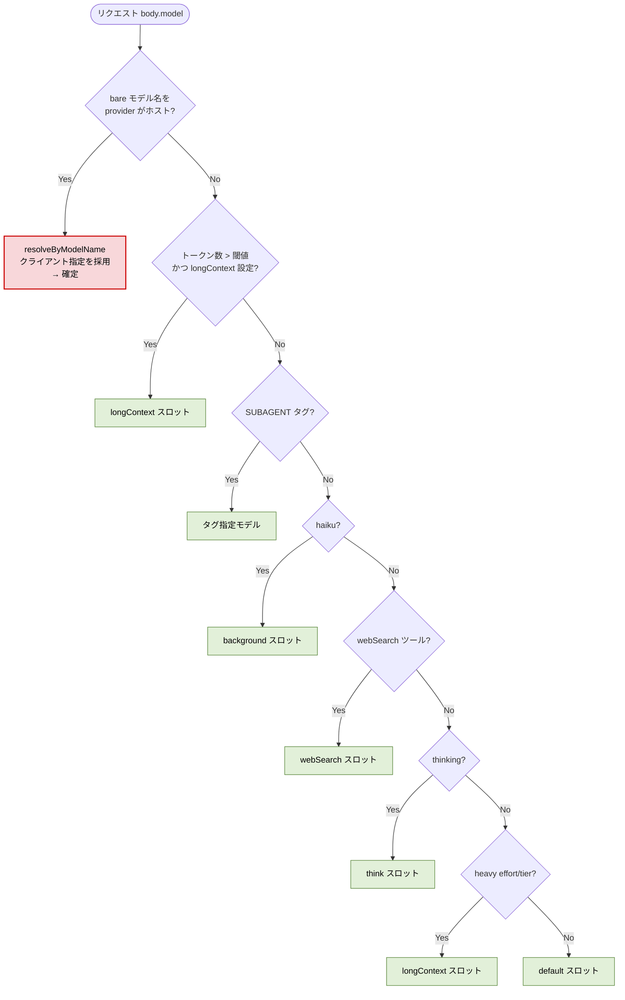
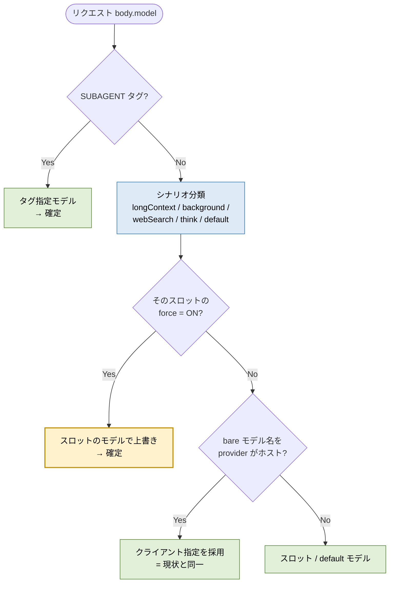

# Router Force Override（スロット単位の強制上書き）

> **置き換え済み（2026-09）:** 本書のルーティング設計はティアマップ（要求ティア → プロバイダのティアエイリアス）に置き換えられた。現行の設計は [quota-and-tier-routing.md](./quota-and-tier-routing.md) を参照。

Status: Planning

## 目的

Router の各シナリオスロット（`default` / `background` / `think` / `webSearch` / `longContext`）に **`force` フラグ**を追加し、
そのシナリオに分類されたリクエストについては **クライアントが送ってきたモデル指定を無視してスロットのモデルで上書き**できるようにする。

`force` を全スロット OFF にすれば **現状と完全に同一挙動**。ON にしたスロットだけ Router が主導権を握る、後方互換な追加とする。

## 問題

### 症状

Claude Code は基本的に常に `model`（例: `claude-opus-4-8`、サブエージェントは `claude-haiku-4-5`）を指定してリクエストを送る。
その結果、**Router 設定がほぼ意味をなさなくなっている**。

### 根本原因

`selectModel`（`src/llms/scenario-router/model-selection.ts`）の優先順位で、
**「bare モデル名がいずれかの provider にホストされていれば、それをそのまま採用」する分岐が最優先で短絡している**ため。

現状の優先順位:

| # | 分岐 | 挙動 |
|---|------|------|
| **1** | **bare モデル名が provider にホスト済み** | **クライアント指定モデルをそのまま採用・短絡** ← 問題箇所 |
| 2 | longContext（トークン閾値超え） | longContext スロットへ |
| 3 | `<CCR-SUBAGENT-MODEL>` タグ | タグ指定モデルへ |
| 4 | haiku → background | background スロットへ |
| 5 | webSearch ツール検出 | webSearch スロットへ |
| 6 | `thinking` フィールドあり | think スロットへ |
| 7 | effort/tier エスカレーション（opus 等） | longContext スロットへ |
| 8 | フォールバック | default スロット / クライアント指定 |

`claude-opus-4-8` を provider の `models` に登録していると、リクエストは **#1 で確定**してしまい、
`longContext` / `think` / `background` などのシナリオスロットへ一切流れない。

> **補足（実測・2026-07-12）**: 以前は最上位に `body.model.includes(',')` による `provider,model` 明示指定分岐があったが、
> 実 Claude Code トラフィックの `body.model` は常に bare 名（`claude-opus-4-8`、コンマなし）で、この分岐は
> 通常発火しない CCR 独自記法のエスケープハッチだった。**入力側のコンマ解釈は削除済み**（`provider,model` は
> router 出力〜下流の内部表現としては引き続き使用）。よって force の主戦場は上記 #1 に集中する。

### 現状フロー（問題箇所をハイライト）



> Claude Code は常に `body.model` を埋めてくるので、実運用ではほぼ全リクエストが **#1 の赤いパス**で確定し、
> 下流のシナリオ分岐（緑）に到達しない。これが「Router が死んでいる」状態。

## 提案設計

### 基本方針

1. **シナリオ分類を先に行う**（現状 #2 の短絡をシナリオ判定より後ろへ動かす）。
2. 分類されたシナリオのスロットが **`force = ON`** なら → **スロットのモデルで確定**（クライアント指定を無視）。
3. **`force = OFF`** なら → **従来どおりクライアントの bare モデル名を尊重**（`resolveByModelName`）。一致しなければスロット / default。

### force の適用範囲（線引き）

`force` が上書きするのは **「bare モデル名指定」のみ**。`<CCR-SUBAGENT-MODEL>` タグは意図的な手動指定なので
**force でも尊重する**。これにより「Claude Code のデフォルト model 選択だけを Router で奪い返す」という最小スコープに閉じる。

### 変更後フロー



- 緑 = 従来どおり尊重するパス（subagent タグ / force OFF 時のクライアント尊重）
- 青 = シナリオ分類を前倒しした部分
- 黄 = 新しい `force` ゲート

### Before / After 早見表

想定: provider に `claude-opus-4-8` を登録済み、`longContext` スロット = `some,glm-4.6`。

| ケース | 現状 | force OFF | `longContext.force = ON` |
|--------|------|-----------|--------------------------|
| opus リクエスト・短文（effort=low/medium 明示） | opus のまま（#1 短絡） | opus のまま（同一） | opus のまま（heavy 非該当で longContext に分類されない） |
| opus リクエスト・短文（effort なし） | opus のまま（#1 短絡） | opus のまま（同一） | **`some,glm-4.6` に上書き**（`isHeavyRequest` が opus tier だけで heavy 判定 → longContext 分類） |
| opus リクエスト・長文（閾値超え） | **opus のまま**（#1 で短絡し longContext に届かない） | opus のまま（同一） | **`some,glm-4.6` に上書き** |
| SUBAGENT タグ | タグ先 | タグ先（同一） | タグ先（force 対象外） |

> 「force OFF」列が現状列と全ケースで一致する ＝ **デフォルトは無変更**であることを表す。

## 永続化設計

`RouterSlot`（Prisma）には既に `params` JSONB がある（`longContextThreshold` が `longContext` スロットの params に乗るのと同じ器）。
**`force` フラグも各スロットの `params.force: boolean` として保存**し、**DDL マイグレーションを不要**にする。

```
RouterSlot(longContext).params = { "threshold": 60000, "force": true }
RouterSlot(default).params     = { "force": false }   // 省略時は false 扱い
```

## 影響範囲

| レイヤー | ファイル | 変更内容 |
|----------|----------|----------|
| ルーティング | `src/llms/scenario-router/model-selection.ts` | `selectModel` の分岐順を組み替え、force ゲートを追加 |
| ルーティング型 | `src/llms/scenario-router/types.ts` | `RouterConfig` に `force` を追加 |
| スキーマ | `src/schemas/router.dto.ts` / `src/schemas/llm-router.dto.ts` | `force` フィールド（scenario 単位）を追加 |
| Config 入出力 | `src/services/config/apply/*` / compose 側 | `params.force` の read/write |
| UI | `src/components/Router.tsx`（および `src/components/router/*`） | スロットごとの force トグル |
| テスト | `__tests__/**`（router/config 周辺） | force ON/OFF の分岐、後方互換の回帰 |

## 後方互換

- `force` 未設定 = `false`。既存 config・既存 provider・既存テストの挙動は不変。
- スキーマは `force` を optional（default `false`）で追加し、旧 config / per-project router ファイルもそのままパース可能にする。

## 実装スライス（1 PR = 1 テーマ）

1. **ロジック + 型 + 単体テスト**: `model-selection.ts` の分岐組み替えと force ゲート。`force` は当面ハードコード無しでスキーマ経由。全 OFF で既存テスト緑を確認。
2. **スキーマ + 永続化**: `router.dto.ts` / `llm-router.dto.ts` に `force` を追加、`RouterSlot.params` の入出力を配線。
3. **UI**: Router 画面にスロット単位の force トグルを追加。
4. **ドキュメント**: `docs/architecture/request-flow.md` の該当図を更新。

## Non-Goals

- `<CCR-SUBAGENT-MODEL>` タグの上書き（force 対象外のまま）。
- Router 全体の単一 force フラグ（スロット単位で提供するため採用しない）。
- フェイルオーバーチェーン（`fallbacks`）や proactive failover の挙動変更。
