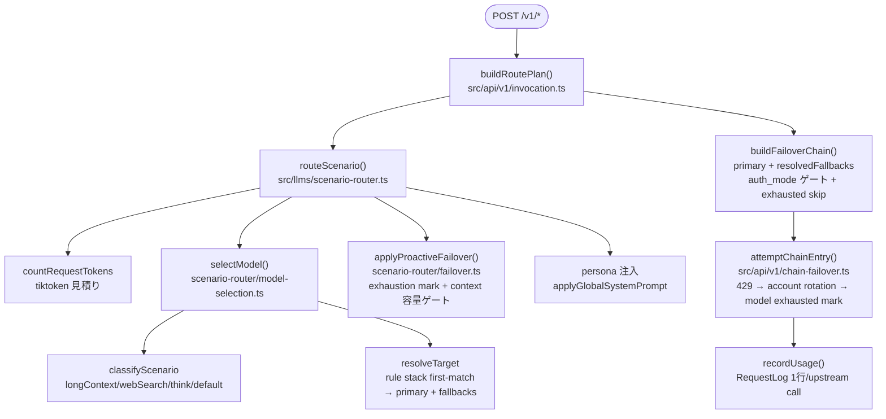
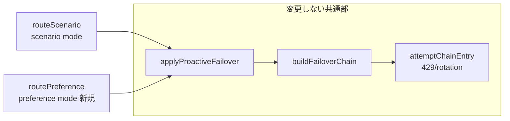

# Subscription Utilization Tuning 実装計画（Level 2 / Level 4）

> **置き換え済み（2026-09）:** 本書のルーティング設計はティアマップ（要求ティア → プロバイダのティアエイリアス）に置き換えられた。現行の設計は [quota-and-tier-routing.md](./quota-and-tier-routing.md) を参照。

Status: Draft (implementation-level)

親ドキュメント: [subscription-utilization-tuning.md](./subscription-utilization-tuning.md)（スコープ・動機・レベル定義はそちらが正）

本書は **実装者がそのままコードを書き始められる粒度** で、

- **Part A**: Level 2「使用率ダッシュボード」の ship-ready 計画
- **Part B**: Level 4「宣言的 Preference-Based Router」への移行計画

を規定する。Level 1（運用ガイド）は Part A のロールアウトに 1 PR として含める。Level 3（オートチューナー）は親ドキュメントどおり別 issue 扱いで、本書では扱わない。

---

## 0. 前提: 現行実装の事実確認（コードを読んだ結果）

計画の前提となる「いまのコードがどうなっているか」。実装時にここが変わっていたら本書の該当箇所も見直すこと。

### 0.1 リクエスト経路



- `selectModel` は `{ model, scenarioType, isSubagent, fallbacks }` を返し、`req.resolvedFallbacks` に載せる。reactive 側（`buildFailoverChain`）も **同じチェーンを読む**（再導出しない）。
- rule の predicate 語彙は `RulePredicateSchema`（`src/schemas/router.dto.ts`）: `requestedTier` / `requestedModel`(glob) / `thinking` / `minTokens` / `maxTokens` / `hasTool` / `effort`。
- tier 判定は `tierOf()`（`model-selection.ts` L209、**現状 module-private**）。fable → opus → sonnet → haiku の順の substring match。
- 枠使用率のデータ源は 2 系統:
  - **in-memory**: `usage-service/cache.ts` の `claudeCache` / `codexCache`（TTL 5min、usage-job の 5 分ポーラーが更新）。`headroom.ts` / `window-headroom.ts` が読む。リクエスト経路で既に使用中（DB アクセスなし）。
  - **DB**: `SubAccountUsage`（per-account 最新値）と `UsageSnapshot`（時系列）。
- 429 の記憶は `services/failover-state.ts` の in-process TTL map（provider / account / model の 3 スコープ）。
- `RequestLog` は `scenario` / `requestedModel` / `isSubagent` / `provider` / `model` / `totalInputTokens` / `status` / `createdAt` を持つ（`@@index([createdAt])` あり）。既存の集計 API 例: `GET /api/request-logs/model-routing`（`src/api/request-logs/model-routing.ts`）。

### 0.2 設定ストア

- Router 実体は `RouterSlot`（scenario ごと 1 行、`params` JSONB に fallbacks / rules / threshold）。
- 書き込みは `POST /api/config` → `applyUiConfig` → `applyRouter`（1 トランザクション）。読み出しは `composeUiConfig`。
- **注意（罠）**: `ApplyConfigPayloadSchema` は `.catchall(JsonValueSchema)` を持ち、未知の top-level キーは **そのまま disk envelope に書かれる**（`LiveRoutingName` はこの経路を意図的に使っている）。新しい構造化データをうっかり top-level に足すと envelope に漏れる。
- envelope スキーマは `ConfigEnvelopeSchema`（`src/schemas/config.dto.ts`）。boot scalar は `applyEnvelopeToEnv` で `process.env` にミラーされる。

### 0.3 リポジトリ規約（本計画のコードが従うもの）

| 項目 | 規約 |
|---|---|
| Zod | `import { z } from '@hono/zod-openapi'`。生の `zod` から import しない |
| 禁止構文 | `??` / `let` / `while` / `as`（`as const` のみ可）。既存違反（chain-failover.ts 等）は grandfathered、新規コードでは書かない |
| 日時 | 保存値は `src/lib/dayjs` 経由。`new Date()` / `Date.now()` を保存パスで直接使わない（in-memory TTL 比較のみ既存慣行として `Date.now()` 使用箇所あり） |
| UI | `src/components/ui/*.tsx` は編集禁止（shadcn 管理）。**Card コンポーネントは使わない**（border-l accent + `hover:bg-muted/50` のフラットパターンで統一） |
| 金額表示 | 有効数字 5 桁（`Intl.NumberFormat`, `minimum/maximumSignificantDigits: 5`） |
| DB | DDL 直接編集禁止。`bun run db:migrate`。**migration 後は `bun run db:migrate:test` も必須**（rialto_test） |
| テスト | ランナーは `bun test`（vitest ではない）。`__tests__/` が `src/` をミラー。DB テストは `HAS_DB` + `describe.skipIf(!HAS_DB)` パターン（`__tests__/db/helpers.ts`） |
| コメント | コード内コメントは英語。plan doc は日本語 |
| フロント | `src/lib/api.ts` の `ApiClient` に型付きメソッドを足す（コンポーネントから生 fetch しない） |

---

# Part A: Level 2 — 使用率ダッシュボード（ship-ready）

DB スキーマ変更なし。追加は「スキーマ 1 ファイル + サービス 1 ファイル + API route 1 ファイル + UI 数ファイル + テスト」。

## A-1. Zod スキーマ: `src/schemas/router-utilization.dto.ts`（新規）

`request-log.dto.ts` の ModelRouting 系と同じ流儀で書く。`index.ts` バレルに `export * from './router-utilization.dto'` を追加。

```ts
import { z } from '@hono/zod-openapi'
import { REQUESTED_MODEL_TIERS } from './router.dto'

// Window for the aggregation. Default 168h (7d) to match the design doc.
export const RouterUtilizationQuerySchema = z.object({
  sinceHours: z.coerce.number().int().min(1).max(8760).default(168)
})

// One (provider, model) target a slot actually sent traffic to.
export const SlotTargetStatSchema = z
  .object({
    provider: z.string().nonempty(),
    model: z.string().nonempty(),
    // Tier the sent model名 buckets into (fable/opus/sonnet/haiku), null when
    // untierable (gpt-5 etc.).
    tier: z.enum(REQUESTED_MODEL_TIERS).nullable(),
    // Whether the provider is auth_mode=subscription (read from the DB
    // Provider table at aggregation time, NOT stored per-row).
    subscription: z.boolean(),
    count: z.number().int().nonnegative(),
    successCount: z.number().int().nonnegative(),
    rateLimitedCount: z.number().int().nonnegative()
  })
  .openapi('SlotTargetStat')

// Requested-tier cross-tab entry: how many requests of each requested tier
// the slot received, and how many of them landed on a fable-tier
// subscription model (the "reach" the design doc cares about).
export const SlotTierReachSchema = z
  .object({
    requestedTier: z.enum(REQUESTED_MODEL_TIERS).nullable(),
    count: z.number().int().nonnegative(),
    sentToSubscriptionFable: z.number().int().nonnegative()
  })
  .openapi('SlotTierReach')

export const TokenPercentilesSchema = z
  .object({
    p50: z.number().nonnegative(),
    p75: z.number().nonnegative(),
    p90: z.number().nonnegative(),
    max: z.number().nonnegative()
  })
  .openapi('TokenPercentiles')

// Per (scenario, route kind) aggregation over the window.
export const SlotUtilizationSchema = z
  .object({
    scenario: z.string().nonempty(), // ScenarioKey; string on the wire like RequestLog.scenario
    isSubagent: z.boolean(),
    total: z.number().int().nonnegative(),
    successRate: z.number().min(0).max(1),
    rateLimitedRate: z.number().min(0).max(1),
    targets: z.array(SlotTargetStatSchema),
    tierReach: z.array(SlotTierReachSchema),
    // Null when the slot had no rows in the window (percentile SQL skips it).
    tokens: TokenPercentilesSchema.nullable()
  })
  .openapi('SlotUtilization')

// Machine-actionable suggestion. `message` is an i18n KEY (router.suggest.*),
// not free text — the UI translates; params interpolate.
export const SuggestionActionSchema = z.discriminatedUnion('kind', [
  z.object({
    kind: z.literal('addRule'),
    scenario: z.string().nonempty(),
    routeKind: z.enum(['agent', 'subagent']),
    // RouteRule-shaped payload the UI feeds to addRule() verbatim.
    rule: z.object({
      name: z.string().optional(),
      when: z.record(z.string(), z.unknown()),
      target: z.string().nonempty()
    })
  }),
  z.object({
    kind: z.literal('lowerMinTokens'),
    scenario: z.string().nonempty(),
    routeKind: z.enum(['agent', 'subagent']),
    ruleIndex: z.number().int().nonnegative(),
    from: z.number().int().nonnegative(),
    to: z.number().int().nonnegative()
  }),
  z.object({
    kind: z.literal('addFallback'),
    scenario: z.string().nonempty(),
    routeKind: z.enum(['agent', 'subagent']),
    target: z.string().nonempty()
  })
])

export const UtilizationSuggestionSchema = z
  .object({
    id: z.string().nonempty(), // stable: `${scenario}:${kind}:${detector}`
    severity: z.enum(['info', 'warn', 'critical']),
    messageKey: z.string().nonempty(), // e.g. 'router.suggest.subscriptionMiss'
    messageParams: z.record(z.string(), z.union([z.string(), z.number()])),
    action: SuggestionActionSchema.nullable() // null = 表示のみ（自動適用不能）
  })
  .openapi('UtilizationSuggestion')

export const RouterUtilizationResponseSchema = z
  .object({
    sinceHours: z.number().int().positive(),
    slots: z.array(SlotUtilizationSchema),
    suggestions: z.array(UtilizationSuggestionSchema),
    // Latest per-metric subscription window state, so the UI can show
    // "Fable weekly: 12%" next to the reach numbers. Mirrors SubAccountUsage.
    subscriptionWindows: z.array(
      z.object({
        provider: z.string().nonempty(),
        metric: z.string().nonempty(), // claude.seven_day_scoped.fable etc.
        percent: z.number().min(0),
        resetAt: z.string().nullable() // ISO
      })
    )
  })
  .openapi('RouterUtilizationResponse')

export type RouterUtilizationResponse = z.infer<typeof RouterUtilizationResponseSchema>
export type SlotUtilization = z.infer<typeof SlotUtilizationSchema>
export type UtilizationSuggestion = z.infer<typeof UtilizationSuggestionSchema>
export type SuggestionAction = z.infer<typeof SuggestionActionSchema>
```

### 前提となる小改修: `tierOf` の export

集計サービスは sent/requested モデル名を tier に潰す必要がある。`tierOf` は現在 `model-selection.ts` の private 関数なので:

- `src/llms/scenario-router/model-selection.ts`: `function tierOf` → `export function tierOf`
- `src/llms/scenario-router.ts` の re-export に追加: `export { isHeavyRequest, selectModel, tierOf } from './scenario-router/model-selection'`

ロジック変更ゼロ。既存テストへの影響なし。

## A-2. サービス: `src/services/router-utilization-service.ts`（新規）

### 関数シグネチャ

```ts
import type { PrismaClient } from '../generated/prisma/client'
import type { Router } from '@/schemas'
import type {
  RouterUtilizationResponse,
  SlotUtilization,
  UtilizationSuggestion
} from '@/schemas'

// Entry point the API route calls. Loads RequestLog aggregates, the current
// Router (composeUiConfig), the Provider auth modes, and the latest
// SubAccountUsage rows, then folds them into the response shape.
export async function getRouterUtilization(
  sinceHours: number,
  prisma: PrismaClient = getPrismaClient()
): Promise<RouterUtilizationResponse>

// Pure: build suggestions from already-aggregated slot stats + the current
// Router config + the provider catalog. Exported for unit tests (no DB).
export function buildSuggestions(
  slots: readonly SlotUtilization[],
  router: Router,
  providers: readonly ProviderCatalogEntry[],
  ruleHitRates: readonly RuleHitRate[]
): UtilizationSuggestion[]

// Provider view the detectors need (subset of composeUiConfig's Provider).
export type ProviderCatalogEntry = {
  name: string
  authMode: 'api_key' | 'subscription'
  enabledModels: readonly string[]
}

// Hit rate of one minTokens-carrying rule, measured against the window.
export type RuleHitRate = {
  scenario: string
  routeKind: 'agent' | 'subagent'
  ruleIndex: number
  minTokens: number
  total: number
  hits: number
}
```

### SQL（`prisma.$queryRaw` タグ付きテンプレート）

Prisma の `groupBy` では percentile が取れないため、token 分布のみ raw SQL。テーブル/カラムは Prisma 既定命名（`@@map` なし）なので **ダブルクォート必須**。

**(1) スロット × 送信先の集計** — Prisma `groupBy` で足りる:

```ts
const grouped = await prisma.requestLog.groupBy({
  by: ['scenario', 'isSubagent', 'provider', 'model', 'requestedModel', 'status'],
  where: {
    createdAt: { gte: since }, // since = dayjs().subtract(sinceHours, 'hour').toDate()
    scenario: { not: null },
    isSubagent: { not: null }
  },
  _count: { _all: true }
})
```

`requestedModel` / sent `model` の tier 化と subscription 判定は TS 側で行う（`tierOf` + Provider.authMode の Map）。カーディナリティは (5 scenario × 2 kind × 実運用モデル数 × status 数) で高々数百行。

**(2) token パーセンタイル** — raw SQL:

```sql
SELECT
  "scenario",
  "isSubagent",
  percentile_cont(0.50) WITHIN GROUP (ORDER BY "totalInputTokens") AS p50,
  percentile_cont(0.75) WITHIN GROUP (ORDER BY "totalInputTokens") AS p75,
  percentile_cont(0.90) WITHIN GROUP (ORDER BY "totalInputTokens") AS p90,
  MAX("totalInputTokens")                                          AS max
FROM "RequestLog"
WHERE "createdAt" >= $1
  AND "scenario" IS NOT NULL
  AND "isSubagent" IS NOT NULL
GROUP BY "scenario", "isSubagent"
```

```ts
type PercentileRow = { scenario: string; isSubagent: boolean; p50: number; p75: number; p90: number; max: number }
const rows = await prisma.$queryRaw<PercentileRow[]>`SELECT ... WHERE "createdAt" >= ${since} ...`
```

**(3) minTokens ルールのヒット率** — 現行 Router を `composeUiConfig()` で読み、`when.minTokens` を持つ rule ごとに 1 クエリ:

```sql
SELECT
  COUNT(*)::int                                                AS total,
  COUNT(*) FILTER (WHERE "totalInputTokens" >= $2)::int        AS hits
FROM "RequestLog"
WHERE "scenario" = $1
  AND "isSubagent" = $3
  AND "createdAt" >= $4
```

> **重要な注記（ダッシュボードにも表示する）**: rule の `minTokens` はルーティング時の **tiktoken 見積り値** に対して評価されるが、`RequestLog.totalInputTokens` は **upstream 実測（cache read/write 込み）**。両者は一致しない（実測の方が大きく出る傾向）。ヒット率・p75 提案は「近似指標」であり、提案文の i18n 文言に必ずこの但し書きを含める。

**(4) subscription 窓の突合** — `SubAccountUsage` を読むだけ:

```ts
const windows = await prisma.subAccountUsage.findMany({
  where: { subAccount: { enabled: true } },
  include: { subAccount: { include: { provider: true } } }
})
```

`metric` はそのまま返す（`claude.seven_day_scoped.fable` の slug は `subaccount-usage-store.ts` の `scopedMetricKey` 準拠）。

### 提案ディテクタ（`buildSuggestions` の中身）

親ドキュメントの表を、取得可能なデータに合わせて確定させる。すべて **表示のみ・適用は人のクリック**:

| ID (detector) | 条件（n = スロットの window 内 req 数） | severity | action |
|---|---|---|---|
| `subscriptionMiss` | n ≥ 100 かつ requestedTier ∈ {opus, fable} の req のうち subscription-Fable へ到達した率 < 10% かつ Provider カタログに enabled な fable モデルを持つ subscription provider が存在 | critical | `addRule`: `{ when: { requestedTier: ['opus','fable'] }, target: '<subProvider>,<fableModel>' }` を rules 先頭に挿入 |
| `deadMinTokens` | rule の hits/total < 5% かつ total ≥ 100 | warn | `lowerMinTokens`: `to = ceil(p75 / 1000) * 1000`（そのスロットの p75 を 1k 丸め） |
| `rateLimitNoFallback` | rateLimitedRate（status=429 率）> 5% かつ該当 route の fallbacks が空 | warn | `addFallback`: 同 tier の別モデル（enabled 順で先頭）。候補が無ければ action=null |
| `tierMismatchTarget` | rule.when.requestedTier に fable/opus を含むのに `tierOf(rule.target)` がそれ未満 | info | null（表示のみ。ユーザー意図の可能性が高いので自動 action は作らない） |

- 提案 `id` は `${scenario}:${routeKind}:${detector}` で安定させ、UI 側の「無視した提案を再表示しない」拡張（将来）に備える。
- 429 判定: `rateLimitedCount` = `status === 429` の行数。`successCount` = `status === 200`。
- 親ドキュメントの「SQL を表示」は、Postgres 移行後の現在では意味を持たないため **「適用前に Router config の before/after diff (JSON) を表示」** と読み替える（A-4 参照）。

## A-3. API route: `src/api/router-utilization/route.ts`（新規）

`refresh-models/route.ts` / `request-logs/model-routing.ts` のパターンを踏襲:

```ts
import { createRoute, OpenAPIHono } from '@hono/zod-openapi'
import { RouterUtilizationQuerySchema, RouterUtilizationResponseSchema } from '../../schemas'
import { getRouterUtilization } from '../../services/router-utilization-service'

export const routerUtilizationRoute = new OpenAPIHono()

const route = createRoute({
  method: 'get',
  path: '/api/router-utilization',
  request: { query: RouterUtilizationQuerySchema },
  responses: {
    200: {
      description:
        'Per-slot routing utilization over the window: request counts, success/429 rates, ' +
        'requested-tier reach into subscription models, token percentiles, and actionable ' +
        'suggestions for closing the gap between config and observed traffic.',
      content: { 'application/json': { schema: RouterUtilizationResponseSchema } }
    }
  }
})
routerUtilizationRoute.openapi(route, async (c) => {
  const { sinceHours } = c.req.valid('query')
  return c.json(await getRouterUtilization(sinceHours), 200)
})
```

`src/index.ts` に mount 追加（`app.route('/', requestLogsRoute)` の隣）:

```ts
import { routerUtilizationRoute } from './api/router-utilization/route'
// ...
app.route('/', routerUtilizationRoute)
```

## A-4. UI

### A-4.1 ApiClient メソッド（`src/lib/api.ts`）

既存の interface 定義スタイル（ModelRoutingResponse 等）に合わせて:

```ts
async getRouterUtilization(sinceHours?: number): Promise<RouterUtilizationResponse> {
  const qs = sinceHours === undefined ? '' : `?sinceHours=${sinceHours}`
  return this.get<RouterUtilizationResponse>(`/router-utilization${qs}`)
}
```

型は `@/schemas` の `RouterUtilizationResponse` を import（`api.ts` は既に `@/schemas` から `RouterConfig` を import 済みなので同じ経路）。

### A-4.2 フェッチフック: `src/hooks/use-router-utilization.ts`（新規）

TanStack Query は本リポジトリでは未採用。`useEnabledModelOptions` と同じ素の hooks パターンで:

```ts
export function useRouterUtilization(sinceHours = 168): {
  data: RouterUtilizationResponse | null
  loading: boolean
  reload: () => void
}
```

（`useEffect` + `useState` + reload カウンタ。エラー時は `data: null` のままにして UI はバッジ非表示に fallback — ダッシュボードが routing 編集を邪魔しないこと。）

### A-4.3 バッジ: scenario ノードへの表示

配置は React Flow の **scenario ノード内**（`src/components/routing-map/edit-nodes.tsx` の `ScenarioEditNode`）。`ui/*` は触らないが routing-map 配下は編集可。

1. `RoutingEditorProps`（`src/components/RoutingEditor.tsx`）に optional prop 追加:

```ts
// Per-slot utilization chips rendered inside each scenario node. Absent →
// no chips (RoutingPresetEditor and read-only views simply don't pass it).
utilization?: readonly SlotUtilization[]
```

2. `RoutingEditor` の `nodes` useMemo 内で `scenario` + kind=`agent` の `SlotUtilization` を引き、node data に載せる:

```ts
data: {
  // ...existing fields...
  utilization: utilizationFor(node.scenario) // { total, successRate, fableReachPct } | undefined
}
```

3. `edit-nodes.tsx` の scenario ノード描画にチップ行を 1 行追加。表示形式（Card 禁止・フラット準拠、`Badge` は `ui/badge.tsx` を利用してよい）:

```
7d: 8,171 req · ✓100% · Fable 0% ⚠
```

バッジ色（親ドキュメント準拠）: `fableReachPct` を主指標として
- 40–80% → `variant='secondary'`（green 系 accent クラス）
- >80% または <10%（かつ opus/fable req が存在）→ yellow
- 0% または 429 率 >5% → red（`variant='destructive'`）
- opus/fable req が無いスロット（default 等）は reach 表示自体を省き `n req · ✓%` のみ

4. `RoutingLiveEditor.tsx` が `useRouterUtilization()` を呼び、`<RoutingEditor utilization={...}>` へ渡す。`RoutingPresetEditor` は渡さない（プリセットは live トラフィックと無関係）。

### A-4.4 Suggested フロー: `src/components/routing-map/SuggestionsBar.tsx`（新規）

- 置き場所: `RoutingLiveEditor` のヘッダー直下（`PageHeader` と `RoutingEditor` の間）。suggestions が空なら何も描画しない。
- 見た目: 提案 1 件 = 1 行のフラットリスト（`border-l-2 border-l-amber-500 pl-3 hover:bg-muted/50` パターン、severity で accent 色分け）。
- 各行: 翻訳済みメッセージ + `[適用]` ボタン（`action === null` なら表示のみ）+ `[詳細]`（後述 diff ダイアログ）。
- **適用の実装**: サーバーは config を直接書かない。`action` を **クライアント側で RouterConfig の draft 変換**にマップする pure ヘルパーを作る:

```ts
// src/lib/router/apply-suggestion.ts (新規, pure)
import type { RouterConfig } from '@/schemas'
import type { SuggestionAction } from '@/schemas'

// Map a server-issued suggestion action onto the draft RouterConfig using
// the same pure edit helpers the editor uses (addRule / connectModel /
// updateRule). Returns the router unchanged when the action no longer
// applies (rule index drifted, model vanished) — the caller shows a toast.
export function applySuggestion(router: RouterConfig, action: SuggestionAction): RouterConfig
```

内部は `src/lib/routing-map/edit-actions.ts` の `addRule` / `updateRule` / `connectModel` を呼ぶだけ。適用後は `api.updateConfig({ ...config, Router: next })`（`RoutingLiveEditor.onSave` と同一経路）→ 保存成功で `useRouterUtilization().reload()`。
- **diff 表示**: `[詳細]` で Dialog（`ui/dialog.tsx` 利用）に before/after の `JSON.stringify(router[scenario], null, 2)` を並べる。Monaco は不要（読み取り専用 `<pre>` で十分）。親ドキュメントの「SQL を表示」の代替。

### A-4.5 i18n（`src/locales/{en,ja,zh}.json`）

追加キー（例、3 言語すべて）:

```
router.utilization.badge        "{{count}} req"
router.utilization.reach        "Fable reach {{pct}}%"
router.suggest.subscriptionMiss "opus/fable 要求の {{pct}}% しか {{model}} に到達していません。ルール追加を検討してください（実測トークンは推定値と異なる点に注意）"
router.suggest.deadMinTokens    "minTokens {{from}} のヒット率は {{pct}}% です。p75 ({{to}}) 付近への引き下げを提案します"
router.suggest.rateLimitNoFallback "429 率 {{pct}}% ですが fallback が未設定です"
router.suggest.tierMismatchTarget  "ルールは {{tier}} 要求を捕捉しますが、target は下位 tier です"
router.suggest.apply            "適用"
router.suggest.detail           "詳細"
```

## A-5. テスト

| ファイル（新規） | 種別 | 内容 |
|---|---|---|
| `__tests__/services/router-utilization.test.ts` | pure（DB 不要） | `buildSuggestions` の 4 ディテクタ。fixture 型は A-2 の `SlotUtilization[]` / `ProviderCatalogEntry[]` / `RuleHitRate[]` をそのままリテラルで組む。境界: n=99 は発火しない / reach 10.0% は発火しない / fable provider 不在なら subscriptionMiss は出ない / p75 丸め |
| `__tests__/db/router-utilization-service.test.ts` | DB（`describe.skipIf(!HAS_DB)`） | `resetDbTables()` → Provider/Model/RouterSlot/Session/RequestLog をシード → `getRouterUtilization(168)` の集計値・percentile・tierReach を検証。RequestLog シードは `prisma.requestLog.createMany`（`createdAt` は `dayjs().subtract(...)` で窓内外を作る） |
| `__tests__/lib/apply-suggestion.test.ts` | pure | `applySuggestion` の 3 action。stale action（ruleIndex 範囲外）で無変更を返すこと |

fixture 追加は不要（すべてインラインリテラルで足りる）。`bun test __tests__/lib __tests__/db` が CI の対象（`CCR_SKIP_LIVE_TESTS=1 bun test __tests__/` も通ること）。

## A-6. ロールアウト（PR 分割）と工数

| PR | 内容 | 依存 | 推定 LOC | 推定時間 |
|---|---|---|---|---|
| **PR-A1** | `docs/guides/subscription-spillover.md`（Level 1 運用ガイド: primary=Fable + fallbacks=[opus] パターン、`failover.ts` の挙動説明） | なし | +80 | 1h |
| **PR-A2** | `tierOf` export + dto + サービス + API route + `src/index.ts` mount + テスト 2 本 | なし | +650 | 5–7h |
| **PR-A3** | ApiClient + hook + バッジ（RoutingEditor/edit-nodes）+ SuggestionsBar + apply-suggestion + i18n + テスト 1 本 | PR-A2 | +550 | 5–7h |

- 互換性: すべて additive。既存 API / DB / ルーティング挙動への影響ゼロ。PR-A2 単体でも `curl /api/router-utilization` で価値が出る。
- 壊れうる点: なし（`tierOf` export はシグネチャ変更なし）。唯一の注意は `$queryRaw` のカラム引用符ミス（テスト DB で検出可能 — `bun run db:migrate:test` 済みであること）。

---

# Part B: Level 4 — Preference-Based Router 移行計画

## B-0. 設計上の最重要判断: 既存 failover 機構への「合流」

Level 4 の新規性は **選択の入力（宣言的リスト）** であって、失敗時の機械ではない。現行パイプラインは既に

- `selectModel` が `{ primary, fallbacks }` を返す
- `applyProactiveFailover` が exhaustion mark + context 容量でチェーンを前詰めする
- `buildFailoverChain` → `attemptChainEntry` が reactive 429 / account rotation を処理する

という「**primary + ordered fallbacks を渡せば残りは全部やってくれる**」構造になっている。したがって preference selector の出力を `{ primary: eligible[0], fallbacks: eligible[1..] }` に整形して `req.resolvedFallbacks` に載せれば、**failover.ts / chain-failover.ts / failover-state.ts は 1 行も変更せずに再利用できる**。これが本計画の背骨。親ドキュメントの「既存 fallback 相当が preference chain に自然に統合される」の実装形。



## B-1. 新スキーマ

### B-1.1 Prisma（`src/prisma/schema.prisma` 追記 → `bun run db:migrate -- --name add_router_preference` → `bun run db:migrate:test`）

```prisma
// Preference-based routing (Level 4). One profile row (key='live') holds the
// mode-independent knobs; ordered entries reference Models directly so the
// same delete-warning flow as RouterSlot applies.
model RouterPreferenceProfile {
  id          String   @id @default(cuid())
  // Singleton discriminator — always 'live'. A future "preference presets"
  // feature would add more keys; today the apply path upserts key='live'.
  key         String   @unique @default("live")
  // Constraint knobs as JSONB (sonnetTierRespect / haikuTierRespect /
  // maxCostPerDay ...). JSONB so adding a knob is not a migration, mirroring
  // RouterSlot.params.
  constraints Json?
  updatedAt   DateTime @updatedAt
  entries     RouterPreferenceEntry[]
}

model RouterPreferenceEntry {
  id        String                  @id @default(cuid())
  profileId String
  profile   RouterPreferenceProfile @relation(fields: [profileId], references: [id], onDelete: Cascade)
  // 1 = most preferred. Unique per profile so the order is total.
  priority  Int
  modelId   String
  model     Model                   @relation(fields: [modelId], references: [id], onDelete: Cascade)
  // Soft toggle: keep the row (and its priority slot) while excluding the
  // model from selection — "一時的に Fable を外す" without reordering.
  enabled   Boolean                 @default(true)

  @@unique([profileId, priority])
  @@index([profileId])
}
```

- `Model` 側に back-relation `preferenceEntries RouterPreferenceEntry[]` を追加。
- **onDelete 方針**: RouterSlot は `Restrict`（configService が先に null 化）だが、preference entry は「リストの 1 行」なので `Cascade` + apply 時の warning で十分。モデル削除で entry が黙って消える点は `applyProviders` の削除 warning に 1 文足す（「preference からも外れました」）。
- seed 変更: `prisma db seed` で `RouterPreferenceProfile(key='live')` を空 entries で upsert（`ensureRouterSlots` の隣に `ensurePreferenceProfile()`）。

### B-1.2 モード切替キー（envelope）

`ConfigEnvelopeSchema`（`src/schemas/config.dto.ts`）に boot scalar を追加:

```ts
// Which selector routes /v1 traffic. 'scenario' = current RouterSlot-based
// router (default; zero behavior change). 'shadow' = scenario routes, but the
// preference selector also runs and logs its would-be decision. 'preference' =
// the preference selector routes.
ROUTER_MODE: z.enum(['scenario', 'shadow', 'preference']).default('scenario'),
// Percentage (0-100) of sessions routed by the preference selector while
// ROUTER_MODE='preference'. Sessions hash outside the bucket stay on the
// scenario router. 100 = full cutover.
ROUTER_PREFERENCE_ROLLOUT_PCT: z.coerce.number().int().min(0).max(100).default(100)
```

- envelope 採用の理由: (1) DB が落ちていても disk の 1 キー書き換え + `ccr restart` で戻せる、(2) `POST /api/config` の catchall 経由（`LiveRoutingName` と同じ）で **再起動なしに** `resetLlmsContext()` が効く、(3) boot scalar の既存機構（`applyEnvelopeToEnv`）に乗る。
- `AppConfigSchema` / `Config`（UI 型）には optional で露出。UI トグルは B-3.3。

### B-1.3 Zod / wire スキーマ: `src/schemas/preference-router.dto.ts`（新規）

```ts
import { z } from '@hono/zod-openapi'

export const PreferenceEntrySchema = z
  .object({
    // "providerName,modelName" — same reference format as RouterSlot
    // primaries / fallbacks, resolved against the Model table on write.
    model: z.string().nonempty(),
    priority: z.number().int().positive(),
    enabled: z.boolean().default(true)
  })
  .openapi('PreferenceEntry')

export const PreferenceConstraintsSchema = z
  .object({
    // A sonnet-tier request may only land on sonnet-tier models.
    sonnetTierRespect: z.boolean().default(true),
    // A haiku-tier request may only land on sonnet-or-below models.
    haikuTierRespect: z.boolean().default(true),
    // Skip a subscription candidate whose binding usage window is at/over
    // this percent (in-memory usage cache; unknown = allow).
    quotaSkipPct: z.number().min(0).max(100).default(95),
    // Skip a candidate whose 5-min error rate exceeds this (event-driven
    // health tracker; fewer than minHealthSamples observations = allow).
    errorRateSkipPct: z.number().min(0).max(100).default(20),
    minHealthSamples: z.number().int().positive().default(10),
    // Reserved: not enforced in the first cut (needs daily cost accounting).
    maxCostPerDay: z.number().positive().optional()
  })
  .openapi('PreferenceConstraints')

export const RouterPreferencesSchema = z
  .object({
    preferences: z.array(PreferenceEntrySchema),
    constraints: PreferenceConstraintsSchema
  })
  .openapi('RouterPreferences')
export type RouterPreferences = z.infer<typeof RouterPreferencesSchema>
export type PreferenceConstraints = z.infer<typeof PreferenceConstraintsSchema>
```

**wire 配置の決定**: `Router.preferences`（親ドキュメント案）ではなく **専用エンドポイント `GET/PUT /api/router-preferences`** にする。理由:

1. `ApplyConfigPayloadSchema` の catchall が未知 top-level キーを disk envelope に書いてしまう罠（§0.2）を踏まない。
2. `RouterSchema` は scenario ネスト構造で、`applyRouter` が `SCENARIO_KEYS` を全走査する。異質なキーを混ぜると `knownKeys` フィルタ・`splitPayload`・preset round-trip 全部に手が入る。
3. RouterSlot と preference は共存期間中 **独立に編集される** ので、保存単位も独立が自然。

## B-2. 新セレクタ: `src/llms/preference-router/`

### ファイル構成

```
src/llms/preference-router/
  index.ts        // routePreference(): routeScenario と同じ副作用契約
  selection.ts    // selectByPreference(): pure、単体テストの主対象
  gates.ts        // CandidateGate 実装（quota / health / context / tier）
src/services/model-health.ts   // event-driven error-rate tracker（新規）
```

### B-2.1 pure セレクタ（`selection.ts`）

```ts
import type { RequestedModelTier } from '@/schemas'

// One trace entry per candidate considered, mirroring the trace shape
// applyProactiveFailover already logs — the two traces concatenate into a
// single per-request decision record.
export type PreferenceTraceEntry = {
  target: string
  reason: 'eligible' | 'disabled' | 'tier' | 'context' | 'exhausted' | 'quota' | 'health' | 'unknown-model'
}

// Injected ports so the selector is pure and clock-controlled in tests.
export type CandidateGate = {
  contextFits: (target: string, tokenCount: number) => boolean
  quotaHealthy: (target: string, now: number) => boolean
  errorRateOk: (target: string, now: number) => boolean
  isExhausted: (target: string) => boolean
  tierOfTarget: (target: string) => RequestedModelTier | undefined
}

export type PreferenceSelectionInput = {
  requestedModel: string
  requestedTier: RequestedModelTier | undefined
  tokenCount: number
  preferences: readonly { target: string; priority: number; enabled: boolean }[]
  constraints: PreferenceConstraints
  gate: CandidateGate
  now: number
}

export type PreferenceSelection = {
  primary: string
  fallbacks: string[]
  trace: PreferenceTraceEntry[]
}

// Walk the preference list in priority order and keep every candidate that
// passes all gates. First survivor = primary, rest = fallbacks (the existing
// proactive/reactive failover walks them unchanged). Returns undefined when
// nothing survives — the caller keeps req.body.model (passthrough), matching
// selectModel's unset-route behavior.
export function selectByPreference(input: PreferenceSelectionInput): PreferenceSelection | undefined
```

アルゴリズム（擬似コード）:

```
sorted = preferences を priority 昇順に整列
eligible = []
for candidate in sorted:
  if !candidate.enabled                    → trace 'disabled';      continue
  tier = gate.tierOfTarget(candidate)
  if !tierAllowed(requestedTier, tier)     → trace 'tier';          continue
  if !gate.contextFits(candidate, tokens)  → trace 'context';       continue
  if gate.isExhausted(candidate)           → trace 'exhausted';     continue
  if !gate.quotaHealthy(candidate, now)    → trace 'quota';         continue
  if !gate.errorRateOk(candidate, now)     → trace 'health';        continue
  trace 'eligible'; eligible.push(candidate)
if eligible is empty → return undefined          // passthrough
return { primary: eligible[0], fallbacks: eligible[1..], trace }

tierAllowed(requested, candidateTier):
  requested == 'sonnet' かつ constraints.sonnetTierRespect
      → candidateTier == 'sonnet'
  requested == 'haiku' かつ constraints.haikuTierRespect
      → candidateTier ∈ {'sonnet', 'haiku'}
  それ以外（opus / fable / 判定不能）→ true
  candidateTier == undefined（gpt 系等）→ true（tier 不明モデルは常に許可。※Open Question 1）
```

- **exhausted / quota を selector 側でも見る理由**: 下流の `applyProactiveFailover` も再チェックするが、selector 側で除外しておくと fallbacks が「いま実際に使える順序付きリスト」になり shadow ログの比較が意味を持つ。二重チェックは冪等で害がない。
- 全滅時 `undefined` → passthrough は、scenario router の「route 未設定 → `req.body.model` のまま」と同じ縮退で、**Claude Code が送ってきたモデルへ直行**する安全側の挙動。

### B-2.2 ゲート実装（`gates.ts`）

すべて **in-process 読み取りのみ**。リクエスト経路に DB / ネットワークを追加しない。

```ts
// Build the runtime gate from the ConfigStore + in-memory caches. All reads
// are O(1) map lookups — the <5ms request-path budget is trivially met.
export function buildRuntimeGate(config: ConfigStore, constraints: PreferenceConstraints): CandidateGate
```

| ゲート | 実装 | データ鮮度 |
|---|---|---|
| `contextFits` | `failover.ts` の `candidateFitsContext` と同じロジック（provider の `modelContextWindows`）。private なので **export して共用**（コピーしない） | config reload 時 |
| `isExhausted` | `isModelExhausted(provider, model)`（`failover-state.ts`、既存） | 即時（event-driven） |
| `quotaHealthy` | `subscriptionKindOf()` で kind 判定 → subscription でなければ常に true。claude/fable のような scoped weekly は `claudeCache` から `weeklyScoped` を model 名 slug 照合、なければ `getKindWindowHeadroom(kind, 'five_hour'/'seven_day', now)`。`pct >= constraints.quotaSkipPct` で false。**キャッシュ空 = true（allow）** — headroom.ts と同じ縮退 | usage-job の 5 分ポーリング（TTL `TTL_MS = 5 * 60_000`、`usage-service/cache.ts` 既存）。**N = 300 秒**。refresh path は既存の BullMQ `usage-job` → `claudeCache`/`codexCache` 書き込みで、追加実装なし |
| `errorRateOk` | 新規 `model-health.ts`（下記） | 即時（event-driven） |

### B-2.3 model-health tracker: `src/services/model-health.ts`（新規）

ポーリング禁止。**イベント駆動**で、既存の 2 箇所から記録する:

- 成功/失敗の確定点: `src/api/v1/route.ts` の `recordUsage(entry)` は `status` を持つ `UsageRecord` を受けるので、その直前に `recordModelOutcome(entry.provider, entry.model, entry.status)` を挟む（1 行）。
- upstream 例外で RequestLog に乗らない失敗: `chain-failover.ts` の `attemptChainEntry` 内、`isRateLimited` 分岐の隣で `recordModelOutcome(inv.provider.name, inv.request.model, 429 or 5xx)`。

```ts
// In-process sliding-window error-rate tracker, keyed "provider||model" like
// failover-state's modelKey. A bounded ring of (epochMs, ok) samples per key;
// reads prune entries older than WINDOW_MS. Process-local by design (resets
// on restart, same policy as failover-state).
const WINDOW_MS = 5 * 60_000
const MAX_SAMPLES_PER_KEY = 200

export function recordModelOutcome(providerName: string, modelName: string, status: number): void

// True when the (provider, model) error rate over the last 5 minutes is
// below `maxPct`, or when fewer than `minSamples` observations exist
// (insufficient data = allow, mirroring the quota gate's empty-cache rule).
export function isModelHealthy(providerName: string, modelName: string, maxPct: number, minSamples: number): boolean

export function __clearModelHealthForTest(): void
```

status の error 判定: `status >= 500 || status === 429`（4xx のうち 400/401 はユーザー/設定起因なので health に数えない）。

### B-2.4 パイプラインへの接続（`index.ts` と `invocation.ts` の変更）

`routeScenario` と同じ副作用契約の `routePreference` を作る:

```ts
// src/llms/preference-router/index.ts
// Same side-effect contract as routeScenario: rewrites req.body.model,
// stamps req.scenarioType (always 'default' — the scenario vocabulary is
// retired in preference mode), req.isSubagent (tag still stripped so the
// marker never leaks upstream), and req.resolvedFallbacks.
export async function routePreference(req: RouterRequest, ctx: RouterContext): Promise<void>
```

分岐点は `buildRoutePlan`（`src/api/v1/invocation.ts`）に置く:

```ts
const mode = resolveRouterMode(ctx.config, sessionIdFromBody) // 'scenario' | 'preference' (+shadow 内部処理)
if (mode === 'preference') await routePreference(routeReq, { config: ctx.config, tokenizers: ctx.tokenizers })
if (mode !== 'preference') await routeScenario(routeReq, { config: ctx.config, tokenizers: ctx.tokenizers })
```

`routePreference` の内部手順:

1. `countRequestTokens`（`scenario-router.ts` の private 関数を **export して共用**。tokenizer は同一）
2. `stripSubagentTag`（同じく export して共用 — タグの strip は preference mode でも必須。値も presence も **ルーティングには使わない**が、CCR 内部マーカーを上流に漏らさない義務は残る）
3. ConfigStore から `RouterPreferences`（flatten 済み、B-3.1）と providers を読み `buildRuntimeGate`
4. `selectByPreference(...)` → 選択あり: `req.body.model = primary; req.resolvedFallbacks = fallbacks` / なし: passthrough
5. `applyProactiveFailover` は **呼ばない**（selector が既に exhausted/context を織り込んだ列を返すため。reactive 側 `buildFailoverChain` の exhausted-skip はそのまま効く）
6. **persona 注入は共通化**: `resolveActivePersonaPrompt` + `applyGlobalSystemPrompt` を `routeScenario` から関数 `applyPersonaTo(req, router, config)` として抽出し、両モードで呼ぶ。persona は routing と直交する機能であり、preference mode で失われてはならない

RequestLog への刻印: `scenario` カラムは `String?` の自由文字列なので、preference mode では `'preference'` を書く（`ScenarioTypeSchema` は runtime enum のため変更しない — `PipelineRequest.scenarioType` の型は `ScenarioType | 'preference'` のユニオンに広げるか、`RoutePlan.scenarioType` を string 化する。**推奨: `RoutePlan` / `UsageRecord` 側の型を `string` に広げ、`ScenarioTypeSchema` は scenario router 内部に閉じ込める**)。ダッシュボード（Part A）は scenario='preference' を 1 スロットとして自然に表示できる。

### B-2.5 リクエスト経路の性能予算

| 項目 | コスト | 備考 |
|---|---|---|
| token counting | 既存と同一（両モード共通、支配項） | 変更なし |
| preference 読み出し | ConfigStore の in-memory 読み（llms context ビルド時に DB から 1 回ロード、`resetLlmsContext` まで不変） | 0ms |
| tier / context ゲート | 文字列 includes / Map lookup | <0.1ms |
| quota ゲート | `claudeCache`/`codexCache` Map 走査（アカウント数 × 窓数、高々数十） | <0.5ms |
| health ゲート | ring buffer 走査（≤200 サンプル/モデル） | <0.5ms |

**リクエスト経路に新規 DB クエリ・ネットワーク I/O はゼロ**。quota の鮮度は usage-job の 5 分周期（TTL 300 秒）で、これは現行 proactive failover が既に受け入れている鮮度と同一。

## B-3. 共存戦略

### B-3.1 config 読み書き

- **読み**: `composeUiConfig` は変更しない（/api/config の wire 互換維持）。llms context（`src/llms/context.ts` `buildLlmsContext`）で `RouterPreferenceProfile` + entries を読み、ConfigStore に flat キー `RouterPreferences` として積む:

```ts
// context.ts 追記イメージ
const preferences = await loadRouterPreferences() // src/services/config/preference.ts (新規)
const config = new ConfigStore({
  ...cfg,
  Providers: providersWithAuth,
  providers: providersWithAuth,
  Router: flattenNestedRouter(cfg.Router),
  RouterPreferences: preferences, // { preferences: [{target, priority, enabled}], constraints }
  RouterMode: routerModeFromEnvelope(cfg) // envelope scalar
})
```

- **書き**: 新 route `src/api/router-preferences/route.ts`:
  - `GET /api/router-preferences` → `RouterPreferencesSchema`（entries は `provider,model` 文字列に compose）
  - `PUT /api/router-preferences` → 1 トランザクションで profile upsert + entries 全置換（`deleteMany` → `createMany`、`applyRouter` と同じ「不明モデルは warning 付きで drop」検証）→ `resetLlmsContext()`
  - `POST /api/router-preferences/migrate`（B-4）
- サービス: `src/services/config/preference.ts`（新規）に `loadRouterPreferences()` / `applyRouterPreferences(incoming, warnings)`。

### B-3.2 shadow mode

`ROUTER_MODE='shadow'` のとき: scenario router が正、preference selector を **同一入力で並走**させ、決定だけ突き合わせる。

- 実装位置: `buildRoutePlan` 内。`routeScenario` 完走後、`selectByPreference` を同じ tokenCount で走らせ（副作用なし・pure 呼び出しのみ）、結果を比較:

```ts
// shadow: run the preference selector on the same inputs and log the
// would-be decision next to the authoritative one. Never touches the body.
recordShadowDecision({
  scenario: plan.scenarioType,
  actual: plan.primaryModel,
  shadow: selection === undefined ? null : selection.primary,
  agree: selection !== undefined && selection.primary === plan.primaryModel,
  trace: selection === undefined ? [] : selection.trace
})
```

- `recordShadowDecision` は `src/services/preference-shadow.ts`（新規、in-process カウンタ + pino info 1 行）。DB カラム追加はしない（DDL 回避、shadow は使い捨ての観測）。
- 集計 API: `GET /api/router-preferences/shadow-report` → `{ total, agree, disagree, topDisagreements: [{actual, shadow, count}] }`（in-process、プロセス再起動でリセット。それで十分 — 判断材料は数日分のログでも取れる）。
- shadow の追加レイテンシは B-2.5 のゲート走査ぶんのみ（<2ms）。tokenCount は再計算しない（routeScenario が `req.tokenCount` に置いた値を使う）。

### B-3.3 UI トグルと画面

- **Settings**（`src/components/SettingsPage.tsx`）: `ROUTER_MODE` の 3 値 Select + rollout % Input。保存は `api.updateConfig({ ...config, ROUTER_MODE: v })`（catchall → envelope、`LiveRoutingName` と同じ 1 キー書き）。
- **Preference editor**（新規ページ `src/components/PreferenceEditor.tsx` + route 追加 in `AppShell` のルーティング）:
  - 優先度リスト: **drag-and-drop は初期実装では採らない**。dnd ライブラリが未導入であり、`RoutingEditorPanel` の fallback 並べ替え（ArrowUp/ArrowDown + ×）と同じ操作系で統一する（依存追加ゼロ・アクセシビリティ既知）。dnd は polish として後続。
  - 行 = `priority. provider,model [enabled switch] [↑][↓][×]`、追加は `PopoverSingle`（`routing-map/RuleEditor.tsx` から export 済み）+ `useEnabledModelOptions()`。
  - constraints セクション: switch ×2 + number input ×3。
  - 「現在の Router から変換」ボタン → B-4 の migrate API（dry-run 表示 → 確定）。
  - scenario mode 稼働中は上部に「現在は scenario router が有効です（shadow で比較できます）」のバナー。
- **Routing Library**（`RoutingLibrary.tsx`）: Live カードの隣に Preference カードを 1 枚追加、`ROUTER_MODE` に応じて `LiveBadge` を付け替え（旧側に "Legacy" バッジを出すのは推奨フェーズ = v2.47 から）。

## B-4. 移行ツール（agentRules → preferences コンバータ）

### 配置と口

- pure 変換: `src/services/preference-migration.ts`（新規）
- 露出: `POST /api/router-preferences/migrate`（body: `{ dryRun: boolean }`）。dryRun=true は ConversionResult を返すだけ、false は変換結果を `applyRouterPreferences` で保存。CLI は作らない（UI ボタンで足りる。必要なら後続）。

### シグネチャ

```ts
export type ConversionEntry = { target: string; priority: number; sourceNote: string }

export type ConversionResult = {
  preferences: ConversionEntry[]
  constraints: PreferenceConstraints
  // Cleanly translated facts, for the confirmation screen.
  translated: string[]
  // Things that exist in the rule config but have NO preference equivalent —
  // the user must decide what to do. Each carries the original rule JSON.
  needsReview: { scenario: string; routeKind: 'agent' | 'subagent'; rule: RouteRule; reason: string }[]
  // Things silently dropped because the preference model covers them by
  // construction (longContext threshold → context-fit gate, etc.).
  dropped: string[]
}

export function convertScenarioRouterToPreferences(
  router: Router,
  providers: readonly ProviderCatalogEntry[]
): ConversionResult
```

### 変換規則（決定的アルゴリズム）

**候補収集** — agent route のみを対象に（subagent は needsReview 行き、下記）、次の走査順で `provider,model` を初出順に収集する:

1. 各 scenario を固定順 `[longContext, think, default, webSearch, image]` で:
   a. `rules[]` を順に、`when.requestedTier` に fable を含む rule の target
   b. `rules[]` を順に、その他の rule の target
   c. `agent.primary`
   d. `agent.fallbacks` を順に
2. 収集列を **target モデルの tier 降順（fable > opus > sonnet > haiku > 不明）で stable sort** し、1 位から priority を振る。

この 2 段構え（出現順で集めて tier で安定整列）により、「Fable が rule の奥に埋まっていても priority 1 に浮上する」= 今回の実障害（longContext に Fable 不在）を変換が是正する。stable sort なので同 tier 内は元の出現順が保たれ、結果は決定的。

**translated（きれいに移るもの）**:

| 元 | 変換先 |
|---|---|
| すべての primary / fallbacks / rule target | preferences の行（上記順序） |
| `when: { requestedTier: ['sonnet'] }` 系の「sonnet は sonnet へ」慣行 | `constraints.sonnetTierRespect = true`（デフォルトのまま） |
| haiku glob rule（旧 background） | `constraints.haikuTierRespect = true` |
| `longContext.threshold` | **dropped**（context-fit ゲートが実容量で代替。閾値エスカレーションという概念自体が消える）|

**needsReview（手動判断が必要 — 変換画面に元 rule JSON ごと列挙）**:

| 元 | 理由 |
|---|---|
| `minTokens` / `maxTokens` predicate | preference モデルに条件分岐がない。トークン帯で送り先を変える意図は表現不能。「短いのは opus、長いのは fable」を維持したいなら Level 4 見送りの材料（Open Question 4） |
| `thinking` / `hasTool` / `effort` predicate | scenario 概念の廃止に伴い対応物なし |
| `subagent` route が agent と異なる構成 | preference リストは単一（Open Question 2）。差分がある場合のみ review |
| target 無し rule（block-escalation パターン） | 「上書きしない」という否定形は preferences で表現不能（passthrough は全滅時のみ） |
| per-project / per-session override file（`getProjectRouter`） | preference mode では読まれない（Open Question 3） |

**dropped（黙って捨ててよいもの、ログには残す）**: `longContext.threshold`、`image` scenario の配線（runtime no-op のため）、rule の `name`。

### テスト

`__tests__/services/preference-migration.test.ts`（pure）: 本番相当 fixture（longContext に Fable 無し / think に minTokens 512k / webSearch）を入力に、(1) Fable が priority 1 に来る、(2) minTokens rule が needsReview に入る、(3) threshold が dropped に入る、(4) 決定性（同一入力 → 同一出力）を検証。

## B-5. 廃止（deprecation）プラン

現行 v2.44.0 起点。1 マイナー ≒ 数週間の想定:

| バージョン | 状態 | 内容 |
|---|---|---|
| v2.45 | Level 2 出荷 | Part A。Level 4 コードなし |
| v2.46 | **共存フェーズ開始** | B-1〜B-4 全部入り。`ROUTER_MODE` default `'scenario'`（挙動不変）。shadow 利用可 |
| v2.47 | 推奨フェーズ | UI で Preference を promote、Live routing カードに "Legacy" バッジ。ドキュメント主載せ替え。migrate ボタンを目立たせる |
| v2.48 | 新規インストールのみ preference default | seed が空 RouterSlot + `ROUTER_MODE='preference'` を書く。既存ユーザーは不変 |
| v2.50 以降（推奨フェーズから最低 2 マイナー + 実運用 1 ヶ月） | **削除フェーズ** | scenario router 削除。`RouterSlot` / `RoutingPreset`(scenario 形) を drop する migration。削除対象ファイル一覧は §C-1 |

削除フェーズの migration は「`RouterSlot` に modelId が残っているのに preferences が空」の場合に **migration を fail させる**（データを黙って捨てない）。その場合は先に migrate API を促すエラーメッセージを出す。

## B-6. ロールアウト & 成功基準

| ステージ | 設定 | 期間/量 | 成功基準（次に進む条件） |
|---|---|---|---|
| 1. shadow | `ROUTER_MODE='shadow'` | 3–7 日 | shadow-report: disagreement の **全件が説明可能**（「Fable 優先ゆえの意図した差」に分類できる）。selector 起因のエラーログ 0。p50 レイテンシ悪化なし（access log 比較） |
| 2. 1% | `ROUTER_MODE='preference'`, `ROUTER_PREFERENCE_ROLLOUT_PCT=1` | 2–3 日 | preference 経由 req の success rate が scenario 経由と同等（±2pt）。429 連鎖・passthrough 多発（>5%）なし |
| 3. 10% | PCT=10 | 3–7 日 | 同上 + Fable 到達率が目標方向（週次 opus/fable-tier req の Fable 到達 >50% を目安）に動いている（Part A のダッシュボードで確認） |
| 4. 100% | PCT=100 | 2–4 週 | ダッシュボード定常。ユーザー苦情なし。RouterSlot 編集の必要が発生しない |
| 5. delete-old | v2.50+ | — | B-5 の条件充足 |

- **バケット判定**: `sessionIdFrom(headers)` の文字列を FNV-1a 等の安定ハッシュ → `hash % 100 < PCT`。session 単位（リクエスト単位ではなく）で選ぶことで、1 セッション内のモデル揺れを防ぐ。sessionId 欠落時は scenario 側に倒す。実装は `resolveRouterMode(config, sessionId)`（`preference-router/index.ts` に同居、pure でテスト可能）。

## B-7. ロールバック

即時（数秒）で戻せることを設計で保証する:

1. **通常ロールバック**: UI Settings で `ROUTER_MODE='scenario'` に戻す → `POST /api/config`（1 キー）→ `resetLlmsContext()` で **次のリクエストから** scenario router。プロセス再起動不要。
2. **DB/UI が死んでいる場合**: `~/.claude-code-router/config.json` の `ROUTER_MODE` を手で `scenario` に書き換え → `ccr restart`。
3. **不変条件**: 共存期間中、preference 系の書き込みは `RouterPreferenceProfile` / `RouterPreferenceEntry` にしか触れない。`RouterSlot` は **凍結されたまま無傷** なので、モード切替 = 完全な設定復元。migrate API も RouterSlot を読み取り専用でしか使わない。
4. in-process 状態（failover-state / model-health / usage cache）は両モード共用なので、切替時の学習し直しコストもない。

## B-8. テスト戦略

### 単体（決定的）

- `__tests__/llms/preference-selection.test.ts`: `selectByPreference` を fake `CandidateGate`（プレーンなオブジェクトリテラル）+ 固定 `now` で網羅:
  - priority 順選択 / disabled skip / tier 制約 4 象限（sonnet 要求 × sonnetTierRespect on/off、haiku 同様）
  - context 溢れで次候補 / exhausted skip / quota skip / health skip
  - 全滅 → undefined（passthrough）
  - trace の 1:1 対応
- `__tests__/services/model-health.test.ts`: ring buffer の窓外 prune、minSamples 未満 = allow、`__clearModelHealthForTest`。
- `__tests__/llms/preference-mode.test.ts`: `resolveRouterMode` のハッシュバケット決定性（同一 sessionId → 常に同一側）、PCT=0/100 境界。
- `__tests__/services/preference-migration.test.ts`: B-4 記載。

### side-by-side（shadow をテストとして固定化）

`__tests__/llms/preference-shadow.test.ts`: `__tests__/providers/__fixtures__/*/request.json`（実 Claude Code トラフィックのキャプチャが既にある）を入力コーパスに、同一 Router/preferences fixture で `selectModel` と `selectByPreference` を両方実行し、`{requestBody → (scenario 決定, preference 決定)}` の対応表を **スナップショット**として commit。意図しない selector 変更が diff で見えるようにする。

### DB

`__tests__/db/preference-config.test.ts`（`describe.skipIf(!HAS_DB)`）: PUT → GET round-trip、不明モデル drop warning、モデル削除で entry cascade + warning、migrate API dry-run。

---

# Part C: Cross-cutting

## C-1. Level 4 で変更/削除される既存テストと源泉ファイル

**共存フェーズ（v2.46）で変更が要るもの**:

| ファイル | 変更 |
|---|---|
| `__tests__/api/invocation.test.ts` | `buildRoutePlan` のモード分岐追加に伴い、既存ケースへ `ROUTER_MODE` 未設定（= scenario）の前提を明示。preference/shadow ケースを追加 |
| `__tests__/llms/scenario-router.test.ts`（990 行） | 変更なしで通ること自体が共存フェーズの回帰条件。`countRequestTokens` / `stripSubagentTag` / `candidateFitsContext` の export 化はシグネチャ非破壊なので影響なし |
| `__tests__/db/config-service.test.ts` | seed に `ensurePreferenceProfile` が入るため `resetDbTables` の対象テーブル追加のみ |
| `src/services/config/apply/providers.ts` の削除 warning 文言 | preference entry cascade の一文追加に伴う文言 assert があれば追随 |

**削除フェーズ（v2.50+）で削除/縮退するもの**:

| 対象 | 処置 |
|---|---|
| `src/llms/scenario-router.ts` / `scenario-router/{model-selection,failover?,persona,project-config,types}.ts` | `failover.ts`（applyProactiveFailover / candidateFitsContext）と persona / types の共用部分は `preference-router/` へ移設。classifyScenario / selectModel / rule evaluator を削除 |
| `__tests__/llms/scenario-router.test.ts` | selectModel / classifyScenario / rule predicate 系（L159–967 の大半）を削除。applyProactiveFailover / candidateUsable 系（L46–127, 643–730）は移設先のテストとして存続 |
| `__tests__/lib/flatten-nested-router.test.ts` + `flattenNestedRouter`（router.dto.ts） | 削除 |
| `src/schemas/router.dto.ts` の RouteRule/RouteTarget/Router 系, `src/schemas/llm-router.dto.ts` | 削除（`ScenarioTypeSchema` はログ語彙として残すか要判断） |
| `src/services/config/apply/router.ts` / compose.ts の RouterSlot 部 / `ensureRouterSlots` | 削除 + `RouterSlot` drop migration |
| `__tests__/db/config-service.test.ts` の Router round-trip 系 | preference round-trip テストに置換 |
| UI: `RoutingEditor.tsx` / `routing-map/*`（RuleEditor 等） / `RoutingLiveEditor` / `RoutingPresetEditor` / `lib/routing-map/*` | Routing Map は「preference リストの可視化」に作り替え（別 plan doc を切る） |
| `__tests__/lib/routing-map/{build-graph,edit-actions}.test.ts` | 上記に追随 |
| `RoutingPreset`（scenario 形 config の snapshot テーブル） | preference 形 snapshot へ移行 or 廃止（要判断） |
| Part A の suggestion ディテクタ（rule 前提の deadMinTokens 等） | preference 語彙の新ディテクタ（例: priority 1 の quota-skip 率）に置換 |

**変更不要（両モード共用）**: `failover-state.test.ts` / `usage-headroom.test.ts` / `session-account-router.test.ts` / `providers/*.test.ts` / envelope・preset 系。

## C-2. 実装開始前に人間の判断が要る Open Questions

1. **tier 制約の充足代数**（最重要）: 設計 doc は `sonnetTierRespect: true` とだけ言うが、
   - sonnet 要求時、sonnet 候補が全滅したら opus/fable 候補で救済してよいか？（本計画の暫定: **不可 → passthrough**。品質は守られるがコスト逆転（opus 消費）を防げる一方、可用性は下がる）
   - opus 要求が fable に「昇格」するのは常に OK か？（暫定: OK — それが本機能の目的）
   - tier 判定不能モデル（gpt-5 等）は常に許可でよいか？（暫定: 許可。subscription 混在構成では意図せぬ格下げになり得る）
2. **agent / subagent の preference リストは 1 本か 2 本か**: 現行は route が完全に二重化されている。暫定は **1 本**（宣言モデルの単純さが価値）だが、subagent だけ軽量モデルに寄せたい実需があるなら entry に `kind` を足す設計変更が要る。migrate の needsReview 件数を見て判断したい。
3. **per-project / per-session override（`getProjectRouter`）**: preference mode で読まない、で確定してよいか。読み込むならファイル形式（flat ScenarioRouterConfig）の preference 版を定義する必要がある。
4. **条件付き preference の要否**: minTokens 帯分岐が needsReview に落ちる設計を受容できるか。受容できない（= 条件分岐が必須要件）なら、Level 4 の宣言モデル自体を再考すべき（設計 doc のデメリット欄の再確認）。
5. **`maxCostPerDay`**: 初期リリースでは未実装（schema 予約のみ）で良いか。実装するなら cost-service の日次集計をゲートに繋ぐ設計が別途要る。
6. **shadow 成功基準の数値**: B-6 ステージ 1 の「説明可能」は人裁定。合意された数値基準（例: 意図外 disagreement < 0.5%）を設定するか。
7. **`ROUTER_MODE` の置き場**: 本計画は envelope（disk）を選択（理由 B-1.2）。DB に寄せたい場合は `RouterPreferenceProfile.mode` カラム案に差し替え可能（ロールバック手順 2 が失われる点だけ許容が必要）。

## C-3. アンチパターン（実装者への「やるな」リスト）

コードを読んでいて実際に踏みそうだと感じた罠:

1. **リクエスト経路で DB を引かない**。quota は `claudeCache`/`codexCache`、exhaustion は `failover-state`、health は `model-health` — 全部 in-process。`getPerAccountUsage`（DB）は reactive 429 側だけの道具。selector から呼んではならない。
2. **`ApplyConfigPayloadSchema` の catchall に新データを流さない**。未知 top-level キーは黙って disk envelope に落ちる。preferences を `POST /api/config` 経由で受けると、DB に入れたつもりのデータが config.json にも二重残留する。専用エンドポイント（B-3.1）を使う。
3. **`applyProactiveFailover` / `chain-failover` のロジックを preference 側に複製しない**。合流（B-0）が本計画の要。コピーすると exhaustion 挙動が 2 系統に割れ、429 対応の修正が片側にしか入らなくなる。
4. **private ヘルパーのコピペ禁止**: `tierOf` / `countRequestTokens` / `stripSubagentTag` / `candidateFitsContext` は export して共用する。同名ロジックの fork は shadow 比較を無意味にする。
5. **`ScenarioTypeSchema` に安易に `'preference'` を足さない**。この enum は per-project override ファイルのパースにも使われており、語彙追加は既存ファイルの意味を変える。ログ用の文字列は `RequestLog.scenario`（自由文字列）に直接書く（B-2.4）。
6. **suggestion の文面をサーバーで英文ハードコードしない**。`messageKey` + params で返し、UI が i18n する（Part A のスキーマがそう定義している）。3 言語 locale が既存要件。
7. **健全性トラッキングをポーリングで作らない**。upstream への test 発行や setInterval での集計は不要。記録点は recordUsage / attemptChainEntry の 2 箇所で完結する（B-2.3）。
8. **`new Date()` / `Date.now()` を新規コードに書かない**。now はシグネチャで注入（`selectByPreference(input.now)`）、保存値は `dayjs`。in-memory TTL の既存 `Date.now()` 慣行（failover-state）に引っ張られないこと。
9. **`??` / `let` / `as` を新規コードに書かない**。`chain-failover.ts` 等の既存違反は warning 扱いの grandfathered であって手本ではない。undefined 分岐は明示 if で書く（`window-headroom.ts` が良い手本）。
10. **UI で shadcn Card を使わない / `src/components/ui/*` を編集しない**。バッジ・提案リストはフラットパターン（§A-4）。
11. **RouterSlot を共存期間中に書き換える機能を作らない**（migrate 含む読み取り専用）。ロールバック保証（B-7 不変条件）が壊れる。
12. **`totalInputTokens` をルーティング時 tokenCount と同一視しない**。Level 2 の提案はすべて近似である旨を UI 文言に含める（A-2 注記）。black-box に「p75 に下げろ」とだけ言う提案文は誤誘導になる。

## C-4. 工数サマリ

| ブロック | LOC 目安 | 時間目安 |
|---|---|---|
| Part A 合計（PR-A1〜A3） | +1,280 | 11–15h（設計 doc の 1–2 日と整合） |
| Part B: schema + dto + config 経路 + API | +550 | 1.5 日 |
| Part B: selector + gates + model-health + パイプライン接続 | +600 | 2 日 |
| Part B: shadow + rollout 判定 + report API | +250 | 1 日 |
| Part B: migrate コンバータ + API | +350 | 1 日 |
| Part B: UI（PreferenceEditor + Settings + Library） | +500 | 1.5–2 日 |
| Part B: テスト一式 | +700 | 1.5 日 |
| **Part B 共存フェーズ合計** | **≈3,000** | **8–10 日**（設計 doc の 1–2 週間と整合） |

削除フェーズ（v2.50+）は別途 2–3 日 + 別 plan doc（Routing Map 再設計）を要する。
